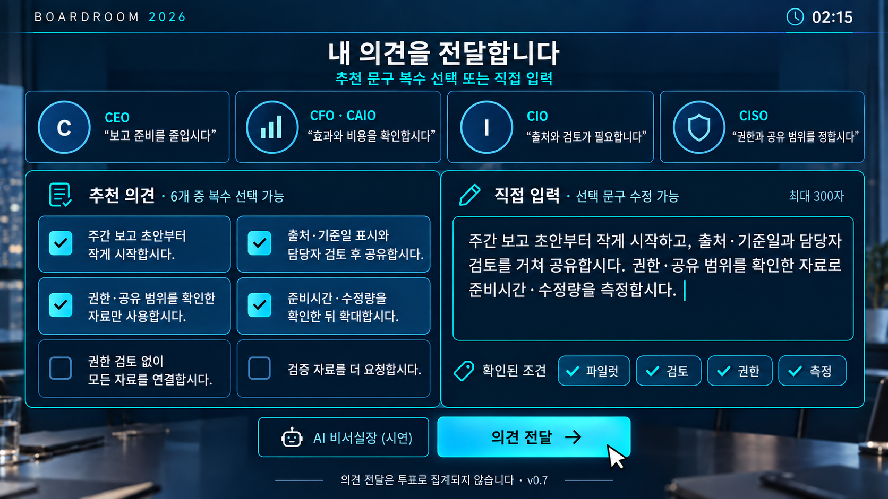
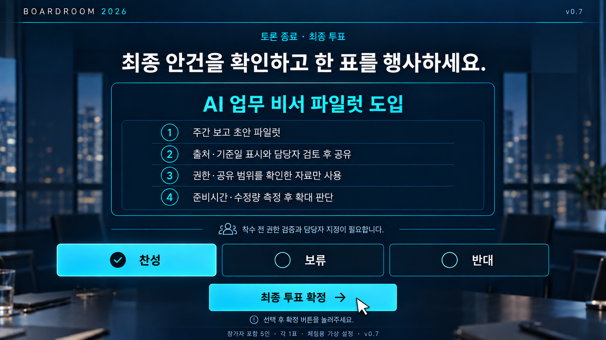

# BOARDROOM 2026 — 디자인 구현 명세

> **v0.8 변경:** [에이전트 명세](../AGENT_BOARDROOM_SPEC.md) 기준으로 live/scripted 모드를 표시한다. live 임원표는 모델 판단이며 그림의 찬성5는 고정 결과가 아니다. 발언 정리는 P0 실제 AI 기능이다. PPT/PNG 바이너리는 v0.7로 유지하며 현재 연결 완료를 뜻하지 않는다.

> **v0.9 변경:** 브리핑에 의장 브리핑·자료 해석·핵심 쟁점·조건 미리보기·진행 스트립을 추가하고 후속 입력을 빠른 답 중심으로 바꾼다(P0.5). P1에서 브리핑~반응을 회의록 타임라인으로 통합한다([판정표](../REVISION_DECISIONS_v0.9.md)).

PPT의 미래적인 이사회 분위기를 실제 조작 가능한 브라우저 UI로 구현한다. 아래 수치는 구현 기본값이며 브랜드 공식 규정이 아니다. 이미지 전체를 배경으로 깔고 버튼 위치만 덮는 방식은 사용하지 않는다. 글자·폼·버튼·카드는 HTML/CSS로 구현한다.

## 1. 시각 레퍼런스

| 참조 | 파일 | 용도 |
| --- | --- | --- |
| PPT v0.7 · 18장 | [기획안](../reference/AX_Day_2026_Boardroom_Proposal.pptx) | 8P AI 브리핑·9P 토론·12P 투표·13P 결과·15P 안건③ |
| 부스 | [booth.png](assets/booth.png) | 공간·조명·PC 마우스·물리 키보드·관람 화면 |
| 안건 선택 | [agenda-select.png](assets/agenda-select.png) | 3개 카드·선택 강조·안건③ 최신 제목 (P1 완성 예시) |
| 의견 작성 | [opinion-compose.png](assets/opinion-compose.png) | 비실사 임원4명·체크 카드6개·300자 입력 |
| 최종 투표 | [final-vote.png](assets/final-vote.png) | 조건4개 확인·단일 선택·별도 확정 |
| 결과 v0.7 | [result.png](assets/result.png) | 동등한5석·찬성5/보류0/반대0·의견·AI 기록 |

| AI 브리핑 | [briefing.png](assets/briefing.png) | 자료4장·상시 AI 정리·사전 구성 표기 |
| 안건③ 최종안 | [prevention-motion.png](assets/prevention-motion.png) | P1+P4 검증안(확대 재심의)·원안/추가 조건 분리 |

### 의견 작성 레퍼런스

### 최종 투표 레퍼런스

나머지 이미지도 위 링크로 직접 열어 비교한다. 이 이미지들은 AI로 제작된 체험 콘셉트 목업이다. 실존 임원의 사진·실제 프로그램 캡처가 아니다. 배경·캐릭터를 재사용할 때 UI 문자가 이미지에 포함된 상태로 제품 화면에 중복 노출하지 않는다. 아바타 기준은 result.png의 비실사 이니셜·아이콘이다. P0와 P1 전 화면에서 동일한 CSS/SVG 역할 아바타를 사용한다. v0.7의 모든 화면 속 임원은 비실사 표현이다. 부스의 실제 참석자·진행요원 모습은 공간 연출용이며 임원 아바타로 사용하지 않는다. 생성 목업별 아이콘 모양의 차이는 구현 시 동일 CSS/SVG 세트로 통일한다.

## 2. 디자인 토큰

동봉 [tokens.css](tokens.css)를 시작점으로 사용한다.

| 요소 | 기본값 | 사용 |
| --- | --- | --- |
| 페이지 배경 | #061424 | 전체 배경 |
| 패널 | #0B2238 | 정보·입력 영역 |
| 상위 패널 | #10344B | hover·활성 영역 |
| 주 강조 | #28D9F0 | 주 CTA·현재 발언·선택 테두리 |
| 보조 강조 | #4C8DFF | 공간 조명·보조 포커스 |
| 본문 | #F3F7FF | 제목·핵심 텍스트 |
| 보조 본문 | #ACC0D3 | 설명·근거 |
| 구분선 | #28536A | 카드 경계 |
| 보류 | #FFD27A | 최종 HOLD 상태 |
| 반대 | #FF8E9A | 최종 NO 상태 |
| 미표결 | #A5B1BF | 최종 UNCAST 상태 |

한글 폰트는 Noto Sans KR 우선, 시스템 sans-serif fallback. 웹폰트는 행사 네트워크에 의존하지 않게 적법한 배포 파일·라이선스를 확보해 로컬 제공한다. 원본 폰트 파일은 본 패키지에 포함하지 않았다.

1920×1080: 제목 40–48px, 본문 24–28px, 카드 설명 20–24px, 메타 16–18px. line-height 1.4–1.55. 1280×720에서는 제목32px/본문20px 전후로 조정하되 중요한 버튼 라벨은 축소보다 재배치한다.

간격은 8px 배수(8/16/24/32/48/64), 카드 radius16px, 입력12px, CTA12px. 최소 클릭 영역56×56px(현장 가독성을 위해 큰 버튼 유지), 주 CTA 높이64px, 버튼 사이12px 이상. 본문 대비4.5:1 목표. 반대·보류는 색 외에 텍스트·아이콘으로 구분한다.

## 3. 화면 구성

공통: 상단 좌측 BOARDROOM 2026, 중앙 단계, 우측 남은 시간. 하단/상단 한 곳에 ‘나 · 특별 이사’ 명패를 항상 유지한다. 토론 화면의 임원 4명은 같은 크기로 정렬하고 내 발언 영역에 독립된 내 좌석 정체성을 준다. 결과에서는 5명이 같은 크기의 투표 카드다.

| 화면 | 데스크톱 배치 | 중요 동작 |
| --- | --- | --- |
| 대기 | 짙은 회의실 분위기 + 큰 제목 + 단일 CTA | 불필요한 설정 없이 시작 |
| 안건 선택 | 3열 대형 카드, 하단 이사회 입장 | 카드 선택 테두리·체크; 준비 중 명시 |
| 브리핑 | 진행 스트립 → 의장 브리핑 블록(상황·결정 질문·내 역할) → 상단 안건 → 좌측 2×2 근거 카드(각 카드에 해석 한 줄 + 관련 임원 아바타) + 우측 핵심 쟁점 3개 카드 → 하단 조건 미리보기 4칩(읽기 전용) | 쟁점 카드는 상시 표시·체험용 사전 구성 표기·E1~E4 연결. 작은 화면에서는 바로 아래 배치. 조건 칩은 클릭 불가 표시 |
| 임원 의견 | 상단 4열 임원 카드, 중앙 쟁점, 하단 CTA | 설명은 순차 영상 대기 없이 읽기 가능 |
| 의견 작성 | 상단 임원 4열; 아래 좌 추천 문구·우 textarea; 하단 AI/전달 | 체크박스와 textarea 모두 실제 입력 요소 |
| 반응 | 내 발언 카드 아래 임원 반응을 답글형(들여쓰기·연결선)으로, 변한 임원만 강조 → “CAIO가 묻습니다” 질문 + 빠른 답 3개 → ‘직접 답하기’(접힘) | 빠른 답만으로 마무리 가능. 직접 답하기를 열면 300자 입력과 조건 칩이 나타난다 |
| 최종 안건 | 중앙 큰 안건 카드·반영 조건·남은 과제 | 이 안건으로 표결 버튼 |
| 최종 투표 | 안건 카드 아래 찬성/보류/반대 3열 + 별도 확정 CTA | radio 단일 선택, 선택만으로 제출하지 않음 |
| 결과 | 제목→동등한 5인 카드→기록 패널→종료 | 세 결론 모두 동등한 완결 연출 |

데스크톱 max-width1760px, 좌우 여백48–64px. 1280px에서24–32px. 필수 검수 해상도는1920×1080 및1280×720이다. PC 200% 확대에서 세로 재배치·스크롤을 허용하며 키보드 접근성을 유지한다. 모바일·터치 레이아웃은 별도 확장이다.

## 4. 컴포넌트 상태와 모션

- 의견 체크 카드: 기본 border, hover 밝은 panel, selected 시안 경계+체크 아이콘. 선택되었다고 ‘찬성’으로 표기하지 않는다.
- textarea: placeholder ‘이사님의 의견을 직접 입력하거나 선택한 문구를 수정해 주세요.’, focus 2px 시안 outline, 오류는 하단 텍스트. 입력300자 초과 금지.
- CTA: 시안 바탕 + 짙은 네이비 글자. secondary는 투명 패널+테두리. disabled는 텍스트와 이유를 유지하며 포인터 상태 구분.
- 의견 전달 중: 로딩+중복 전송 방지. 장시간 입력 차단 금지; 데모는 즉시 반응.
- 최종 투표 radio: 기본 빈 원, 선택 체크 원+선택됨 라벨. 초기 선택 없음. 확정 버튼은 선택 전 비활성.
- 타이머: 평소 보조색, 30초 이하 앰버. 지속 점멸·경고음 강제 사용 금지.
- 화면 전환180–250ms opacity/소폭 translate. 선택120ms. 임원 발언 강조는 얇은 glow 1회. 결과 공개는 전체1초 이내이며 건너뛰기 가능.
- prefers-reduced-motion에서 이동·빛 효과 제거. 접근성 focus-visible 유지, 모든 버튼 키보드 조작 가능.
- 한 화면에 장식보다 안건·내 발언·다음 행동이 먼저 보여야 한다. 실시간 표결률·성공 확률·‘정답’ 표시는 넣지 않는다.

## 5. 검수 및 자산 사용

부스 이미지는 분위기 레퍼런스다. 복잡한 회의실 배경을 쓸 때 입력 영역 아래 불투명 네이비 패널을 두어 읽기 쉽게 한다. 로고·브랜드 슬로건처럼 보이는 생성 이미지 속 장식은 공식 자산으로 추출하지 않는다.

브라우저 캡처를 1920×1080, 1280×720로 남겨 PPT의 7P·8P·9P·12P·13P·15P와 나란히 검토한다. 이미지 텍스트를 그대로 복제하기보다 최신 MD의 문구를 따른다. 같은 페이지에서 토론 체크박스와 투표 radio가 함께 나타나면 요구사항 위반이다.

## 6. 실제 콘텐츠 수량과 현장 검수

- v0.7 목업에는 추천 문구6개·최종 조건4개를 반영했다. 실제 토론은 시나리오의 P1~P6 체크 카드 6개와 300자 입력창을 제공하고, 안건 ② 대표 경로의 최종 조건 4개를 모두 표시한다. 이미지에 맞추려고 문구나 조건을 삭제하지 않는다.
- 1280×720에서 상단 임원 카드는 접힌 한 줄 요약으로 줄이고, 하단을 추천 문구 2열×3행 영역과 입력 영역으로 나눈다. 최소 클릭 높이56px·본문20px 기준으로 실문구 6개와 300자 입력을 배치한다. PC 기본 배율 상태에서 모든 체크 카드·입력창·전달 CTA를 함께 보여주는 캡처를 검수한다. 텍스트 전체는 입력창 내부 스크롤 가능하다. 불가능하면 레이아웃을 조정하며 글자 축소나 항목 누락으로 통과시키지 않는다.
- 200% 확대·작은 화면에서는 세로 스크롤을 허용하되 입력창·글자 수·전달 버튼에 접근할 수 있어야 한다. 기본 한 화면 검수와 접근성 재배치 검수는 구분한다.
- 결과에는 자동 자료 정리 데모 표시와 추가 도움 사용 내역을 구분한다. 비실사 5인 아바타는 토론과 결과에 동일한 인물 매핑을 사용한다.
- 무입력75초 안내/90초 복귀, 운영 버튼 클릭, 전체화면 및 물리 키보드 한글 입력 동작은 [구현 지시서](../../CLAUDE_IMPLEMENTATION.md) 3장을 따른다. 폰트와 모든 이미지·아이콘은 로컬 번들하며, 네트워크 단절 상태로 새로고침해 검증한다.
- 이 문서의 레이아웃은 구현 기준이다. 실제 1280×720 및 현장 키보드 캡처 검증은 앱 구현 후 수행할 완료 조건이며 현재 검증 완료를 의미하지 않는다.

## 7. 현장 마우스 조작 기준 — 2026-09-09

- 기본 장비는 PC·모니터·마우스이며 직접 입력에는 물리 키보드를 사용한다. v0.7 부스 목업도 PC·마우스·물리 키보드 구성이다.
- 카드의 라벨을 포함한 전체 영역을 한 번 클릭해 선택/해제한다. 체크박스와 카드 이벤트가 중복 실행돼 두 번 토글되지 않게 한다. 다음·의견 전달·최종 투표 확정도 한 번 클릭한다.
- 클릭 가능한 요소에 pointer 커서와 hover·pressed 상태를 제공한다. 선택 상태는 클릭 후 유지하며 hover만으로 선택·진행·투표하지 않는다. 필수 정보와 버튼은 hover 없이 보인다.
- 더블클릭·드래그·롱프레스는 요구하지 않는다. 휠 스크롤과 키보드 접근성을 지원하며 빠른 중복 클릭으로 발언·표가 중복 제출되지 않게 한다.
- ‘운영’ 버튼을 클릭해 초기화·전체화면 메뉴를 연다. 단순 커서 이동은 무입력90초 시계를 갱신하지 않는다.
- 마우스 클릭만으로 추천 문구 경로를 완주하고 물리 키보드 직접 입력 경로도 검수한다. 터치 키보드 검증은 기본 행사 완료 조건이 아니다.

## 8. v0.7 시각 자료와 관람 화면

2026-09-09 PPT 18장과 이미지7종을 v0.7로 교체했다. 시나리오② PILOT+REVIEW+ACCESS+MEASURE 및 참가자 YES 결과는 찬성5·보류0·반대0이다. 참가자 NO이면 찬성4·반대1이다. result.png와 PPT13P는 전자의 단일 예시이며 모든 경로가 만장일치라는 뜻은 아니다.

기존 v0.5의 찬성4·보류1 이미지와 PPT는 Git 이력에서만 확인한다. 현재 파일은 최신 예시로 사용한다. 버전·페이지 대응표는 [자산 버전표](assets/README.md)에 기록했다. 실제 앱의 동작·정확한 문구·분기는 최신 시나리오 문서가 기준이다.

CISO를 포함한 모든 역할에 YES/HOLD/NO 시각 상태를 제공한다. 관람 화면은 입력·AI 초안·원문 인용 없이 공개용 콘텐츠만 렌더한다. 상태 동기화·reset·읽기 전용 규칙은 구현 지시서3장을 따른다. 대형 화면은 본문을 그대로 복제하지 말고 안건·역할·최종 집계·결론 중심으로 배치한다.

## 9. v0.7 문구·실행 방식 표시

안건③ 선택 문구는 ‘시범 운영이 끝났고, 확대 규모를 정해야 합니다.’, 부제는 ‘검증한 AI 서비스를 어디까지 확대할까?’다. agenda-select.png에도 최신 문구를 반영했다.

③ 토론 카드 꼬리표는 P1 운영 준비 조건 / P2 단계 확대 제안 / P3 성과 추적 조건 / P4 선검증·확대 재심의 / P5 반복검증·확대 재심의 / P6 정보 절차 변경이다. ‘확대 승인’처럼 표결 결과를 미리 표시하지 않는다. 복수 선택 시 개별 꼬리표가 최종 실행 방식을 결정하지 않으며 최종안 정규화 결과가 기준이다.

MOTION 상단에 안건명과 동등한 위계로 확대안/단계 확대안/검증안(확대 재심의)/반복 검증안(확대 재심의) 중 하나를 표시한다. RESULT에서도 그 안건 종류와 결과를 함께 표시한다. P1+P4 선택 시 ‘검증안(확대 재심의)’여야 한다. 참가자는 마지막 VOTE에서만 표를 확정한다.

P1 운영 메뉴에 관람 창 열기를 추가한다. 관람 창은 화면용 전체화면 버튼만 제공하며 참가자 세션을 조작하지 않는다. 창 실행·프로필·팝업 차단·연결 대안은 구현 지시서3장을 따른다.

## v0.8 화면 추가 요구

임원별 판단 중/발언/응답 실패 상태를 표시하고 최종표는 결과 전 비공개로 유지한다. 내 발언 정리는 원문·초안 비교, 적용·원문 유지, 수정 후 별도 의견 전달을 제공한다. 결과에 역할별 짧은 판단 근거와 미표결 사유를 표시한다. 자동 사전 정리·실제 호출·초안 적용·미사용을 구분하며 관람 창에는 참가자 원문·초안·미확정 표를 보내지 않는다.

## v0.9 회의록 타임라인 (P1)

> **v1.0 개정(2026-09-20):** 아래 "한 개의 스크롤 타임라인" 통합안은 v1.0 6절 무스크롤 규칙과 충돌해 채택하지 않는다. 회의록은 v1.0 7절의 **회의록 패널**(왼쪽 열 무대 아래, 창 고정·스크롤 없음)로 구현하고, 후속 라운드 대기 게이트·라운드별 기록(roundLog)·live region 조건만 그대로 가져간다. 자동 스크롤·포커스 이동 조건은 스크롤이 없어 소멸한다.

BRIEFING~REACTIONS를 한 개의 스크롤 타임라인으로 그린다. 상단 고정: 헤더·명패·진행 스트립·안건 한 줄. 본문 블록 순서: 의장 브리핑 → 자료 4장(접힘 가능, 1280×720에서는 제목만) → 핵심 쟁점 3개 → 임원 4명 첫 의견 → [내 차례] 추천 문구 빠른 답 + 작성기 → 내 발언 → 임원 반응(답글) → CAIO 후속 질문 + 빠른 답 3개 → 내 답 → 임원 후속 발언(live에서는 “판단 중…” 후 도착) → 의장 “이 조건으로 안건을 고정합니다” → MOTION. 내 차례 블록만 입력 가능하며 나머지는 읽기 전용이다. 새 블록은 `aria-live="polite"`로 발화자와 첫 문장을 읽어 주고, 내 차례 블록으로 포커스를 옮긴다. 자동 스크롤은 무입력 활동으로 세지 않는다. live의 안건 고정 CTA는 임원 후속 라운드가 끝난 뒤에만 켠다. MOTION·VOTE·RESULT와 관람 화면은 그대로다.

## v1.0 애니메이션 프레임 (디즈니·픽사 무대) — 2026-09-19

배경: 2026-09-17 UX 검토에서 "게임적 요소 부족, 안건이 딱딱함, 화면이 재미없음"이 확인됐다. 참고 이미지(미래형 회의실)와 목업 검토를 거쳐 **디즈니·픽사 애니메이션 프레임**을 전체 UI 톤으로 채택했다. 목업: 세션 아티팩트 "이사회 무대 목업", 렌더 원본 `docs/design/assets/stage-render-01.jpg`(AI 생성 3D 카툰, 비실사, 1672×941). 이 절은 2장 토큰과 3·4장 화면 구성 위에 **덧쓰는** 규칙이며, 표결·조건·타이머·세션 규칙과 56px 클릭 목표·64px CTA·4.5:1 대비·reduced-motion 규칙은 그대로다.

### 1. 무대 띠(StageBand)

- SELECT 이후 모든 화면(BRIEFING~RESULT) 상단, 진행 스트립 바로 아래에 렌더 배경의 무대 띠를 둔다. 1920×1080에서 높이 300px(화면의 약 28%). 1280×720에서는 56px 좌석 띠로 접히고, "무대 펼치기" 버튼으로 잠시 펼쳐 볼 수 있다(펼친 상태에서도 하단 CTA가 가려지지 않는다).
- 배경 `stage-render-01.jpg`를 `object-fit: cover`, `object-position: center 40%`로 깔고, 위·아래 네이비 비네트를 얹어 오버레이 텍스트 대비를 확보한다. 좌석 가로 위치(배경 기준): CEO 14.5%, CFO 39.5%, CAIO 63%, CISO 87.5%. '나'는 하단 중앙에 의자 등받이 실루엣(뒷모습)과 흰 명패 "나 · 특별 이사".
- 오버레이(HTML, 그림 파일 없음): 임원별 명패(어두운 판 + 역할색 글자·테두리), 발언 시 바닥 시안 글로우, 판단 중(live pending) 시 점 세 개 말풍선 "판단 중", 말풍선(발언자 라벨 + 첫 문장 최대 40자), 의견 유지 임원은 흐림, 표결 배지(찬성 ✓ 민트·보류 ॥ 앰버·반대 ✕ 핑크·미표결 – 회색). 말풍선은 캐릭터 머리 위 여백에만 띄우고 밝은 상판 위에는 두지 않는다. 동시에 여러 발언이 오면 도착 순서대로 0.4초 간격으로 띄운다.
- 화면별 상태: BRIEFING 의장(CEO) 말풍선 = 의장 브리핑 첫 문장. OPINIONS 임원 4명 말풍선 = 첫 의견(live는 도착 순, pending은 판단 중). DISCUSS 말풍선 없음, '나' 좌석 글로우. REACTIONS '나' 말풍선(시안) = 내 발언 첫 문장, 반응한 임원 말풍선, 유지 임원 흐림. MOTION 의장 말풍선 "이 조건으로 안건을 고정합니다". VOTE 말풍선 없음(대기·판단 중 상태는 본문 vote-waiting-execs가 전담). live에서 응답 실패한 임원은 무대에서 흐림만 하고 말풍선을 두지 않는다(본문 카드가 전담). RESULT 표결 배지 순차 공개(아래 3).
- 무대 띠는 장식이다. 컨테이너에 `aria-hidden="true"`를 두고, 읽어야 할 정보는 모두 아래 본문 블록에 그대로 둔다. 무대 애니메이션은 무입력 활동으로 세지 않는다.
- 성능: 글로우·비네트는 정적 레이어. 움직이는 것은 말풍선 등장, 판단 중 점, 배지 등장뿐. `backdrop-filter`는 헤더 한 곳에만 쓴다.

### 2. 프레임 스킨(토큰·타이포·컴포넌트)

- 팔레트: 2장 토큰을 유지하되 렌더의 노을 색을 보조 강조로 더한다. `--warm: #FFB457`(따뜻한 강조·명패 하이라이트), `--sky: #8FD3FF`(CTA 그라데이션 끝), `--panel: #0F2A48`, `--panel-active: #16385C`, `--border: #2A5A86`. 배경 조명 `--bg-gradient`는 좌상단 파랑·우상단 노을(앰버 6%)·우하단 시안.
- 타이포: 제목·결론·도장에 디스플레이 서체 **Black Han Sans**(OFL, `@fontsource/black-han-sans` 로컬 번들)를 쓴다. 본문은 Noto Sans KR 그대로. 디스플레이 서체는 한글 2,350자 범위이므로 fallback을 Noto Sans KR 900으로 둔다. 크기 스케일(2장)은 유지.
- 카드: radius 20px, 2px 테두리 `--border`, 상단 1px 흰색 8% 하이라이트, 그림자 `--shadow-card`. 선택·발언 강조는 시안 테두리 + 얇은 글로우. 카드는 "토이"처럼 살짝 도톰하게 보이되 텍스트 대비를 우선한다.
- CTA: 알약(999px), 시안→하늘 그라데이션, 짙은 네이비 굵은 글자, hover 2px 떠오름, active 눌림, focus-visible 2px 외곽선. secondary는 투명 + 2px 테두리. 크기 규칙(64px 높이·56px 최소)은 유지.
- 추천 문구·빠른 답·조건 칩: 둥근 카드/칩, 선택 시 체크 배지가 튀어나오는 120ms 스케일 애니메이션.
- 대기(ATTRACT): 렌더를 전체 배경으로 깔고(어두운 그라데이션 오버레이), 디스플레이 서체 큰 제목 + 단일 CTA. 안건 선택(SELECT): 3열 카드는 그대로, 카드 상단에 역할색 띠.
- 진행 스트립: 알약 칩을 잇는 선을 그리고 현재 단계는 시안 채움, 지난 단계는 체크.
- 헤더: 유리 패널(`backdrop-filter: blur(8px)`), 4분 시계는 무대 띠 우상단 벽시계 pill로 복제 표시(헤더 타이머는 유지).

### 3. 결과 연출(성적표)

- 표결 배지는 CEO → CFO → CAIO → CISO → 나 순으로 0.2초 간격으로 튀어나오고(총 1초 이내, 4장 규칙), 그 뒤 결론 도장이 화면에 찍힌다(회전 -9°, 디스플레이 서체, 결과색): PASS이고 반영 조건이 있으면 "조건부 가결", PASS는 "가결", HOLD는 "보류", REJECT는 "부결". 클릭·키 입력으로 즉시 건너뛴다. 결과 텍스트(5석 카드)는 DOM에 처음부터 있고 시각 효과만 지연된다.
- "내 조건이 바꾼 표 n명 / 4명" 게이지: scripted에서만 계산한다(조건 없는 안건의 임원 표와 실제 표를 비교). live에서는 표시하지 않는다. 점수·랭킹·정답 표시는 두지 않는다(4장 규칙 유지).
- 결과 명패(출력물 문구)는 그대로다. 6개월 뒤 시뮬레이션 문장은 콘텐츠 작업(별도)이다.

### 4. 검수

- 1920×1080·1280×720 스크린샷을 갱신하고, 720에서 무대가 접힌 상태로 CTA가 보이는지 확인한다.
- 렌더 이미지의 인물은 가상의 역할 캐릭터다. 실존 인물·실제 프로그램 캡처가 아니라는 표기를 자산 README에 남긴다.

### 5. 좌우 분할 개정 — 2026-09-19 (T44)

상단 띠는 인물이 잘리고 말풍선 여백이 없어 **좌우 분할**로 바꾼다. 1절의 상태·말풍선·배지 규칙은 그대로이고 배치만 바뀐다.

- 앱 셸: SELECT 이후 화면은 2열 그리드. 왼쪽 열 = 무대(폭 `clamp(420px, 42vw, 860px)`, `position: sticky; top: <헤더+진행 스트립 높이>`), 오른쪽 열 = 본문(스크롤). 열 간격 24px. 1280×720에서는 왼쪽 40%(약 512×288). 좌석 띠·"무대 펼치기" 토글은 제거한다.
- 무대: 원본 16:9 비율 그대로(`aspect-ratio: 16/9`, `object-fit: cover; object-position: center 20%`), 라운드 20px. 말풍선은 캐릭터 머리 위 하늘 여백(상단 0~28%)에 두고, '나' 말풍선(시안)은 테이블 위 중앙(상단 58%~) 한 곳만 허용한다. 4분 벽시계 pill은 무대 우상단.
- 본문 폭 축소 대응: 브리핑 자료 카드 4장은 2열, 쟁점 3개는 그 아래 세로; 1280에서 자료 카드는 제목+한 줄 해석만 보이고 `details`로 펼친다(testid 유지). 추천 문구 6개는 2열. 결과 5석 카드는 3+2로 감싼다(1280에서도 3+2). live 판단 근거는 2줄(1280에서 1줄), 남은 우려는 1줄로 클램프한다. 임원 4열 카드(OPINIONS·DISCUSS 상단)는 2열.
- 명패 '나 · 특별 이사'는 본문 열 맨 위에 그대로 둔다. 도장은 무대 우하단에 겹쳐 찍는다(무대 열 안, `position:absolute`).
- 검수: 1920×1080·1280×720 스크린샷. 반응·표결·결과는 스크롤 없이 한 화면, 브리핑만 스크롤 허용(1280에서 자료 접힘 기본).

### 6. 조종석 배치와 무스크롤 규칙 — 2026-09-19 (T45)

5절의 좌우 분할을 유지하되 열의 역할을 고정하고, 게임 화면처럼 **페이지 스크롤을 없앤다**.

- 열 역할: 왼쪽 열 = "나"(무대 + 내 행동: 입력·선택·CTA). 오른쪽 열 = "회의 정보"(안건·사건·근거·쟁점·임원 의견·반응·최종 안건·결과 기록). 모든 CTA는 왼쪽 열 무대 아래에 있다. 하단 고정 푸터는 쓰지 않는다.
- 무스크롤: 1920×1080과 1280×720에서 ATTRACT~RESULT 모든 화면의 `document.scrollingElement.scrollHeight <= clientHeight`. 이 잠금은 폭 ≥1200·높이 ≥700 뷰포트에서만 적용하고, 그보다 짧거나 좁으면(PC 200% 확대 상당 960×540 등) 셸을 문서 흐름으로 되돌려 페이지 스크롤을 열고 두 열을 세로 1열(무대 → 내 행동 → 회의 정보)로 재배치한다(3장 200% 확대 규칙 유지, `e2e/a11y.spec.ts`가 마우스 휠로만 CTA에 닿는지 검수). 앱 셸은 `height: 100dvh; overflow: hidden`, 두 열은 각각 `min-height: 0`인 flex 열. 내용이 넘치면 페이지가 아니라 **지정된 패널 하나**만 안에서 스크롤한다(화면당 최대 1개, 아래 표). 그 패널은 아래쪽 페이드로 더 있음을 알린다.
- 타이포 스케일(2장 덮어씀, v1.0): 1080 제목 32/본문 20/카드 18/메타 14, 720 제목 26/본문 17/카드 15/메타 12. 56px 클릭 목표·64px 주 CTA는 유지하되 720에서 추천 문구 카드는 48px까지 허용한다(2장 규칙의 예외, 세로 예산 때문).
- 왼쪽 열 세로 예산(1080): 무대 16:9(열 폭 40vw → 약 432px), 아래 입력 영역 약 500px. 720: 무대 열 폭 36vw(약 260px 높이), 입력 영역 약 330px.
- 예산 초과 시 원칙(2026-09-19 T45 검토 반영): 내부 스크롤을 추가하지 않는다. 대신 (a) 선택지 묶음을 오른쪽 열로 옮기거나(추천 문구), (b) 같은 자리에서 모드를 전환한다(빠른 답 ↔ 직접 답하기). 56px 클릭 목표는 지킨다.

| 화면 | 왼쪽(나) | 오른쪽(회의 정보) | 내부 스크롤 패널 |
| --- | --- | --- | --- |
| 대기·안건 선택 | 1열 그대로(전체 배경 렌더 / 3열 카드 + 입장 CTA) | — | 없음 |
| 브리핑 | 무대 + "의견 듣기" + 회의록 패널(7절) | 안건 한 줄 · 의장 브리핑 3문장 · 근거 2×2(제목+해석 한 줄, 720은 해석만) · 쟁점 3칩 · 조건 미리보기 4칩 | 없음 |
| 임원 의견 | 무대(말풍선) + "내 의견 말하기" + 회의록 패널 | 임원 4장 2×2(발언 + 근거 보기 토글) | 없음 |
| 의견 작성 | 무대 + 입력창 3줄 + 조건 칩(한 줄) + [비서실장][의견 전달] | **비서실장 추천 문구 2×3**(클릭 시 입력창에 반영, 기존 testid 유지) + 근거 2×2 압축 + 임원 첫 의견 4줄 | 없음(비서실장 패널은 오른쪽 열 위에 겹치는 드로어) |
| 반응 | 무대 + 내 발언 인용(2줄 클램프) + 빠른 답 3 ↔ 직접 답하기(**같은 자리 전환**: 열면 빠른 답 3개가 입력창·조건 칩으로 바뀌고, 닫으면 복귀) | CAIO 질문 + 임원 반응 2×2 답글 | 없음 |
| 최종 안건 | 무대 + "이 안건으로 표결"(live는 후속 라운드 도착까지 비활성, 7절) + 회의록 패널 | 안건 카드 · 반영 조건 · 남은 과제 | 없음 |
| 최종 투표 | 무대 + 찬성/보류/반대 3열 + 확정 + 회의록 패널(720은 최근 3건) | 안건 카드 · 조건 | 없음 |
| 결과 | 무대(배지·도장) + 게이지 + "체험 종료" | 결론 · 5석(3+2, live 근거 2줄/우려 1줄 클램프) · 기록 3패널(내 의견은 4줄 클램프) | 기록 패널 1개 |

- 명패 '나 · 특별 이사'는 왼쪽 열 무대 위 좌상단(무대 안 pill)으로 옮겨 세로 공간을 아낀다(testid 유지).
- 검수: e2e에서 두 해상도 × 모든 단계에 대해 페이지 스크롤 없음을 단언한다. 스크린샷은 전체 화면 1장으로 각 단계가 다 보여야 한다.

### 7. 회의록 패널과 후속 대기 게이트 — 2026-09-20 (T41·T46)

v0.9 B안(스크롤 타임라인)을 무스크롤 조종석에 맞게 다시 정의한다. 회의록은 "지금까지 누가 무엇을 말했는가"를 한 줄씩 쌓는 **창 고정 패널**이고, 페이지·패널 스크롤은 없다.

- 위치: 왼쪽 열 무대·행동(CTA) 아래 네 번째 grid area(`'stage info' / 'actions info' / 'minutes info'`, rows `auto auto 1fr`). AppShell이 **BRIEFING·OPINIONS·MOTION·VOTE**에서만 렌더한다. DISCUSS·REACTIONS는 입력이 왼쪽 열을 채우고, RESULT는 기록 3패널이 같은 역할을 하므로 두지 않는다. 각 Screen 컴포넌트는 바꾸지 않는다.
- 항목(시간순, 순수 함수 `buildMinutes(session, scenario, roundLog)`가 세션 상태에서 매번 계산):
  1. 의장 브리핑 — CEO · `chairBriefing.situation`
  2. 임원 첫 의견 4건 — scripted는 `scenario.initialOpinions`, live는 transcript의 OPINIONS 발언. live 미도착은 "판단 중…"(점 3개 + 스크린리더용 상태 문구), 실패는 "응답 없음"(roundLog 기준, 뒤 라운드가 roleStatus를 덮어도 남는다)
  3. 내 발언 — `opinions[0].originalText`
  4. 임원 반응 4건 — scripted는 `scenario.reactions`를 첫 의견의 확정 조건으로 고른 것(ReactionsScreen의 `reactionsFor` 규칙을 공용 함수로 뽑아 같이 쓴다. 해당 반응이 없는 임원은 "기존 의견 유지"), live는 REACTIONS 발언
  5. CAIO 질문 — `followUp.question` (REACTIONS 이후)
  6. 내 답 — `opinions[1].originalText`, 유지를 골랐으면 "앞서 전달한 의견을 유지"
  7. 임원 후속 4건 — live에서 `opinions.length >= 2`일 때만. FOLLOWUP 발언 / "판단 중…" / "응답 없음"
  8. 의장 — "이 조건으로 안건을 고정합니다" (MOTION 이후)
- 한 항목 = 아바타(sm, 이니셜이 역할을 보여준다) + 발화자 직함(스크린리더용, 화면에서는 숨김) + 첫 문장 1줄 클램프(무대 말풍선과 같은 `firstSentenceClipped` 규칙). 내 항목은 참가자 색(시안 왼쪽 선). 패널은 내용 높이만 차지한다(1건뿐인 BRIEFING에서 빈 틀이 아래까지 늘어나지 않음, T47 다듬기).
- 창 고정: 1080은 최근 6건, 720은 최근 4건(VOTE는 3건)만 보이고 더 오래된 항목은 시각적으로만 숨긴다(sr-only — 스크린리더에는 전체가 남는다). 머리글 "회의록"과 총 건수 배지. 페이지·패널 스크롤 금지(6절 예산 규칙 유지, `e2e/noscroll.spec.ts`가 두 해상도에서 단언).
- 접근성: `<section aria-label="회의록">` + `<ol aria-live="polite" aria-relevant="additions text">`, 각 행 `<li aria-atomic="true">`. 새 항목이 도착하거나 live의 "판단 중" 행이 같은 행 안에서 응답으로 바뀔 때 발화자와 첫 문장을 한 덩어리로 읽어 준다(PR #7 Codex 1차 검토). 포커스는 옮기지 않는다(입력 블록이 없다).
- 라운드별 기록(roundLog): `SET_ROLE_STATUS`에 선택 필드 `stage?: StatementStage`를 더하고 runner가 채운다(reducer는 읽지 않음, 동작 불변). App이 stage가 있는 SET_ROLE_STATUS만 `{stage, roleId, status}`로 upsert해 보관하고 sessionId가 바뀌면 비운다. 공개 payload에는 넣지 않는다.
- 후속 대기 게이트(live, T46): 후속 답을 제출하면 reducer는 지금처럼 MOTION으로 넘어가되, App이 "이 세션의 `runRound('FOLLOWUP')` promise가 settle됐는가"만 상태로 들고 게이트는 세션 상태에서 동기적으로 계산해(`isFollowUpGateActive`, MOTION 첫 프레임부터 잠김) **settle 전에는 "이 안건으로 표결" CTA를 비활성**으로 두고 CTA 아래에 "임원 후속 판단 중…"을 보여준다. 벽시계 타이머로 열지 않는다(앞 라운드가 사슬에 남아 있으면 8초 상한은 그 뒤에 시작한다). scripted와 '의견 유지'(후속 라운드 없음)는 게이트가 없다. 회의록 패널의 7번 항목이 같은 상태를 "판단 중…"으로 보여준다.

### 8. 안건 사건화와 "6개월 뒤" 에필로그 — 2026-09-20 (T47)

안건이 딱딱하다는 진단(2026-09-19)에 대한 카피 보강이다. 표결 규칙·조건·자료 수치는 그대로이고, 새 수치·절감률·확정 사실을 만들지 않는다(SCENARIO_AI_ASSISTANT.md "검증되지 않은 수치 금지"). 모든 문구는 시나리오 데이터(`Scenario.incident`, `resultCopy.sixMonthsLater`)에서 읽고 화면은 하드코딩하지 않는다.

- 사건 카드(SELECT): 안건 카드의 제목을 원안 문장 대신 **사건 헤드라인**으로 바꾼다. 구성 = 사건 번호 칩(`incident.caseLabel`, 예 "사건 02") + 헤드라인(`incident.headline`, 한 문장, 서술형) + 갈등 한 줄(`incident.hook`, 자료 E1~E4에 이미 있는 사실만). 원안 문장(`subtitle`)은 카드에서 빼고 BRIEFING 상단 안건 제목이 그대로 담당한다. 준비 중 안건은 헤드라인 = 제목, hook = "준비 중인 안건입니다."
- 사건 표기(BRIEFING): 안건 제목 위에 한 줄 eyebrow "사건 02 · {headline}"(testid `briefing-incident`). 720 세로 예산 안(한 줄, 메타 서체).
- "6개월 뒤" 에필로그(RESULT): 왼쪽 열 게이지 아래·"체험 종료" 위에 카드 하나(testid `result-epilogue`). 머리글 "6개월 뒤" + 배지 "체험용 가상 전망" + 결과(PASS/HOLD/REJECT)별 두 문장(`resultCopy.sixMonthsLater.{pass,passOriginal,hold,reject}`). 가결은 도장과 같은 기준으로 나눈다 — 참가자가 확정한 조건이 최종안에 반영됐으면 `pass`, 없으면(원안 그대로, live에서 임원 표로 가능) 조건을 전제하지 않는 `passOriginal`(PR #8 Codex 2차 검토). 시간 만료로 원안이 집계된 경우도 outcome·반영 조건 기준으로 같은 규칙을 쓴다. 3줄 클램프. 두 해상도 무스크롤 유지.
- 문구 원칙: 미래 서술은 "~합니다"의 현재형 묘사로 쓰되 수치·비율·금액을 넣지 않는다. 가결 문구는 붙인 조건이 실행 점검표가 된다는 뜻을, 보류는 다시 상정되기까지 현 상태가 이어진다는 뜻을, 부결은 이사님의 우려가 다음 안건의 출발점이 된다는 뜻을 담는다.

### 9. 이사회 한 장 요약 — 2026-09-21 (T48)

결과 화면의 정보(게이지·5석·기록 3패널·에필로그)가 흩어져 있어 참가자가 "내가 뭘 했고 그래서 뭐가 달라졌는지"를 한 번에 읽지 못한다는 진단에 대한 정리. 오른쪽 열 아래 기록 영역을 **한 장 요약 패널**(2/3 폭) + 보조 패널(1/3 폭: 남은 과제 + AI가 도운 일)로 재배치한다. 표결 규칙·조건·집계는 그대로다.

- 배치: `.result-screen__records`를 `2fr 1fr` 2열로. 왼쪽 `result-summary`(testid), 오른쪽 세로 스택 = "남은 과제"(`result-tasks`) 위, "AI가 도운 일"(`result-ai-help`, 화면 유일 내부 스크롤 유지) 아래. 기존 "내 의견" 패널(`result-mine`)은 요약 패널 안으로 흡수한다(testid 유지: 요약 패널의 내 의견 블록에 `result-mine`).
- 요약 패널 구성(위에서 아래):
  1. 머리글 "이사회 한 장 요약" + 집계 배지 "찬성 n · 보류 n · 반대 n(· 미표결 n)" (`result-summary-tally`).
  2. 내가 붙인 조건 한 줄: "이사님이 붙인 조건: {반영 조건 라벨, …}" / 없으면 "조건 없이 원안 그대로 상정" (`result-summary-conditions`).
  3. 임원 4행(`result-summary-row-{memberId}`): 아바타 sm + 표 배지(색+텍스트+아이콘, 4장 규칙) + **판단 이유 한 줄**(1줄 클램프) + 바뀐 표 태그. 이유는 scripted에서 표결 규칙의 일치 행에 붙인 `reason`(시나리오 데이터, 아래), live에서 `ballot.reason`(없으면 UNCAST 사유 또는 "판단 근거 없음"). 바뀐 표 태그 "이사님 조건으로 바뀜"(`result-summary-changed`)은 scripted에서만, 조건 없는 안건의 표(`decideBoard` baseline)와 다를 때 붙인다(게이지 "내 조건이 바꾼 표 n명"과 같은 계산).
  4. 내 행(`result-summary-row-PARTICIPANT`): 아바타 + 내 표 + 결정력 한 줄 — 내 표를 다른 어느 값으로 바꿔도 결론이 달라지면 "이사님의 한 표가 결과를 정했습니다", 아니면 "결과는 임원 표만으로 정해졌습니다"(`result-summary-decisive`, 순수 함수 `participantDecisive(ballots)`; UNCAST 미표결도 대안에 포함). 두 모드 공통.
  5. 내 의견 원문(`result-mine`, 2줄 클램프) — 기존 내 의견 패널의 인용·반영 태그 목록은 조건 한 줄(2번)로 대체하고 원문만 남긴다.
- 표결 규칙 데이터 확장: `VoteRule.reason?: string`(선택). aiAssistant 시나리오의 모든 규칙 행에 채운다(아래 원문). 규칙 평가(`decideMember`)는 그대로이고, 새 순수 함수 `explainBoard(scenario, motion)`이 임원별 `{ vote, reason, changed }`를 돌려준다. `reason`이 없는 규칙은 표 텍스트만 쓴다(기존 테스트·준비 중 안건 호환).
- 세로 예산: 1080·720 모두 무스크롤. 720에서 요약 행은 12px, 임원 4행+내 행+조건+원문 2줄 = 기록 영역 안. 기존 "AI가 도운 일" 내부 스크롤 1개 외 스크롤 추가 금지. 왼쪽 열 게이지·에필로그·CTA는 그대로.
- 문구 원칙: 이유는 조건 라벨을 그대로 인용하고(예: "출처·기준일 검토 조건이 없어 반대"), 새 수치·확정 사실을 만들지 않는다.

