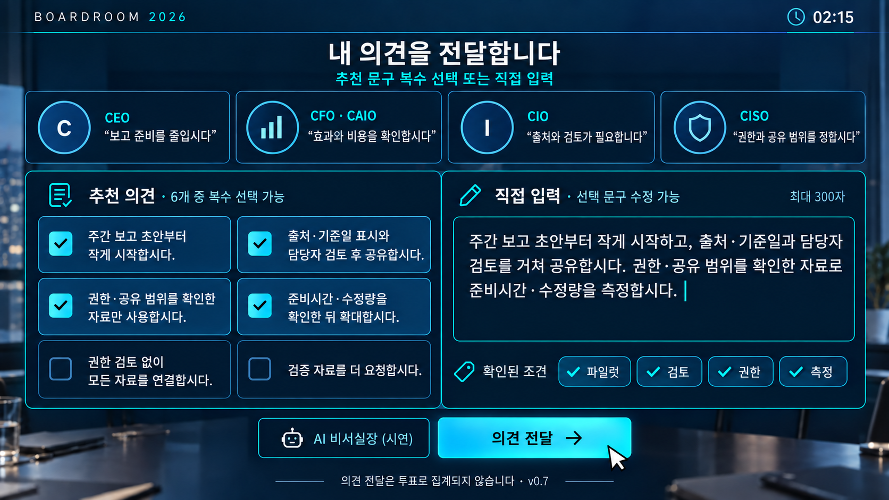
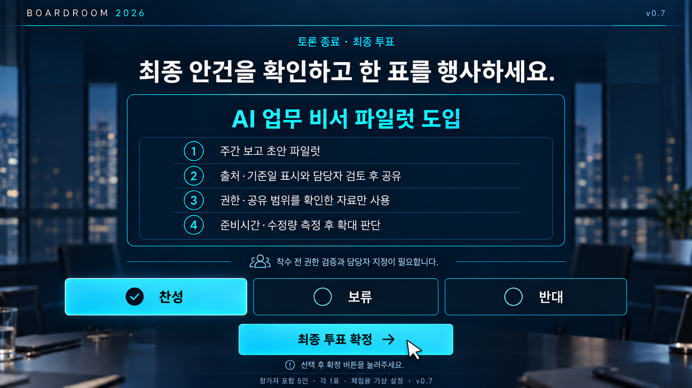

# BOARDROOM 2026 — 디자인 구현 명세

> **v0.8 변경:** [에이전트 명세](../AGENT_BOARDROOM_SPEC.md) 기준으로 live/scripted 모드를 표시한다. live 임원표는 모델 판단이며 그림의 찬성5는 고정 결과가 아니다. 발언 정리는 P0 실제 AI 기능이다. PPT/PNG 바이너리는 v0.7로 유지하며 현재 연결 완료를 뜻하지 않는다.

> **v0.9 변경:** 브리핑에 의장 브리핑·자료 해석·핵심 쟁점·조건 미리보기·진행 스트립을 추가하고 후속 입력을 빠른 답 중심으로 바꾼다(P0.5). P1에서 브리핑~반응을 회의록 타임라인으로 통합한다([판정표](../REVISION_DECISIONS_v0.9.md)).

PPT의 미래적인 이사회 분위기를 실제 조작 가능한 브라우저 UI로 구현한다. 아래 수치는 구현 기본값이며 브랜드 공식 규정이 아니다. 이미지 전체를 배경으로 깔고 버튼 위치만 덮는 방식은 사용하지 않는다. 글자·폼·버튼·카드는 HTML/CSS로 구현한다.

## 1. 시각 레퍼런스

| 참조 | 파일 | 용도 |
| --- | --- | --- |
| PPT v0.7 · 18장 | [기획안](../reference/AX_Day_2026_Boardroom_Proposal.pptx) | 8P AI 브리핑·9P 토론·12P 투표·13P 결과·15P 안건③ |
| 부스 | [booth.png](assets/booth.png) | 공간·조명·PC 마우스·물리 키보드·관람 화면 |
| 안건 선택 | [agenda-select.png](assets/agenda-select.png) | 3개 카드·선택 강조·안건③ 최신 제목 (P1 완성 예시) |
| 의견 작성 | [opinion-compose.png](assets/opinion-compose.png) | 비실사 임원4명·체크 카드6개·300자 입력 |
| 최종 투표 | [final-vote.png](assets/final-vote.png) | 조건4개 확인·단일 선택·별도 확정 |
| 결과 v0.7 | [result.png](assets/result.png) | 동등한5석·찬성5/보류0/반대0·의견·AI 기록 |

| AI 브리핑 | [briefing.png](assets/briefing.png) | 자료4장·상시 AI 정리·사전 구성 표기 — AI 정리 카드·배지는 T52(2026-09-23)에서 제거된 시각 레퍼런스 |
| 안건③ 최종안 | [prevention-motion.png](assets/prevention-motion.png) | P1+P4 검증안(확대 재심의)·원안/추가 조건 분리 |

### 의견 작성 레퍼런스

### 최종 투표 레퍼런스

나머지 이미지도 위 링크로 직접 열어 비교한다. 이 이미지들은 AI로 제작된 체험 콘셉트 목업이다. 실존 임원의 사진·실제 프로그램 캡처가 아니다. 배경·캐릭터를 재사용할 때 UI 문자가 이미지에 포함된 상태로 제품 화면에 중복 노출하지 않는다. 아바타 기준은 result.png의 비실사 이니셜·아이콘이다. P0와 P1 전 화면에서 동일한 CSS/SVG 역할 아바타를 사용한다. v0.7의 모든 화면 속 임원은 비실사 표현이다. 부스의 실제 참석자·진행요원 모습은 공간 연출용이며 임원 아바타로 사용하지 않는다. 생성 목업별 아이콘 모양의 차이는 구현 시 동일 CSS/SVG 세트로 통일한다.

## 2. 디자인 토큰

동봉 [tokens.css](tokens.css)를 시작점으로 사용한다.

| 요소 | 기본값 | 사용 |
| --- | --- | --- |
| 페이지 배경 | #061424 | 전체 배경 |
| 패널 | #0B2238 | 정보·입력 영역 |
| 상위 패널 | #10344B | hover·활성 영역 |
| 주 강조 | #28D9F0 | 주 CTA·현재 발언·선택 테두리 |
| 보조 강조 | #4C8DFF | 공간 조명·보조 포커스 |
| 본문 | #F3F7FF | 제목·핵심 텍스트 |
| 보조 본문 | #ACC0D3 | 설명·근거 |
| 구분선 | #28536A | 카드 경계 |
| 앰버(경고·대기) | #FFD27A | 타이머 경고, 제한·만료 안내, 준비 중 배지 등(T62: 표결 결과 보류는 없앴고, 이 색은 표결과 무관한 경고·대기 용도로만 남았다) |
| 반대 | #FF8E9A | 최종 NO 상태 |
| 미표결 | #A5B1BF | 최종 UNCAST 상태 |

한글 폰트는 Noto Sans KR 우선, 시스템 sans-serif fallback. 웹폰트는 행사 네트워크에 의존하지 않게 적법한 배포 파일·라이선스를 확보해 로컬 제공한다. 원본 폰트 파일은 본 패키지에 포함하지 않았다.

1920×1080: 제목 40–48px, 본문 24–28px, 카드 설명 20–24px, 메타 16–18px. line-height 1.4–1.55. 1280×720에서는 제목32px/본문20px 전후로 조정하되 중요한 버튼 라벨은 축소보다 재배치한다.

간격은 8px 배수(8/16/24/32/48/64), 카드 radius16px, 입력12px, CTA12px. 최소 클릭 영역56×56px(현장 가독성을 위해 큰 버튼 유지), 주 CTA 높이64px, 버튼 사이12px 이상. 본문 대비4.5:1 목표. 반대는 색 외에 텍스트·아이콘으로 구분한다.

## 3. 화면 구성

공통: 헤더 한 줄 — 좌측 BOARDROOM 2026 + 케이스 라벨, 가운데 진행 스트립(01~05, ATTRACT·SELECT는 비어 있음), 우측 모드 배지 + 운영(v1.2 T67, 아래 참고. ~~중앙 단계, 우측 남은 시간~~은 각각 진행 스트립(v0.9)·240초 카운트다운 제거(T50)로 이미 바뀌어 있었다). ~~하단/상단 한 곳에 ‘나 · 특별 이사’ 명패를 항상 유지한다.~~(v1.2 T67에서 폐기 — 헤더 명패 pill과 단계 이름 칩을 없애고 진행 스트립만 남겼다. 참가자 정체성은 무대 좌석 글로우·말풍선·표 배지로 충분하다는 판단, 아래 v1.2 절 참고.) 토론 화면의 임원 4명은 같은 크기로 정렬하고 내 발언 영역에 독립된 내 좌석 정체성을 준다. ~~결과에서는 5명이 같은 크기의 투표 카드다.~~(v1.1 T66에서 폐기 — 무대 명패가 이미 표 배지를 보여주고 VERDICTS 패널이 표를 글자로 다시 적어 카드가 중복이었다. v1.1 5절 참고.)

| 화면 | 데스크톱 배치 | 중요 동작 |
| --- | --- | --- |
| 대기 | ~~짙은 회의실 분위기 + 큰 제목 + 단일 CTA~~(v1.3 T71에서 시안 S0_Attract 그대로로 재작성 — 아래 v1.3 절 참고) | 불필요한 설정 없이 시작 |
| 안건 선택 | ~~3열 대형 카드, 하단 이사회 입장~~(v1.3 T70에서 시안 S1_Select 그대로로 재작성 — 카드 2장, 아래 v1.3 절 참고) | 카드 선택 테두리·체크; 준비 중 명시 |
| 브리핑 | 진행 스트립 → 의장 브리핑 블록(상황·결정 질문·내 역할) → 상단 안건 → 자료 4장(자료명·해석 한 줄·원문 상시 노출, 자료 ID 미표기). 핵심 쟁점 3개 카드·조건 미리보기 4칩·"체험용 사전 구성" 표기는 T52(2026-09-23)에서 제거 — 현재 배치는 v1.0 6절 | 진행 스트립은 유지(BRIEFING ①). 작은 화면에서는 세로 배치 |
| 임원 의견 | ~~상단 4열 임원 카드, 중앙 쟁점, 하단 CTA~~(v1.3 T72에서 시안 S2_Opinions 그대로로 재작성 — 오른쪽 열이 종이 한 장, 카드 2×2, 아래 v1.3 3절 참고) | 설명은 순차 영상 대기 없이 읽기 가능 |
| 의견 작성 | 상단 임원 4열; 아래 좌 추천 문구·우 textarea; 하단 AI/전달 | 체크박스와 textarea 모두 실제 입력 요소 |
| 반응 | 내 발언 카드 아래 임원 반응을 답글형(들여쓰기·연결선)으로, 변한 임원만 강조 → “〈임원〉이 묻습니다” 질문(안건 ② 사내 게시판 익명제에서는 CFO의 신고 처리 담당자 질문) + 빠른 답 3개 → ‘직접 답하기’(접힘) | 빠른 답만으로 마무리 가능. 직접 답하기를 열면 300자 입력과 조건 칩이 나타난다 |
| 최종 안건 | ~~중앙 큰 안건 카드·반영 조건·남은 과제~~(v1.3 T75에서 시안 S5_Motion 그대로로 재작성 — 오른쪽 열이 종이 한 장, MOTION ON THE TABLE·CONDITIONS·NOT INCLUDED·CHAIR, 아래 v1.3 6절 참고) | 이 안건으로 표결 버튼 |
| 최종 투표 | ~~안건 카드 아래 찬성/반대 2열 + 별도 확정 CTA~~(v1.3 T76에서 시안 S6_Vote 그대로로 재작성 — 왼쪽 열 BALLOTS 봉인 패널, 오른쪽 종이에 큰 원형 도장 라디오 2칸, 아래 v1.3 7절 참고) | radio 단일 선택, 선택만으로 제출하지 않음 |
| 결과 | 제목→동등한 5인 카드→기록 패널→종료(v1.1 T66에서 종이 보고서 한 장 + VERDICTS 5행으로 재구성, 아래 5절) | 두 결론(가결·부결) 모두 동등한 완결 연출 |

데스크톱 max-width1760px, 좌우 여백48–64px. 1280px에서24–32px. 필수 검수 해상도는1920×1080 및1280×720이다. PC 200% 확대에서 세로 재배치·스크롤을 허용하며 키보드 접근성을 유지한다. 모바일·터치 레이아웃은 별도 확장이다.

## 4. 컴포넌트 상태와 모션

- 의견 체크 카드: 기본 border, hover 밝은 panel, selected 시안 경계+체크 아이콘. 선택되었다고 ‘찬성’으로 표기하지 않는다.
- textarea: placeholder ‘이사님의 의견을 직접 입력하거나 선택한 문구를 수정해 주세요.’, focus 2px 시안 outline, 오류는 하단 텍스트. 입력300자 초과 금지.
- CTA: 시안 바탕 + 짙은 네이비 글자. secondary는 투명 패널+테두리. disabled는 텍스트와 이유를 유지하며 포인터 상태 구분.
- 의견 전달 중: 로딩+중복 전송 방지. 장시간 입력 차단 금지; 데모는 즉시 반응.
- 최종 투표 radio: 기본 빈 원, 선택 체크 원+선택됨 라벨. 초기 선택 없음. 확정 버튼은 선택 전 비활성.
- 타이머 없음(2026-09-22 결정, T50): 240초 만료·75/90초 무입력 복귀와 그에 딸린 카운트다운·경고 문구를 모두 없앴다. 화면 어디에도 남은 시간 표시를 두지 않는다.
- 화면 전환180–250ms opacity/소폭 translate. 선택120ms. 임원 발언 강조는 얇은 glow 1회. 결과 공개는 전체1초 이내이며 건너뛰기 가능.
- prefers-reduced-motion에서 이동·빛 효과 제거. 접근성 focus-visible 유지, 모든 버튼 키보드 조작 가능.
- 한 화면에 장식보다 안건·내 발언·다음 행동이 먼저 보여야 한다. 실시간 표결률·성공 확률·‘정답’ 표시는 넣지 않는다.

## 5. 검수 및 자산 사용

부스 이미지는 분위기 레퍼런스다. 복잡한 회의실 배경을 쓸 때 입력 영역 아래 불투명 네이비 패널을 두어 읽기 쉽게 한다. 로고·브랜드 슬로건처럼 보이는 생성 이미지 속 장식은 공식 자산으로 추출하지 않는다.

브라우저 캡처를 1920×1080, 1280×720로 남겨 PPT의 7P·8P·9P·12P·13P·15P와 나란히 검토한다. 이미지 텍스트를 그대로 복제하기보다 최신 MD의 문구를 따른다. 같은 페이지에서 토론 체크박스와 투표 radio가 함께 나타나면 요구사항 위반이다.

## 6. 실제 콘텐츠 수량과 현장 검수

- v0.7 목업에는 추천 문구6개·최종 조건4개를 반영했다. 실제 토론은 시나리오의 P1~P6 체크 카드 6개와 300자 입력창을 제공하고, 안건 ② 대표 경로의 최종 조건 4개를 모두 표시한다. 이미지에 맞추려고 문구나 조건을 삭제하지 않는다.
- 1280×720에서 상단 임원 카드는 접힌 한 줄 요약으로 줄이고, 하단을 추천 문구 2열×3행 영역과 입력 영역으로 나눈다. 최소 클릭 높이56px·본문20px 기준으로 실문구 6개와 300자 입력을 배치한다. PC 기본 배율 상태에서 모든 체크 카드·입력창·전달 CTA를 함께 보여주는 캡처를 검수한다. 텍스트 전체는 입력창 내부 스크롤 가능하다. 불가능하면 레이아웃을 조정하며 글자 축소나 항목 누락으로 통과시키지 않는다.
- 200% 확대·작은 화면에서는 세로 스크롤을 허용하되 입력창·글자 수·전달 버튼에 접근할 수 있어야 한다. 기본 한 화면 검수와 접근성 재배치 검수는 구분한다.
- 결과의 ‘AI가 도운 일’은 실제 사용한 AI 비서실장 도움만 나열하고, 없으면 미사용 문구를 보인다(자동 자료 정리 데모 표시는 T52 카드 제거에 맞춰 PR #10 Codex 27차에서 함께 없앴다 — 표시하지 않은 것을 기록하지 않는다). 비실사 5인 아바타는 토론과 결과에 동일한 인물 매핑을 사용한다.
- 운영 버튼 클릭, 전체화면 및 물리 키보드 한글 입력 동작은 [구현 지시서](../../CLAUDE_IMPLEMENTATION.md) 3장을 따른다. 무입력 75초 안내/90초 복귀 검수는 T50(2026-09-22)에서 타이머와 함께 제거했다. 폰트와 모든 이미지·아이콘은 로컬 번들하며, 네트워크 단절 상태로 새로고침해 검증한다.
- 이 문서의 레이아웃은 구현 기준이다. 실제 1280×720 및 현장 키보드 캡처 검증은 앱 구현 후 수행할 완료 조건이며 현재 검증 완료를 의미하지 않는다.

## 7. 현장 마우스 조작 기준 — 2026-09-09

- 기본 장비는 PC·모니터·마우스이며 직접 입력에는 물리 키보드를 사용한다. v0.7 부스 목업도 PC·마우스·물리 키보드 구성이다.
- 카드의 라벨을 포함한 전체 영역을 한 번 클릭해 선택/해제한다. 체크박스와 카드 이벤트가 중복 실행돼 두 번 토글되지 않게 한다. 다음·의견 전달·최종 투표 확정도 한 번 클릭한다.
- 클릭 가능한 요소에 pointer 커서와 hover·pressed 상태를 제공한다. 선택 상태는 클릭 후 유지하며 hover만으로 선택·진행·투표하지 않는다. 필수 정보와 버튼은 hover 없이 보인다.
- 더블클릭·드래그·롱프레스는 요구하지 않는다. 휠 스크롤과 키보드 접근성을 지원하며 빠른 중복 클릭으로 발언·표가 중복 제출되지 않게 한다.
- ‘운영’ 버튼을 클릭해 초기화·전체화면 메뉴를 연다. (단순 커서 이동이 무입력 90초 시계를 갱신하지 않는다는 조건은 T50에서 시계와 함께 소멸했다.)
- 마우스 클릭만으로 추천 문구 경로를 완주하고 물리 키보드 직접 입력 경로도 검수한다. 터치 키보드 검증은 기본 행사 완료 조건이 아니다.

## 8. v0.7 시각 자료와 관람 화면

2026-09-09 PPT 18장과 이미지7종을 v0.7로 교체했다. 시나리오② PILOT+REVIEW+ACCESS+MEASURE 및 참가자 YES 결과는 찬성5·보류0·반대0이다. 참가자 NO이면 찬성4·반대1이다. result.png와 PPT13P는 전자의 단일 예시이며 모든 경로가 만장일치라는 뜻은 아니다.

기존 v0.5의 찬성4·보류1 이미지와 PPT는 Git 이력에서만 확인한다. 현재 파일은 최신 예시로 사용한다. 버전·페이지 대응표는 [자산 버전표](assets/README.md)에 기록했다. 실제 앱의 동작·정확한 문구·분기는 최신 시나리오 문서가 기준이다.

CISO를 포함한 모든 역할에 YES/NO/UNCAST 시각 상태를 제공한다(T62: 보류 제거). 관람 화면은 입력·AI 초안·원문 인용 없이 공개용 콘텐츠만 렌더한다. 상태 동기화·reset·읽기 전용 규칙은 구현 지시서3장을 따른다. 대형 화면은 본문을 그대로 복제하지 말고 안건·역할·최종 집계·결론 중심으로 배치한다.

## 9. v0.7 문구·실행 방식 표시

안건③ 선택 문구는 ‘시범 운영이 끝났고, 확대 규모를 정해야 합니다.’, 부제는 ‘검증한 AI 서비스를 어디까지 확대할까?’다. agenda-select.png에도 최신 문구를 반영했다.

③ 토론 카드 꼬리표는 P1 운영 준비 조건 / P2 단계 확대 제안 / P3 성과 추적 조건 / P4 선검증·확대 재심의 / P5 반복검증·확대 재심의 / P6 정보 절차 변경이다. ‘확대 승인’처럼 표결 결과를 미리 표시하지 않는다. 복수 선택 시 개별 꼬리표가 최종 실행 방식을 결정하지 않으며 최종안 정규화 결과가 기준이다.

MOTION 상단에 안건명과 동등한 위계로 확대안/단계 확대안/검증안(확대 재심의)/반복 검증안(확대 재심의) 중 하나를 표시한다. RESULT에서도 그 안건 종류와 결과를 함께 표시한다. P1+P4 선택 시 ‘검증안(확대 재심의)’여야 한다. 참가자는 마지막 VOTE에서만 표를 확정한다.

P1 운영 메뉴에 관람 창 열기를 추가한다. 관람 창은 화면용 전체화면 버튼만 제공하며 참가자 세션을 조작하지 않는다. 창 실행·프로필·팝업 차단·연결 대안은 구현 지시서3장을 따른다.

## v0.8 화면 추가 요구

임원별 판단 중/발언/응답 실패 상태를 표시하고 최종표는 결과 전 비공개로 유지한다. 내 발언 정리는 원문·초안 비교, 적용·원문 유지, 수정 후 별도 의견 전달을 제공한다. 결과에 역할별 짧은 판단 근거와 미표결 사유를 표시한다. 자동 사전 정리·실제 호출·초안 적용·미사용을 구분하며 관람 창에는 참가자 원문·초안·미확정 표를 보내지 않는다.

## v0.9 회의록 타임라인 (P1)

> **v1.0 개정(2026-09-20):** 아래 "한 개의 스크롤 타임라인" 통합안은 v1.0 6절 무스크롤 규칙과 충돌해 채택하지 않는다. 회의록은 v1.0 7절의 **회의록 패널**(왼쪽 열 무대 아래, 창 고정·스크롤 없음)로 구현하고, 후속 라운드 대기 게이트·라운드별 기록(roundLog)·live region 조건만 그대로 가져간다. 자동 스크롤·포커스 이동 조건은 스크롤이 없어 소멸한다.

BRIEFING~REACTIONS를 한 개의 스크롤 타임라인으로 그린다. 상단 고정: 헤더·명패·진행 스트립·안건 한 줄. 본문 블록 순서: 의장 브리핑 → 자료 4장(접힘 가능, 1280×720에서는 제목만) → 핵심 쟁점 3개 → 임원 4명 첫 의견 → [내 차례] 추천 문구 빠른 답 + 작성기 → 내 발언 → 임원 반응(답글) → CAIO 후속 질문 + 빠른 답 3개 → 내 답 → 임원 후속 발언(live에서는 “판단 중…” 후 도착) → 의장 “이 조건으로 안건을 고정합니다” → MOTION. 내 차례 블록만 입력 가능하며 나머지는 읽기 전용이다. 새 블록은 `aria-live="polite"`로 발화자와 첫 문장을 읽어 주고, 내 차례 블록으로 포커스를 옮긴다. 자동 스크롤은 무입력 활동으로 세지 않는다. live의 안건 고정 CTA는 임원 후속 라운드가 끝난 뒤에만 켠다. MOTION·VOTE·RESULT와 관람 화면은 그대로다.

## v1.0 애니메이션 프레임 (디즈니·픽사 무대) — 2026-09-19

배경: 2026-09-17 UX 검토에서 "게임적 요소 부족, 안건이 딱딱함, 화면이 재미없음"이 확인됐다. 참고 이미지(미래형 회의실)와 목업 검토를 거쳐 **디즈니·픽사 애니메이션 프레임**을 전체 UI 톤으로 채택했다. 목업: 세션 아티팩트 "이사회 무대 목업", 렌더 원본 `docs/design/assets/stage-render-01.jpg`(AI 생성 3D 카툰, 비실사, 1672×941). 이 절은 2장 토큰과 3·4장 화면 구성 위에 **덧쓰는** 규칙이며, 표결·조건·타이머·세션 규칙과 56px 클릭 목표·64px CTA·4.5:1 대비·reduced-motion 규칙은 그대로다.

### 1. 무대 띠(StageBand)

- SELECT 이후 모든 화면(BRIEFING~RESULT) 상단, 진행 스트립 바로 아래에 렌더 배경의 무대 띠를 둔다. 1920×1080에서 높이 300px(화면의 약 28%). 1280×720에서는 56px 좌석 띠로 접히고, "무대 펼치기" 버튼으로 잠시 펼쳐 볼 수 있다(펼친 상태에서도 하단 CTA가 가려지지 않는다).
- 배경 `stage-render-01.jpg`를 `object-fit: cover`, `object-position: center 40%`로 깔고, 위·아래 네이비 비네트를 얹어 오버레이 텍스트 대비를 확보한다. 좌석 가로 위치(배경 기준): CEO 14.5%, CFO 39.5%, CAIO 63%, CISO 87.5%. '나'는 하단 중앙에 의자 등받이 실루엣(뒷모습)만 두고 명패는 두지 않는다(2026-09-28 사용자 — 헤더 pill "나 · 특별 이사"가 항상 보이므로 중복이고, 임원 4석 사이에 끼면 임원이 다섯으로 읽힌다).
- 오버레이(HTML, 그림 파일 없음): 임원별 명패(어두운 판 + 역할색 글자·테두리), 발언 시 바닥 시안 글로우, 판단 중(live pending) 시 점 세 개 말풍선 "판단 중", 말풍선(발언자 라벨 + 첫 문장 최대 40자. 표시는 줄 수로 다시 자른다 — 1920 3줄·≤1280 2줄, CSS line-clamp; 말풍선 폭이 좌석 폭 22%에 묶여 40자가 1280에서 5줄이 돼 얼굴을 가리던 것을 2026-09-28에 실측해 정함), 의견 유지 임원은 흐림, 표결 배지(찬성 ✓ 민트·반대 ✕ 핑크·미표결 – 회색, T62: 보류 배지 제거). 말풍선은 캐릭터 머리 위 여백에만 띄우고 밝은 상판 위에는 두지 않는다. 동시에 여러 발언이 오면 도착 순서대로 0.4초 간격으로 띄운다.
- 화면별 상태: BRIEFING 의장(CEO) 말풍선 = 의장 브리핑 첫 문장. OPINIONS 임원 4명 말풍선 = 첫 의견(live는 도착 순, pending은 판단 중). DISCUSS 말풍선 없음, '나' 좌석 글로우. REACTIONS '나' 말풍선(시안) = 내 발언 첫 문장, 반응한 임원 말풍선, 유지 임원 흐림. MOTION 의장 말풍선 "이 조건으로 안건을 고정합니다". VOTE 말풍선 없음(대기·판단 중 상태는 본문 vote-waiting-execs가 전담). live에서 응답 실패한 임원은 무대에서 흐림만 하고 말풍선을 두지 않는다(본문 카드가 전담). RESULT 표결 배지 순차 공개(아래 3).
- 무대 띠는 장식이다. 컨테이너에 `aria-hidden="true"`를 두고, 읽어야 할 정보는 모두 아래 본문 블록에 그대로 둔다. (무대 애니메이션을 무입력 활동으로 세지 않는다는 조건은 T50에서 무입력 시계와 함께 소멸했다.)
- 성능: 글로우·비네트는 정적 레이어. 움직이는 것은 말풍선 등장, 판단 중 점, 배지 등장뿐. `backdrop-filter`는 헤더 한 곳에만 쓴다.

### 2. 프레임 스킨(토큰·타이포·컴포넌트)

- 팔레트: 2장 토큰을 유지하되 렌더의 노을 색을 보조 강조로 더한다. `--warm: #FFB457`(따뜻한 강조·명패 하이라이트), `--sky: #8FD3FF`(CTA 그라데이션 끝), `--panel: #0F2A48`, `--panel-active: #16385C`, `--border: #2A5A86`. 배경 조명 `--bg-gradient`는 좌상단 파랑·우상단 노을(앰버 6%)·우하단 시안.
- 타이포: 제목·결론·도장에 디스플레이 서체 **Black Han Sans**(OFL, `@fontsource/black-han-sans` 로컬 번들)를 쓴다. 본문은 Noto Sans KR 그대로. 디스플레이 서체는 한글 2,350자 범위이므로 fallback을 Noto Sans KR 900으로 둔다. 크기 스케일(2장)은 유지.
- 카드: radius 20px, 2px 테두리 `--border`, 상단 1px 흰색 8% 하이라이트, 그림자 `--shadow-card`. 선택·발언 강조는 시안 테두리 + 얇은 글로우. 카드는 "토이"처럼 살짝 도톰하게 보이되 텍스트 대비를 우선한다.
- CTA: 알약(999px), 시안→하늘 그라데이션, 짙은 네이비 굵은 글자, hover 2px 떠오름, active 눌림, focus-visible 2px 외곽선. secondary는 투명 + 2px 테두리. 크기 규칙(64px 높이·56px 최소)은 유지.
- 추천 문구·빠른 답·조건 칩: 둥근 카드/칩, 선택 시 체크 배지가 튀어나오는 120ms 스케일 애니메이션.
- 대기(ATTRACT): 렌더를 전체 배경으로 깔고(어두운 그라데이션 오버레이), 디스플레이 서체 큰 제목 + 단일 CTA. 안건 선택(SELECT): 3열 카드는 그대로, 카드 상단에 역할색 띠.
- 진행 스트립: 알약 칩을 잇는 선을 그리고 현재 단계는 시안 채움, 지난 단계는 체크.
- 헤더: 유리 패널(`backdrop-filter: blur(8px)`). 4분 시계의 벽시계 pill 복제와 헤더 타이머는 T50에서 제거했다 — 무대 띠에 시간 표시를 두지 않는다.

### 3. 결과 연출(성적표)

- 표결 배지는 CEO → CFO → CAIO → CISO → 나 순으로 0.2초 간격으로 튀어나오고(총 1초 이내, 4장 규칙), 그 뒤 결론 도장이 화면에 찍힌다(회전 -9°, 디스플레이 서체, 결과색): PASS이고 반영 조건이 있으면 "조건부 가결", PASS는 "가결", REJECT는 "부결"(T62: 보류 제거로 두 갈래만 남았다). 클릭·키 입력으로 즉시 건너뛴다. 결과 텍스트(5석 카드)는 DOM에 처음부터 있고 시각 효과만 지연된다.
- "내 조건이 바꾼 표 n명 / 4명" 게이지: scripted에서만 계산한다(조건 없는 안건의 임원 표와 실제 표를 비교). live에서는 표시하지 않는다. 점수·랭킹·정답 표시는 두지 않는다(4장 규칙 유지).
- 결과 명패(출력물 문구)는 그대로다. 6개월 뒤 시뮬레이션 문장은 콘텐츠 작업(별도)이다.

### 4. 검수

- 1920×1080·1280×720 스크린샷을 갱신하고, 720에서 무대가 접힌 상태로 CTA가 보이는지 확인한다.
- 렌더 이미지의 인물은 가상의 역할 캐릭터다. 실존 인물·실제 프로그램 캡처가 아니라는 표기를 자산 README에 남긴다.

### 5. 좌우 분할 개정 — 2026-09-19 (T44)

상단 띠는 인물이 잘리고 말풍선 여백이 없어 **좌우 분할**로 바꾼다. 1절의 상태·말풍선·배지 규칙은 그대로이고 배치만 바뀐다.

- 앱 셸: SELECT 이후 화면은 2열 그리드. 왼쪽 열 = 무대(폭 `clamp(420px, 42vw, 860px)`, `position: sticky; top: <헤더+진행 스트립 높이>`), 오른쪽 열 = 본문(스크롤). 열 간격 24px. 1280×720에서는 왼쪽 40%(약 512×288). 좌석 띠·"무대 펼치기" 토글은 제거한다.
- 무대: 원본 16:9 비율 그대로(`aspect-ratio: 16/9`, `object-fit: cover; object-position: center 20%`), 라운드 20px. 말풍선은 캐릭터 머리 위 하늘 여백(상단 0~28%)에 두고, '나' 말풍선(시안)은 테이블 위 중앙(상단 58%~) 한 곳만 허용한다. 4분 벽시계 pill은 무대 우상단.
- 본문 폭 축소 대응: 브리핑 자료 카드 4장은 2열로 자료명·해석·원문을 클램프 없이 상시 노출한다(T52 — 쟁점 목록 제거, 원문 클램프는 PR #10 Codex 29차에서 제거). ~~DISCUSS 근거 카드는 1280에서 제목+한 줄 해석만 보이고 `details`로 펼친다(testid 유지).~~(T69에서 폐기 — DISCUSS도 BRIEFING과 같은 "근거 자료 보기" 버튼 + EvidenceDialog 팝업으로 바뀌며 `details` 아코디언 자체가 없어졌다, 아래 v1.2 T69 절 참고.) 추천 문구 6개는 2열. 결과 5석 카드는 3+2로 감싼다(1280에서도 3+2). live 판단 근거는 2줄(1280에서 1줄), 남은 우려는 1줄로 클램프한다. 임원 4열 카드(OPINIONS·DISCUSS 상단)는 2열.
- 명패 '나 · 특별 이사'는 본문 열 맨 위에 그대로 둔다. 도장은 무대 우하단에 겹쳐 찍는다(무대 열 안, `position:absolute`). **v1.1(T64)에서 이 도장 배치는 폐기됐다 — 아래 "v1.1 게임형 스킨" 참고.**
- 검수: 1920×1080·1280×720 스크린샷. 반응·표결·결과는 스크롤 없이 한 화면, 브리핑만 스크롤 허용(1280에서 자료 접힘 기본).
- 임원 표정 배지(T63, 2026-09-29 사용자): 명패 아래에 지름 18px 원형 배지를 상시 둔다(`stage-band__mood`, RESULT는 제외 — 표결 배지가 대신한다). CSS/inline SVG로 그린 얼굴(밝은 얼굴/굳은 얼굴/생각 중 점 3개)이며 이모지를 쓰지 않는다. 색은 표결 배지와 같은 계열(찬성 쪽 `--accent`, 반대 쪽 `--vote-no`, 미정 `--text-muted`)이되 얼굴 모양으로도 구분한다(색만으로 구분 금지). 표정은 표결 규칙표에서 미리 계산한 값이다(scripted는 `domain/stance.ts`의 `scriptedStances`, live는 임원 발언에 실린 `stance` 필드). 값이 바뀐 임원은 배지에 200ms 스케일 애니메이션이 한 번 붙는다(`prefers-reduced-motion`에서는 base.css 전역 규칙이 없앤다). **갱신 단위는 라운드다**: live는 `/api/board/round`가 임원 4명의 응답을 한 번에 돌려주고(AGENT_BOARDROOM_SPEC 4장 라운드 계약, `Promise.allSettled` 뒤 배열 1개) orchestrator가 `APPEND_STATEMENTS` 한 번으로 반영하므로, 표정도 라운드 응답이 도착하는 순간 넷이 함께 바뀐다. 임원별 도착 시점에 하나씩 바꾸려면 역할별 요청·스트리밍으로 서버 계약을 바꿔야 하므로 이 라운드에서는 하지 않는다(PR #11 Codex 11차 P2에서 확인). 응답을 기다리는 동안은 직전 표정이 유지되고 본문 카드가 "판단 중"을 보여준다. 무대는 장식(`aria-hidden`)이므로 같은 문구("찬성 쪽/반대 쪽/미정")를 본문 임원 카드에도 텍스트로 둔다.

### 6. 조종석 배치와 무스크롤 규칙 — 2026-09-19 (T45)

5절의 좌우 분할을 유지하되 열의 역할을 고정하고, 게임 화면처럼 **페이지 스크롤을 없앤다**.

- 열 역할: 왼쪽 열 = "나"(무대 + 내 행동: 입력·선택·CTA). 오른쪽 열 = "회의 정보"(안건·사건·근거·쟁점·임원 의견·반응·최종 안건·결과 기록). 모든 CTA는 왼쪽 열 무대 아래에 있다. 하단 고정 푸터는 쓰지 않는다.
- 무스크롤: 1920×1080과 1280×720에서 ATTRACT~RESULT 모든 화면의 `document.scrollingElement.scrollHeight <= clientHeight`. 이 잠금은 폭 ≥1200·높이 ≥700 뷰포트에서만 적용하고, 그보다 짧거나 좁으면(PC 200% 확대 상당 960×540 등) 셸을 문서 흐름으로 되돌려 페이지 스크롤을 열고 두 열을 세로 1열(무대 → 내 행동 → 회의 정보)로 재배치한다(3장 200% 확대 규칙 유지, `e2e/a11y.spec.ts`가 마우스 휠로만 CTA에 닿는지 검수). 앱 셸은 `height: 100dvh; overflow: hidden`, 두 열은 각각 `min-height: 0`인 flex 열. 내용이 넘치면 페이지가 아니라 **지정된 패널 하나**만 안에서 스크롤한다(화면당 최대 1개, 아래 표). 그 패널은 아래쪽 페이드로 더 있음을 알린다.
- 타이포 스케일(2장 덮어씀, v1.0): 1080 제목 32/본문 20/카드 18/메타 14, 720 제목 26/본문 17/카드 15/메타 12. 56px 클릭 목표·64px 주 CTA는 유지하되 720에서 추천 문구 카드는 48px까지 허용한다(2장 규칙의 예외, 세로 예산 때문).
- 왼쪽 열 세로 예산(1080): 무대 16:9(열 폭 40vw → 약 432px), 아래 입력 영역 약 500px. 720: 무대 열 폭 36vw(약 260px 높이), 입력 영역 약 330px.
- 예산 초과 시 원칙(2026-09-19 T45 검토 반영): 내부 스크롤을 추가하지 않는다. 대신 (a) 선택지 묶음을 오른쪽 열로 옮기거나(추천 문구), (b) 같은 자리에서 모드를 전환한다(빠른 답 ↔ 직접 답하기). 56px 클릭 목표는 지킨다.

| 화면 | 왼쪽(나) | 오른쪽(회의 정보) | 내부 스크롤 패널 |
| --- | --- | --- | --- |
| 대기·안건 선택 | 1열 그대로(전체 배경 렌더 / 3열 카드 + 입장 CTA) | — | 없음 |
| 브리핑 | 무대(명패 약칭 CEO·CFO·CAIO·CISO — 참가자 좌석은 명패 없이 글로우·말풍선·표 배지만, 2026-09-28) + "의견 듣기" + 회의록 패널(7절) | 결정 질문(최대) · 현재 상황·제안·아직 정하지 않은 것 · 특별 이사님이 할 일 + "최종 결정: 찬성·반대"(T62) · 자료 4장(자료명·해석 한 줄·원문 상시 노출, 자료 ID 미표기). 쟁점 3칩·조건 미리보기 4칩·"체험용 사전 구성" 배지는 T52(2026-09-23)에서 제거 | 없음 |
| 임원 의견 | 무대(말풍선) + "내 의견 말하기" + 회의록 패널 | 임원 4장 2×2(발언 + 근거 보기 토글) | 없음 |
| 의견 작성 | 무대 + 입력창 3줄 + 조건 칩(한 줄) + [비서실장][의견 전달] | **비서실장 추천 문구 2×3**(클릭 시 입력창에 반영, 기존 testid 유지) + ~~근거 2×2 압축~~(T69에서 "근거 자료 보기" 버튼 + EvidenceDialog 팝업으로 교체, 아래 v1.2 T69 절) + 임원 첫 의견 4줄 | 없음(비서실장 패널은 오른쪽 열 위에 겹치는 드로어) |
| 반응 | 무대 + 내 발언 인용(2줄 클램프) + 빠른 답 3 ↔ 직접 답하기(**같은 자리 전환**: 열면 빠른 답 3개가 입력창·조건 칩으로 바뀌고, 닫으면 복귀) | 후속 질문(`followUp.question`, 발화자는 시나리오 `followUp.askedBy` — 안건 ② 사내 게시판 익명제에서는 CFO의 신고 처리 담당자 질문) + 임원 반응 2×2 답글 | 없음 |
| 최종 안건 | 무대 + "이 안건으로 표결"(live는 후속 라운드 도착까지 비활성, 7절) + 회의록 패널 | 안건 카드 · 반영 조건 · 남은 과제 | 없음 |
| 최종 투표 | 무대 + 찬성/반대 2열 + 확정 + 회의록 패널(720은 최근 3건) | 안건 카드 · 조건 | 없음 |
| 결과 | 무대(표 배지만, 도장은 v1.1에서 오른쪽 종이 보고서로 옮겼다) + TALLY 패널 + 게이지 + 에필로그 + "체험 종료" + "회의록 전문 보기" | 결론·도장 칸 · 5석(3+2, live 근거 1줄/우려 1줄 클램프, 720 아바타 36px) · 이사회 한 장 요약(9절, 토글 시 회의록 전문) + 남은 과제·AI가 도운 일 | AI가 도운 일 1개(요약 상태) / 회의록 전문 목록(전문 상태) |

- ~~명패 '나 · 특별 이사'는 왼쪽 열 무대 위 좌상단(무대 안 pill)으로 옮겨 세로 공간을 아낀다(testid 유지).~~(v1.2 T67에서 폐기 — 이 pill은 실제로는 헤더 좌측에 있었고, T67에서 헤더 명패 자체를 없앴다. 아래 v1.2 절 참고.)
- ~~비서실장 패널은 오른쪽 열 위에 겹치는 드로어(position: absolute, 열 안)~~(T89에서 폐기 — EvidenceDialog와 같은 모달 팝업(DialogShell)으로 바꿨다. 아래 T89 절 참고.) ~~반응 | 무대 + 내 발언 인용 + 빠른 답 3 ↔ 직접 답하기(같은 자리 전환) | 후속 질문 + 임원 반응 2×2 답글~~(T89에서 REACTIONS를 "반응 듣기"·"다시 답하기" 두 화면으로 나눴다 — 아래 T89 절 참고.)
- 검수: e2e에서 두 해상도 × 모든 단계에 대해 페이지 스크롤 없음을 단언한다. 스크린샷은 전체 화면 1장으로 각 단계가 다 보여야 한다.

### 7. 회의록 패널과 후속 대기 게이트 — 2026-09-20 (T41·T46)

v0.9 B안(스크롤 타임라인)을 무스크롤 조종석에 맞게 다시 정의한다. 회의록은 "지금까지 누가 무엇을 말했는가"를 한 줄씩 쌓는 **창 고정 패널**이고, 페이지·패널 스크롤은 없다.

> **2026-09-28 개정(사용자, 두 차례):** (1) 화면 제목·aria-label을 **"발언 흐름"**으로 바꾼다("회의록"은 전문을 약속하는 이름이라 기대와 어긋났다). (2) 같은 날 다시 결정 — 창 고정(최근 N건)과 한 줄 말줄임을 없애고 **모든 항목을 전문 그대로 줄바꿈해 보여주며, 넘치면 이 패널의 목록만 세로 스크롤한다.** 페이지 스크롤 금지(6절)는 유지하고, 패널 내부 스크롤만 이 절의 예외로 허용한다. 새 항목이 오면 목록을 맨 아래(최신)로 내리고, 목록은 tabIndex=0으로 키보드 스크롤이 된다. 아래 "한 항목 = … 한 줄"·"창 고정: 1080은 최근 6건…" 규칙과 T56의 남은 높이 건수 계산은 이 개정으로 폐기됐다. **결과 화면의 회의록 전문 패널(T58, T64 item 7 "회의록 전문 보기")이 그 기록을 맡는다** — 별도 결과 보고서 화면은 두지 않는다. 아래 본문의 "회의록 패널"은 이 패널을 가리키는 설계 용어로 그대로 둔다.
>
> **2026-10-02 개정(T77, 시안 TRANSCRIPT 형식):** 아래 본문 중 아바타·"내 항목" 강조·`aria-label="회의록"`·"판단 중…(점 3개)"·"`[mm:ss]` 타임스탬프는 붙이지 않는다" 서술은 더 이상 맞지 않는다 — 시안(S2_Opinions·S5_Motion·S6_Vote·Main) TRANSCRIPT 블록 그대로 다시 그리며 아바타·강조 배경을 빼고, `aria-label`은 실제로 "발언 흐름"이며, pending 행은 "▌ 대기 중" 평문, 세션 시작 기준 실측 `[mm:ss]`를 붙인다. 해당 문장에 취소선을 긋고 각주를 달았다 — 최신 규칙은 v1.3 8절 참고.

- 위치: 왼쪽 열 무대·행동(CTA) 아래 네 번째 grid area(`'stage info' / 'actions info' / 'minutes info'`, rows `auto auto 1fr`). AppShell이 **BRIEFING·OPINIONS·MOTION·VOTE**에서만 렌더한다. DISCUSS·REACTIONS는 입력이 왼쪽 열을 채우고, RESULT는 기록 3패널이 같은 역할을 하므로 두지 않는다. 각 Screen 컴포넌트는 바꾸지 않는다.
- 항목(시간순, 순수 함수 `buildMinutes(session, scenario, roundLog)`가 세션 상태에서 매번 계산):
  1. 의장 브리핑 — CEO · `chairBriefing.situation`
  2. 임원 첫 의견 4건 — scripted는 `scenario.initialOpinions`, live는 transcript의 OPINIONS 발언. live 미도착은 ~~"판단 중…"(점 3개 + 스크린리더용 상태 문구)~~(v1.3 T77에서 폐기 — 시안 그대로 "▌ 대기 중" 평문, 8절 참고), 실패는 "응답 없음"(roundLog 기준, 뒤 라운드가 roleStatus를 덮어도 남는다)
  3. 내 발언 — `opinions[0].originalText`
  4. 임원 반응 4건 — scripted는 `scenario.reactions`를 첫 의견의 확정 조건으로 고른 것(ReactionsScreen의 `reactionsFor` 규칙을 공용 함수로 뽑아 같이 쓴다. 해당 반응이 없는 임원은 "기존 의견 유지"), live는 REACTIONS 발언
  5. 후속 질문 — 시나리오 `followUp.askedBy`가 묻는 `followUp.question` (REACTIONS 이후, 안건 ②는 CFO)
  6. 내 답 — `opinions[1].originalText`, 유지를 골랐으면 "앞서 전달한 의견을 유지"
  7. 임원 후속 4건 — live에서 `opinions.length >= 2`일 때만. FOLLOWUP 발언 / ~~"판단 중…"~~(v1.3 T77 "▌ 대기 중", 8절) / "응답 없음"
  8. 의장 — "이 조건으로 안건을 고정합니다" (MOTION 이후)
- ~~한 항목 = 아바타(sm, 이니셜이 역할을 보여준다) + 발화자 직함(스크린리더용, 화면에서는 숨김) + 전문을 한 줄에 넣고 넘치는 만큼만 CSS 말줄임(2026-09-28: 40자 JS 자르기 `firstSentenceClipped`를 이 패널에서는 없앴다 — 1920은 한 줄에 50자쯤 들어가 더 보이고 스크린리더는 전문을 읽는다). 내 항목은 참가자 색(시안 왼쪽 선).~~(v1.3 T77에서 폐기 — 시안 TRANSCRIPT 형식은 아바타·"내 항목" 강조 배경이 없다. 한 항목 = 타자기 앰버 `[mm:ss] 역할` 태그 + 본문, 발화자 직함은 sr-only로만 남는다. 8절 참고.) 패널은 내용 높이만 차지한다(1건뿐인 BRIEFING에서 빈 틀이 아래까지 늘어나지 않음, T47 다듬기).
- 창 고정: 1080은 최근 6건, 720은 최근 4건(VOTE는 3건)만 보이고 더 오래된 항목은 시각적으로만 숨긴다(sr-only — 스크린리더에는 전체가 남는다). ~~머리글 "회의록"과 총 건수 배지.~~(2026-09-28 개정으로 머리글은 "발언 흐름"이 됐고, v1.3 T77에서 건수 배지도 시안 영문 형식 "N ENTRIES · 스크롤"로 바뀌었다 — 8절 참고.) 페이지·패널 스크롤 금지(6절 예산 규칙 유지, `e2e/noscroll.spec.ts`가 두 해상도에서 단언).
- 접근성: ~~`<section aria-label="회의록">`~~(2026-09-28 개정으로 실제 aria-label은 "발언 흐름"이다 — 위 개정 메모 참고) + `<ol aria-live="polite" aria-relevant="additions text">`, 각 행 `<li aria-atomic="true">`. 새 항목이 도착하거나 live의 ~~"판단 중" 행이 같은 행 안에서 응답으로 바뀔 때~~(v1.3 T77에서 "▌ 대기 중" 행이 같은 행 안에서 응답 문장으로 바뀔 때로 표시만 바뀌었다, 동작은 그대로) 발화자와 첫 문장을 한 덩어리로 읽어 준다(PR #7 Codex 1차 검토). 포커스는 옮기지 않는다(입력 블록이 없다).
- 라운드별 기록(roundLog): `SET_ROLE_STATUS`에 선택 필드 `stage?: StatementStage`를 더하고 runner가 채운다(reducer는 읽지 않음, 동작 불변). App이 stage가 있는 SET_ROLE_STATUS만 `{stage, roleId, status}`로 upsert해 보관하고 sessionId가 바뀌면 비운다. 공개 payload에는 넣지 않는다.
- 후속 대기 게이트(live, T46): 후속 답을 제출하면 reducer는 지금처럼 MOTION으로 넘어가되, App이 "이 세션의 `runRound('FOLLOWUP')` promise가 settle됐는가"만 상태로 들고 게이트는 세션 상태에서 동기적으로 계산해(`isFollowUpGateActive`, MOTION 첫 프레임부터 잠김) **settle 전에는 "이 안건으로 표결" CTA를 비활성**으로 두고 CTA 아래에 "임원 후속 판단 중…"을 보여준다. 벽시계 타이머로 열지 않는다(앞 라운드가 사슬에 남아 있으면 8초 상한은 그 뒤에 시작한다). scripted와 '의견 유지'(후속 라운드 없음)는 게이트가 없다. 회의록 패널의 7번 항목이 같은 상태를 ~~"판단 중…"~~(v1.3 T77 "▌ 대기 중", 8절)으로 보여준다.

### 8. 안건 사건화와 "6개월 뒤" 에필로그 — 2026-09-20 (T47)

안건이 딱딱하다는 진단(2026-09-19)에 대한 카피 보강이다. 표결 규칙·조건·자료 수치는 그대로이고, 새 수치·절감률·확정 사실을 만들지 않는다(SCENARIO_AI_ASSISTANT.md "검증되지 않은 수치 금지"). 모든 문구는 시나리오 데이터(`Scenario.incident`, `resultCopy.sixMonthsLater`)에서 읽고 화면은 하드코딩하지 않는다.

- ~~사건 카드(SELECT): 안건 카드의 제목을 원안 문장 대신 **사건 헤드라인**으로 바꾼다. 구성 = 사건 번호 칩(`incident.caseLabel`, 예 "사건 02") + 헤드라인(`incident.headline`, 한 문장, 서술형) + 갈등 한 줄(`incident.hook`, 자료 E1~E4에 이미 있는 사실만). 원안 문장(`subtitle`)은 카드에서 빼고 BRIEFING 상단 안건 제목이 그대로 담당한다. 준비 중 안건은 헤드라인 = 제목, hook = "준비 중인 안건입니다."~~(v1.3 T70에서 폐기 — 시안 S1_Select 카드는 헤드라인·hook 대신 `chairBriefing.question`만 쓴다. incident.headline·hook은 BRIEFING eyebrow 등 다른 화면에서 여전히 쓰여 데이터는 그대로다. 아래 v1.3 절 참고.)
- 사건 표기(BRIEFING): 안건 제목 위에 한 줄 eyebrow "사건 02 · {headline}"(testid `briefing-incident`). 720 세로 예산 안(한 줄, 메타 서체).
- "6개월 뒤" 에필로그(RESULT): 왼쪽 열 게이지 아래·"체험 종료" 위에 카드 하나(testid `result-epilogue`). 머리글 "6개월 뒤" + 배지 "체험용 가상 전망" + 결과(PASS/REJECT, T62: 보류 제거)별 두 문장(`resultCopy.sixMonthsLater.{pass,passOriginal,reject}`). 가결은 도장과 같은 기준으로 나눈다 — 참가자가 확정한 조건이 최종안에 반영됐으면 `pass`, 없으면(원안 그대로, live에서 임원 표로 가능) 조건을 전제하지 않는 `passOriginal`(PR #8 Codex 2차 검토). 시간 만료로 원안이 집계된 경우도 outcome·반영 조건 기준으로 같은 규칙을 쓴다. 3줄 클램프. 두 해상도 무스크롤 유지.
- 문구 원칙: 미래 서술은 "~합니다"의 현재형 묘사로 쓰되 수치·비율·금액을 넣지 않는다. 가결 문구는 붙인 조건이 실행 점검표가 된다는 뜻을, 부결은 이사님의 우려가 다음 안건의 출발점이 된다는 뜻을 담는다.

### 9. 이사회 한 장 요약 — 2026-09-21 (T48)

**이 절의 레이아웃(2/3+1/3 분할, 5석 카드, "AI가 도운 일" 내부 스크롤)은 v1.1 T66(위 5절)에서 종이 보고서 한 장 + VERDICTS 전체 폭 패널로 다시 짰다 — 아래는 그 전의 배치 기록이다. 계산 로직(`buildResultSummary`·`explainBoard`·`participantDecisive`)과 문구 원칙은 T66에서도 그대로다.**

결과 화면의 정보(게이지·5석·기록 3패널·에필로그)가 흩어져 있어 참가자가 "내가 뭘 했고 그래서 뭐가 달라졌는지"를 한 번에 읽지 못한다는 진단에 대한 정리. 오른쪽 열 아래 기록 영역을 **한 장 요약 패널**(2/3 폭) + 보조 패널(1/3 폭: 남은 과제 + AI가 도운 일)로 재배치한다. 표결 규칙·조건·집계는 그대로다.

- 배치: `.result-screen__records`를 `2fr 1fr` 2열로. 왼쪽 `result-summary`(testid), 오른쪽 세로 스택 = "남은 과제"(`result-tasks`) 위, "AI가 도운 일"(`result-ai-help`, 화면 유일 내부 스크롤 유지) 아래. 기존 "내 의견" 패널(`result-mine`)은 요약 패널 안으로 흡수한다(testid 유지: 요약 패널의 내 의견 블록에 `result-mine`).
- 요약 패널 구성(위에서 아래):
  1. 머리글 "이사회 한 장 요약" + 집계 배지 "찬성 n · 반대 n(· 미표결 n)"(T62: 보류 항목 제거) (`result-summary-tally`).
  2. 내가 붙인 조건 한 줄: "이사님이 붙인 조건: {반영 조건 라벨, …}" / 없으면 "조건 없이 원안 그대로 상정" (`result-summary-conditions`).
  3. 임원 4행(`result-summary-row-{memberId}`): 아바타 sm + 표 배지(색+텍스트+아이콘, 4장 규칙) + **판단 이유 한 줄**(1줄 클램프) + 바뀐 표 태그. 이유는 scripted에서 표결 규칙의 일치 행에 붙인 `reason`(시나리오 데이터, 아래), live에서 `ballot.reason`(없으면 UNCAST 사유 또는 "판단 근거 없음"). 바뀐 표 태그 "이사님 조건으로 바뀜"(`result-summary-changed`)은 scripted에서만, 조건 없는 안건의 표(`decideBoard` baseline)와 다를 때 붙인다(게이지 "내 조건이 바꾼 표 n명"과 같은 계산).
  4. 내 행(`result-summary-row-PARTICIPANT`): 아바타 + 내 표 + 결정력 한 줄 — 내 표를 다른 어느 값으로 바꿔도 결론이 달라지면 "이사님의 한 표가 결과를 정했습니다", 아니면 "결과는 임원 표만으로 정해졌습니다"(`result-summary-decisive`, 순수 함수 `participantDecisive(ballots)`; UNCAST 미표결도 대안에 포함). 두 모드 공통.
  5. 내 의견 원문(`result-mine`, 2줄 클램프) — 기존 내 의견 패널의 인용·반영 태그 목록은 조건 한 줄(2번)로 대체하고 원문만 남긴다.
  6. "설득 도장" 근거 한 줄(`persuasion-summary`, T63, 2026-09-29 사용자): 내 표와 같은 표가 나를 포함해 3석 이상(5석 과반)이면 무대 우하단에 기존 가결·부결 도장 0.4초 뒤 두 번째 도장 "설득 성공"(`result-stamp--persuasion`, `data-testid="persuasion-stamp"`)을 겹쳐 찍는다. 도장은 하나, 규칙도 하나다(도장 종류 추가 금지). 획득 시 "이사님 표 {찬성/반대} · 같은 표 n석 → 추가 도장", 미획득 시 "이사님 표 {찬성/반대} · 같은 표 n석 · 추가 도장은 3석부터"(순수 함수 `persuasionStamp(ballots, participantVote)`, UNCAST는 세지 않는다). 참가자가 아직 표를 확정하지 않았거나(UNCAST) RESULT 진입 전이면 도장·근거 줄 모두 그리지 않는다.
- 표결 규칙 데이터 확장: `VoteRule.reason?: string`(선택). aiAssistant 시나리오의 모든 규칙 행에 채운다(아래 원문). 규칙 평가(`decideMember`)는 그대로이고, 새 순수 함수 `explainBoard(scenario, motion)`이 임원별 `{ vote, reason, changed }`를 돌려준다. `reason`이 없는 규칙은 표 텍스트만 쓴다(기존 테스트·준비 중 안건 호환).
- 세로 예산: 1080·720 모두 무스크롤. 최악 조합 = live 조건 4개(조건 줄 2줄) + 160자 근거 4행 + 우려 3개. 이를 위해 머리글과 집계 배지는 한 줄, 임원·내 행 패딩 4px, 원문 1줄 클램프, 5석 근거 1줄(720 아바타 36px). `e2e/noscroll.spec.ts` live 케이스가 조건 4개로 진행해 요약 패널 자체의 `scrollHeight <= clientHeight`와 마지막 블록(원문·내 행) 가시를 단언한다(PR #9 Codex 1차 검토). 기존 "AI가 도운 일" 내부 스크롤 1개 외 스크롤 추가 금지. 왼쪽 열 게이지·에필로그·CTA는 그대로.
- 문구 원칙: 이유는 조건 라벨을 그대로 인용하고(예: "출처·기준일 검토 조건이 없어 반대"), 새 수치·확정 사실을 만들지 않는다.

### 10. 운영 메뉴 — 모델 연결 확인과 scripted 재시작 — 2026-09-21 (T49)

부스 개장 전 운영자가 "실제 임원 에이전트가 답하는가"를 화면에서 확인할 수 있어야 한다. 지금은 헤더 배지 LIVE가 "서버가 살아 있다"만 뜻하고, 키가 틀리면 임원 카드가 전부 "응답 지연·확인 필요"로 나올 때까지 알 수 없다(2026-09-11 실측 144회 전부 `provider_error`). AGENT_BOARDROOM_SPEC.md 6장 "장애 시 운영자가 별도 확인 후 세션을 초기화하고 scripted 모드로 새로 시작할 수 있다"를 화면으로 만든다.

- 운영 메뉴 항목 추가(기존 새 체험·전체화면·닫기 유지): **모델 연결 확인**(`operator-probe`), **scripted로 새 체험**(`operator-restart-scripted`).
- 모델 연결 확인 패널(`operator-probe-panel`): 누르면 서버 `POST /api/ops/probe`를 호출해 실제 제공자에 아주 짧은 호출 1회를 보낸다(응답 스키마 `{ ok: true }`, `ROUND_TIMEOUT_MS` 상한 — 기본 15초, T91). 결과 줄: 성공 "연결됨 · {modelId} · {latencyMs}ms"(`operator-probe-ok`), 실패 "실패 · {error}"(`operator-probe-fail`) + 안내 "키·MODEL_PROVIDER를 확인하거나 scripted로 새 체험을 시작하세요". 아래에 서버 정보 한 줄 "provider {provider} · 모드 {mode} · 프롬프트 {promptVersion}"(`/api/health`에서). 확인 중에는 "확인 중…"(`operator-probe-pending`)과 버튼 비활성.
- scripted로 새 체험: 확인 대화상자(`operator-confirm-restart-scripted`) 뒤 **현재 `pathname`을 유지한 채** 쿼리만 `?mode=scripted`로 바꿔 이동한다(`scriptedRestartUrl(window.location.pathname)`, 세션 초기화 + 모드 고정, `mode.ts`의 기존 쿼리 규칙 재사용). 루트 고정 `/?mode=scripted`는 GitHub Pages(`/<repo>/` base, `pages.yml`)에서 앱을 벗어나 404로 가므로 쓰지 않는다(PR #10 Codex 9차 검토). live 도중 실패한 역할을 몰래 scripted로 바꾸지 않는다는 규칙은 그대로다 — 새 세션부터만 scripted.
- 서버 `POST /api/ops/probe`: 접속 토큰 보호 대상(`isProtectedApiPath`에 `/api/ops/` 추가). 세션 상한·호출 상한을 소비하지 않는다. 남용 방지로 서버 전역 10초에 1회(초과 시 429 `probe_rate_limit`). 응답은 항상 200 JSON `{ ok, provider, modelId, latencyMs, error? }`(진단 결과이므로 실패도 200). mock 제공자는 즉시 ok.
- 화면 문구는 운영자용이며 참가자 화면(대기·본문)에는 아무것도 추가하지 않는다. 720 운영 패널 폭 안에서 두 줄 이내.

## v1.1 게임형 스킨 — "기밀 작전실"(C안) — 2026-09-29·30 (T64)

배경: 2026-09-17 진단("게임적 요소 부족")에 대한 두 번째 답. v1.0의 애니메이션 무대는 유지하되, 전체 톤을 근미래 지휘소 콘셉트로 다시 입힌다(원본 시안: claude.ai 디자인 캔버스, 로컬 사본 `docs/design/mockups/`— `README.md`가 채택 경위·파일 목록을 담는다. `Main.html`·`C_Result.html`·`C_Result_Reject.html`이 채택된 C안이고, `A_*`·`B_*`는 참고용 이전 시안이다). **레이아웃·흐름·동작·문구는 바꾸지 않는다 — 스킨(색·서체·장식)만 교체한다.** 왼쪽 무대는 A안 HUD(시안 브래킷·스캔라인·판독 라벨), 오른쪽 열·CTA·발언 흐름은 B안 서류철(종이·타자기 라벨·붉은 스탬프·앰버 CTA). 명패는 코드네임 없이 직함(CEO·CFO·CAIO·CISO)만 쓴다.

### 1. 토큰 2계열과 서체

`tokens.css`에 v1.0 토큰(`--bg`·`--panel`·`--accent` 등)을 그대로 둔 채 새 토큰을 더한다(다른 화면·카드가 계속 v1.0 토큰을 참조할 수 있어 즉시 지우지 않는다).

- 무대(HUD) 계열: `--hud-bg #050b14`, `--hud-line #28d9f0`(브래킷·판독 라벨), `--hud-warn #ffb457`.
- 본문(서류) 계열: `--bg #0b0d10`, `--paper #ece7dc`, `--paper-2 #fbf8f1`, `--paper-border #c9c2b4`, `--ink #1b1a17`, `--ink-muted #5c5850`, `--label #6b4a1f`(타자기 라벨), `--amber #e0a34a`(CTA), `--stamp-red #b23b3b`, `--stamp-amber #b8781f`. 표 색은 종이 위(`--paper-vote-yes #0d5c37`·`--paper-vote-no #b23b3b`)와 어두운 바탕(`--dark-vote-yes #7ce0b3`·`--dark-vote-no #e06b6b`)을 구분해 둔다. `--paper-vote-yes`는 `--paper-2` 대비 7.61:1·`--paper` 대비 6.54:1로 WCAG AA(4.5:1) 이상이다(2026-09-30 Codex 리뷰 17차 지적 — 이전 값 `#1f8f5f`는 각각 3.84:1/3.31:1로 미달이었다).
- 배경(`--skin-bg` 계열): 짙은 배경 위 앰버 40px 격자(5% 알파) + 좌상단 앰버 라디얼(`.app-scale-outer::before`).
- 서체: `--font-label 'Special Elite'`(타자기, 라벨·칩·로그 발화자), `--font-hud 'Share Tech Mono'`(무대 판독·명패). 두 서체 모두 라틴 서브셋 woff2 한 장을 `public/fonts/`에 로컬로 번들해 `fonts.css`의 `@font-face`로 싣는다(런타임 외부 요청 금지 — `e2e/fixtures.ts`가 localhost 밖 요청을 차단). 한글 라벨 문구(예: "01 상황 파악")는 이 폰트에 없는 문자라 스택의 다음 값(시스템 폰트)으로 글자 단위 자동 대체된다(원본 시안과 같은 동작). 본문·제목(Noto Sans KR·Black Han Sans)은 그대로 v1.0 서체를 쓴다.

### 2. 헤더·진행 스트립·무대(HUD)·CTA

- 헤더: 로고 옆 타자기 라벨 "CASE FILE No. 02 · SESSION {sessionId 앞 4자}"(`app-header__case-file`, 장식). 진행 스트립은 각진 종이 탭("01 상황 파악"…"05 표결", 현재 단계 = 종이색 채움, 지난 단계 = 앰버 테두리+체크, 나머지 = 회색 테두리). LIVE 배지는 붉은 테두리 기울인 스탬프 칩, scripted는 회색 테두리 칩. 운영 버튼은 타자기 라벨. 문구·testid는 그대로다.
- 무대(`stage.css`·`StageBand.tsx`): 시안 1px 테두리 + 네 귀퉁이 22px 브래킷 + 2px/5px 반복 스캔라인(장식, `aria-hidden`). 좌상단 "CAM 01 · 회의실 A · REC ●" 판독 라벨, 우상단 "CLASSIFIED" 앰버 칩(1280 이하는 숨김). 명패는 어두운 판(`rgba(5,11,20,.9)`) + 역할색 테두리(CEO 시안·CFO 파랑·CAIO 민트·CISO 앰버) + HUD 서체 대문자 직함, 아래 회색 캡션 "{관심사 한 단어} · {찬성 쪽/반대 쪽/미정}"(RESULT는 표 배지가 대신하므로 캡션을 겹쳐 그리지 않는다). 말풍선은 어두운 판 + 시안 테두리 + 발화자 라벨("의장 · CEO" 등). **줄 수 자르기 규칙(1920 3줄·1280 2줄)은 그대로다.** 말풍선이 발화자 라벨 한 줄만큼 커진 만큼 `top`을 8%에서 4%로 올려 하늘 여백(28%) 규칙을 다시 맞췄다(실측, `e2e/stage.spec.ts`).
- CTA(`shell.css .cta`): 앰버 채움 + 검정 글자 + 굵은 그림자(`6px 6px 0 #3a2a12`) + `clip-path`로 모서리 14px을 깎는다. 보조 CTA(`cta--secondary`, 예: "회의록 전문 보기")는 앰버 테두리만 두고 채움·그림자는 뺀다. 64px 높이·56px 최소 클릭 영역·focus-visible은 v1.0 그대로다.

### 3. 발언 흐름과 오른쪽 열(서류철)

- `minutes.css`·`MinutesPanel.tsx`: 패널은 어두운 판(`--transcript-bg #15171b`, `--transcript-border`), 머리글 "발언 흐름"(타자기 앰버) + ~~"n건"~~(v1.3 T77에서 시안 영문 형식 "N ENTRIES · 스크롤"로 바뀌었다, 8절). ~~각 행 앞에 직함 코드(`minutes__tag`, 예: "CEO")를 장식으로 붙인다 — 발언 도착 시각을 세션 데이터에 담지 않으므로 `[mm:ss]` 타임스탬프는 붙이지 않는다(카드 조건).~~(v1.3 T77에서 폐기 — 세션 시작 기준 실측 경과 시간을 계산해 `[mm:ss] 역할` 형식으로 붙인다, 실측 불가하면 `--:--`. 8절 참고.) 전문·내부 스크롤·바닥 따라가기 규칙은 v1.0 7절 그대로다.
- 오른쪽 열은 종이 패널(`--paper-2` 바탕, `4px 4px 0 #1f2126` 카드 그림자 · 메인 패널은 `8px 8px 0 #1f2126`)로 통일한다. 브리핑의 SITREP·PROPOSAL·UNKNOWN·"YOUR ORDERS"(점선 상자)와 자료 카드 "EXHIBIT A~D"(장식 태그, 자료 ID는 여전히 화면에 쓰지 않는다), 임원 의견·반응·안건·표결 카드 모두 같은 종이 패널·타자기 라벨 체계를 쓴다.

### 4. 결과 화면 — 도장 이동과 회의록 전문 패널(T58 흡수)

- **무대 우하단 도장 배치(5절 "명패 '나 · 특별 이사'는 본문 열 맨 위에 그대로 둔다. 도장은 무대 우하단에 겹쳐 찍는다")는 폐기한다.** 무대에는 표 배지만 남는다(`stage.css`는 더 이상 `.result-stamp`를 그리지 않는다, `resultStamp.ts` 순수 함수는 ResultScreen이 직접 쓴다).
- 오른쪽 종이 보고서 머리글을 두 열로 나눈다(`result-report__top`): 왼쪽 `result-report__main`(eyebrow "DEBRIEF 02 · 이사회 한 장 요약" + 결론 제목 + 안내 문구), 오른쪽 `result-stamp-box`(200px 폭 도장 칸). 결론 도장(잉크, 붉은 원, `mix-blend-mode:multiply`)과 설득 도장(T63, 0.4초 뒤 앰버 원, 왼쪽 아래에 겹침)은 이 칸 안에서만 움직인다. 미획득이면 점선 한 줄 "BONUS 미획득 · 같은 표 n석 · 3석부터"(도장이 아니라 문구 — 4장 규칙 "도장 종류를 늘리지 않는다"를 지킨다).
  - **세로 예산 재조정(실측, `e2e/noscroll.spec.ts` live 최악 조합)**: 도장 칸이 오른쪽 종이 보고서 안으로 들어오며 v1.0 9절이 맞춰 둔 예산이 깨졌다 — 1080에서 54px, 720에서 51px가 모자랐다. (a) 도장 칸 높이를 기본 90px(마크업의 232px보다 훨씬 작다)로 줄이고 도장 원도 84px/58px로 함께 줄였다. (b) 720에서는 도장 칸이 제목과 한 줄을 나눠 쓰는데, 폭이 넓으면(140px) 최악 조합 결론 문장이 두 줄로 접혀 28px를 더 먹는다 — 실측으로 한 줄을 유지하는 최대 폭(80px)을 찾아 줄였다. (c) 그래도 720에서 11px가 모자라 "이사회 한 장 요약" 패널의 행간·패딩을 한 번 더 줄였다(`gap:2px`, `padding:4px 8px`). 도장은 여전히 두 해상도 모두에서 읽을 수 있는 크기를 유지한다.
- **회의록 전문 패널(T58 흡수)**: 왼쪽 열에 보조 CTA "회의록 전문 보기"(`result-transcript-toggle`, `aria-pressed`)를 둔다. 누르면 오른쪽 열의 "이사회 한 장 요약" 기록 영역이 **회의록 전문**(`result-transcript`, "발언 흐름"과 같은 순수 함수 `buildMinutes(session, scenario, roundLog)`로 계산 — 항목 수가 항상 같다)으로 바뀌고, 다시 누르면 요약으로 돌아온다. 세션 상태는 바꾸지 않는 화면 로컬 상태다. 두 상태 모두 페이지 스크롤 없음, 전문 패널만 내부 스크롤(발언 흐름 패널과 같은 규칙). 무대 아래 "발언 흐름" 패널은 RESULT에서 렌더되지 않으므로 전문은 여기서만 읽을 수 있다.
- **TALLY 패널**: 왼쪽 열(게이지 위)에 어두운 판 + 5칸 막대(`result-tally`, 찬성=`--dark-vote-yes`·반대=`--dark-vote-no`)를 둔다. 오른쪽 열의 집계·설득 문구를 다시 그린 것이라 `aria-hidden`이다(같은 정보가 이미 오른쪽 열 본문에 접근 가능하게 있다 — 무대 띠와 같은 원칙).

### 5. 결과 화면 재구성 — 종이 보고서 한 장(T66, 2026-09-30)

4절이 남긴 실측 문제: 도장 두 개가 어두운 바탕 우상단에 작게 겹쳐 "조건부 가결" 글자가 원 안에서 줄바꿈돼 깨지고, 설득 도장은 읽을 수 없으며, T64는 구조(5석 동일 카드 + 한 장 요약 2/3 + 보조 패널 1/3)를 그대로 남겨 확정 시안(`docs/design/mockups/C_Result.html`·`C_Result_Reject.html`)과 다르다. 오른쪽 열을 시안 구조로 바꾼다 — 표결 규칙·집계·문구 데이터는 그대로다.

- **오른쪽 열 = 종이 보고서 한 장**(`result-screen`에 직접 `background:var(--paper)` + `box-shadow:var(--shadow-paper-main)`을 준다, 새 토큰 `tokens.css`). 위쪽(`result-report__top`)은 왼쪽(결론 제목 + YOUR CONDITIONS·YOUR WORDS 2열 카드, `result-your-columns`)과 오른쪽 200px 도장 칸(`result-stamp-box`)으로 나뉜다.
- **도장 크기를 mock 값으로 되살린다**: 5석 카드를 없앤 만큼 생긴 세로 여유로 결론 도장을 132px(1080)/96px(720) 원으로, 설득 도장을 92px/66px 원으로 키웠다(4절의 84px/58px보다 크다). 줄바꿈 문제의 진짜 원인은 원 크기가 아니라 "조건부 가결"(5글자)이 한 줄에 다 들어가지 않는 것이었다 — 큰 글자는 `stampText()`가 이미 정한 문구에서 "가결"/"부결" 두 글자만 쓰고, "조건부" 여부는 위 작은 케이스 줄에 "CASE 02 · 조건부"로 옮겨 표기만 나눈다(새 판정 아니다). 두 해상도 모두 도장 글자가 원 안에서 줄바꿈되지 않는다(육안 검수).
- **VERDICTS · 임원별 판단**(`result-verdicts`, 종이-2 패널, 전체 폭): 5행(임원 4명 + 나) — 직함(타자기 서체, 찬성/반대 색) + 표(색+텍스트+아이콘) + 판단 이유 한 줄(`buildResultSummary`의 기존 계산 그대로, "이사님 조건으로 바뀜" 칩 유지). live의 UNCAST 행은 사유 자리에 `unavailableReason`을 그대로 보여준다. testid는 `result-seat-<id>`·`result-seat-reason-<id>`로 통일한다(T64의 5석 카드가 쓰던 이름을 그대로 물려받는다 — 무대 명패가 이미 표 배지를 보여주고 이 패널이 표를 글자로 다시 적으므로 카드 자체는 뺐다, 3절 표 참고).
- 행 아래 "남은 과제"·"AI가 도운 일"을 각 한 줄로 붙인다(라벨 + 항목을 "·"로 이어서, AI 미사용이면 기존 미사용 문구 그대로). 마지막 줄 "+6 MONTHS · {에필로그 문구} {체험용 가상 전망 배지}" — 옛 왼쪽 열 에필로그 카드와 게이지("내 조건이 바꾼 표 n명")는 이 한 줄과 위 VERDICTS 칩으로 흡수돼 왼쪽 열에서 뺐다.
- **왼쪽 열**은 무대 → TALLY 패널(그대로) → "체험 종료" → "회의록 전문 보기"만 남는다.
- 세로 예산: mock 그대로 `result-verdicts`에 `flex-grow:1`(+ `min-height:0`)을 두어 패널이 남는 세로 공간을 모두 차지하고, footer(남은 과제·AI가 도운 일·+6 MONTHS)는 `margin-top:auto`로 패널 바닥에 고정한다(C_Result.html "+6 MONTHS" 줄과 같은 규칙). `e2e/noscroll.spec.ts` live 최악 조합(조건 4개 + 160자 근거 4행)이 두 해상도 무스크롤로 통과하고, 720에서도 5행 + footer 세 줄이 잘리지 않는다.
- 스크린샷: `result.png`(가결)에 더해 부결 경로(찬성 2석, `result-reject.png`)를 추가해 `C_Result_Reject.html`의 "BONUS 미획득" 점선 문구·표 배지 조합을 함께 검수한다.

### 6. 검수

`npm run check && npm run build && npx playwright test`(외부 요청 0건 fixture 포함)가 통과해야 한다. 1920×1080·1280×720 스크린샷을 시안과 나란히 두고 확인한다. 1272×698 축소 경로에서 종이 패널 그림자·도장이 잘리지 않는다(`e2e/viewport-fit.spec.ts`).

## v1.2 헤더 정리 — 명패·단계 이름 칩 제거, 진행 스트립을 헤더 한 줄로 (T67, 2026-09-30)

배경(2026-09-30 사용자 요청): 헤더가 두 겹(브랜드·명패 줄 + 그 아래 진행 스트립 줄)이라 본문 세로 예산을 그만큼 갉아먹었고, 참가자 명패 '나 · 특별 이사'와 가운데 단계 이름 칩("대기"·"안건 선택"·"결과" 등)은 진행 스트립과 뜻이 겹쳤다. `docs/design/mockups/Main.html` 헤더(56px 한 줄: 좌 브랜드·케이스 라벨 | 가운데 01~05 탭 | 우 LIVE 배지·운영)를 그대로 따른다.

- **헤더 = 한 줄, 세 구역**(`Header.tsx`): 좌측(`app-header__left`) BOARDROOM 2026 + "CASE FILE No. 02 · SESSION {sessionId 앞 4자}"(그대로), 가운데(`app-header__center`) `ProgressStrip`, 우측(`app-header__right`) 모드 배지 + 운영 메뉴(그대로). 참가자 명패(`Nameplate`)와 단계 이름 칩(`.app-header__stage`, "대기"·"안건 선택"·… 9종 라벨)은 없앴다.
- **진행 스트립 위치 이동**: 이전에는 `App.tsx`가 헤더 아래에 별도로 `<ProgressStrip>`을 렌더했다(BRIEFING~RESULT에서만, ATTRACT·SELECT는 아예 렌더하지 않음). 이제 `Header.tsx`가 모든 단계에서 항상 `<ProgressStrip stage={session.stage} />`를 렌더하고, `ProgressStrip`은 여전히 `STAGE_TO_STEP`에 없는 단계(ATTRACT·SELECT)에서는 `null`을 돌려준다 — 결과적으로 그 두 단계는 헤더 가운데가 비고 좌·우만 남는다(시안의 대기 화면과 같다). `App.tsx`의 본문 위 별도 렌더 줄은 없앴다.
- **Nameplate 컴포넌트 제거**: `Nameplate.tsx`(참가자 좌석에는 쓰지 않는다는 2026-09-28 결정은 유지, `StageBand.tsx` 참고)는 헤더 밖에서 쓰이지 않았으므로 컴포넌트 파일·`shell.css`의 `.nameplate`·`.nameplate--header`·`.nameplate__name` 규칙·`e2e/stage.spec.ts`의 `nameplate` testid 단언을 함께 없앴다.
- **세로 예산**: 본문 위에서 따로 한 줄을 차지하던 진행 스트립이 헤더 안으로 들어오면서 그 줄의 높이·gap을 `.app-body` 쪽 예산으로 돌려준다(개별 화면 CSS는 손대지 않는다 — 기존 세로 예산 계산이 늘어난 여유를 그대로 흡수한다).
- **헤더 높이**: 720(1280 이하 미디어 쿼리)은 시안과 같은 56px(세로 여백 8px × 2 + 운영 버튼 최소 높이 40px). 1080(기본)은 기존 헤더 높이(운영 버튼 40px + 여백 32px = 72px)를 넘지 않는다 — 명패·단계 칩이 빠져도 헤더 높이를 정하던 요소가 원래 운영 버튼이었으므로 그대로다.
- **한 줄 유지**: `.app-header`는 `flex-wrap: nowrap`으로 바꾸고(명패·단계 칩이 빠지며 더는 줄바꿈이 필요 없다), `.progress-strip__list`도 `flex-wrap: nowrap`으로 바꿔 1280 너비에서도 5개 탭이 좌·우 구역과 겹치지 않는 한 줄에 들어간다. 탭 문구는 줄이지 않는다("04 반응에 답하기"를 "04 반응"으로 줄이지 않는다) — letter-spacing·padding은 시안 값을 그대로 쓴다.
- testid는 그대로다: `progress-strip`·`progress-step-1`~`5`·`mode-badge`. `nameplate`·`app-header__stage` 관련 testid/클래스는 더 이상 존재하지 않는다.
- 검수: `npm run check && npm run build && npx playwright test`(외부 요청 0건 fixture 포함)가 통과해야 한다. 두 해상도 모든 화면 스크린샷에서 헤더 한 줄에 진행 스트립이 들어가고 명패·단계 칩이 없으며, 페이지 스크롤이 없다(`e2e/noscroll.spec.ts`).

### 무대 HUD 라벨·말풍선·명패 겹침 수정 (T67 item6·7, 2026-09-30)

`docs/screenshots/desktop-1080/reactions.png`·`desktop-720/reactions.png` 실측에서 드러난 세 겹침을 고친다. 무대(`stage.css`·`StageBand.tsx`) 2절 서술에 아래 예외 규칙을 더한다.

- **HUD 라벨 상단 띠 예약(item6)**: 양쪽 끝 좌석(CEO·CISO)은 "CAM 01 · 회의실 A · REC" 판독 라벨(좌상단)·"CLASSIFIED" 칩(우상단)과 같은 가로 구간에 있어, 3줄 클램프까지 찬 말풍선이 라벨을 덮었다(1920×1080 실측, 1280 이하는 두 라벨이 이미 숨어 있어(2절 "1280 이하는 숨김") 해당 없음). `stage.css`가 `min-width:1281px`에서만 두 좌석의 말풍선 `top`에 라벨 칩 하단(실측 최대 약 34px) + 여유를 더한 `calc(4% + 11px)`을 준다 — 가운데 두 좌석(CFO·CAIO)은 라벨과 가로로 겹치지 않아 그대로 `4%`를 쓴다. 하늘 여백 28% 규칙(`e2e/stage.spec.ts`)은 3줄 클램프 최악 높이 기준으로 두 해상도 모두 재확인했다(1080에서 약 4px 여유).
- **참가자 말풍선 하단 고정 앵커(item7a)**: 참가자 말풍선(`.stage-band__bubble--participant`)은 `top:60%`로 위에서 내려 그렸는데, 글자 줄 수가 늘수록 아래쪽(=CFO·CAIO 명패 줄)으로 자라 1280×720에서 명패를 덮었다. `top`을 없애고 `bottom`(1080: 118px·720: 96px, 명패 줄 상단까지 실측 + 여유 15px 안팎)으로 앵커링해 글자가 늘어도 위쪽(명패에서 먼 방향)으로만 자라게 했다.
- **내 발언 인용 상자 클램프 정합(item7b)**: `reactions.css`의 2줄 클램프 상자(`.reactions-screen__quote`)가 아래쪽 패딩만큼 다음 줄이 클립 경계 안으로 들어와 3번째 줄 일부가 그대로 보였다(`overflow:hidden`의 클립 경계는 패딩 바깥쪽이라, 아래쪽 패딩은 "빈 공간"이 아니라 "넘친 다음 줄이 밀고 들어올 여유 공간"이 된다). 아래쪽 패딩을 0으로 없애고 `max-height`를 그만큼 줄여 클립 경계가 2번째 줄 끝과 겹치게 했다. 말줄임표(…)는 없어졌지만 잘리는 위치는 정확해졌다.
- 검증: `e2e/stage.spec.ts`에 REACTIONS 말풍선 vs CAM/CLASSIFIED 라벨, 참가자 말풍선 vs CFO·CAIO 명패의 bounding box 비겹침 단언을 추가(두 해상도). `e2e/reactions.spec.ts`에 인용 상자가 `Range.getClientRects()` 기준으로 클립 경계에 걸쳐 반쯤 보이는 줄이 없다는 단언을 추가. 세 항목 모두 `docs/screenshots`의 `opinions`·`discuss`·`reactions`(두 해상도) 재생성으로 육안 확인.

## v1.2 개정 — BRIEFING "근거 자료" 팝업, 진행 스트립 연결선 제거 (T68, 2026-09-30)

배경(2026-09-30 사용자 요청): BRIEFING 오른쪽 열의 "판단에 참고할 자료" 4장(EvidenceGrid `variant="expanded"`, 상시 펼침)이 세로를 많이 차지해 720에서 잘렸다. 그 자리를 버튼 하나로 줄이고 자료는 팝업에서 본다. 또 헤더 진행 스트립의 칩을 잇는 가로선(2절)이 글자 가운데를 지나는 것처럼 보여 없앴다.

- **EvidenceDialog(신규, `src/components/parts/EvidenceDialog.tsx`)**: `role="dialog"` `aria-modal="true"` `aria-labelledby`(제목 "근거 자료 · EXHIBIT A–D"), 딤 배경 + 종이 서류철 스킨(`--paper`·`--ink`·`--paper-border`, `evidenceDialog.css`) 카드, 안에는 기존 ~~`EvidenceGrid variant="expanded"`~~(T69에서 이 형태 하나만 남기고 variant prop 자체를 없앴다, 아래 v1.2 T69 절)를 그대로 렌더한다(4장 전문, 팝업 내부 스크롤 허용). 저장소에 기존 모달 컴포넌트가 없어(`AssistantPanel`은 `role="dialog"`도 포커스 트랩도 없는 인라인 드로어) 직접 만들었다: 열릴 때 닫기 버튼(`data-testid="evidence-dialog-close"`)에 포커스, 마운트 시점의 `document.activeElement`를 기억해 두었다가 언마운트 시 그 요소로 포커스를 되돌린다(트리거 prop 없이 어느 버튼에서 열든 같은 규칙). Tab/Shift+Tab은 `keydown` 리스너가 팝업 안의 포커스 가능 요소 목록(첫/끝)만 순환시켜 밖으로 빠져나가지 않는다. 닫기는 닫기 버튼·Esc(`keydown`)·딤 클릭(`event.target === event.currentTarget` 검사로 팝업 안쪽 클릭과 구분) 세 경로 모두 지원한다. 세션 리셋·화면 전환으로 `BriefingScreen`이 언마운트되면 팝업도 함께 사라진다(팝업 상태가 그 화면의 로컬 state이기 때문).
- **BriefingScreen**: 4번째 블록(`briefing-screen__body`)의 제목+`EvidenceGrid`를 버튼 `근거 자료 보기`(`data-testid="open-evidence"`)로 바꾸고 옆에 안내 한 줄 "EXHIBIT A–D · 4장"(`.evidence-open-hint`)을 둔다. 버튼은 종이 톤(`--paper-2` 배경 + `--label` 테두리·글자, `--font-label` 타자기 서체)으로 그려 왼쪽 무대 아래 앰버 주 CTA "의견 듣기"와 뚜렷이 구분한다(주 CTA의 깎인 모서리·굵은 그림자는 쓰지 않는다). 자료 4장이 빠지며 생긴 세로 여유는 위 1~3번 블록(사건·상황/제안/미정·할 일)이 흡수한다(그 블록들의 CSS는 바꾸지 않았다 — flex 컨테이너의 남는 공간을 그대로 나눠 받는다). **버튼·안내 한 줄 자체의 스타일(`.evidence-open-button`·`.evidence-open-hint`)은 T69에서 DISCUSS와 함께 쓰도록 `evidenceDialog.css`의 공용 규칙으로 옮겼다 — `briefing-screen__body`는 BRIEFING 전용 배치(가운데 정렬 한 줄)만 남았다.**
- **진행 스트립 연결선 제거**: `shell.css`의 `.progress-strip__list::before`(칩 사이 가로선)와, 그 선 위에 칩을 올리기 위해서만 있던 `.progress-strip__list`의 `position:relative`·`.progress-strip__step`의 `position:relative`+`z-index:1`을 함께 없앴다. 칩 모양과 현재/완료 표시(채움색·체크)는 그대로다.
- 접근성·테스트: 단위 테스트 `tests/components/EvidenceDialog.test.tsx`(포커스 이동·복귀, 닫기 버튼/딤 클릭/Esc 세 경로, `role`/`aria-*`, 자료 4장 렌더, Tab이 팝업 밖으로 나가지 않음)·`tests/components/BriefingScreen.test.tsx`(팝업 열기 전엔 `evidence-card`가 없고 연 뒤 4장, 닫으면 다시 없음). `e2e/briefing.spec.ts`를 버튼 → 팝업 → 자료 4장(원문 클램프 없음 단언 포함) → Esc 닫힘·포커스 복귀 흐름으로 재작성하고, 닫기 버튼·딤 클릭·Esc 세 경로 + 포커스 트랩을 확인하는 테스트를 추가했다. `e2e/noscroll.spec.ts`(BRIEFING에서 버튼만 있을 때와 팝업을 연 상태 모두 페이지 스크롤 없음, 팝업이 뷰포트 안에 있음)·`e2e/screenshots.spec.ts`(팝업 연 상태 `briefing-evidence.png` 추가)를 함께 갱신했다.
- 검수: `npm run check && npm run build && npx playwright test -c playwright.local.config.ts`가 통과해야 한다. 두 해상도에서 BRIEFING 오른쪽 열에 자료 카드 없이 버튼만 있고 페이지 스크롤이 없다. 팝업에서 4장 전문이 보이고 세 가지 방법으로 닫힌다. 헤더에 칩을 잇는 선이 없다(진행 스트립 연결선 제거는 모든 화면 헤더에 영향을 주므로 `briefing`뿐 아니라 다른 화면 스크린샷도 함께 갱신해 확인한다).

## v1.2 개정 — DISCUSS "근거 자료" 팝업으로 통일 (T69, 2026-10-01)

배경(2026-10-01 사용자 결정): DISCUSS 오른쪽 열의 `EvidenceGrid`(아코디언, 4장 접힘 카드)를 없애고 BRIEFING(T68)과 같은 "근거 자료 보기" 버튼 + `EvidenceDialog` 팝업으로 바꾼다. 두 화면의 자료 보기 동작이 같아지고, 오른쪽 열은 추천 문구·임원 카드에 더 넓게 쓴다.

- **DiscussScreen**: `discuss-screen__evidence`(근거 2×2 압축 카드) 블록을 BRIEFING과 같은 버튼 행(`근거 자료 보기` + "EXHIBIT A–D · 4장", `data-testid="open-evidence"`, 래퍼 `.discuss-screen__evidence-row`)으로 바꾸고 `EvidenceDialog`를 로컬 state(`evidenceOpen`)로 연다. 버튼 행은 추천 문구 아래·임원 카드 위, 종이 톤 보조 CTA 스타일로 주 CTA "의견 전달"(앰버 채움)과 뚜렷이 구분된다. 자료 카드가 빠지며 생긴 세로 여유는 추천 문구·임원 첫 의견 블록이 자연히 흡수한다(그 블록들의 CSS는 바꾸지 않았다).
- **공용 버튼 스타일 추출**: "근거 자료 보기" 버튼·안내 한 줄의 실제 스타일(`.evidence-open-button`·`.evidence-open-hint`)을 `briefing.css`에서 `evidenceDialog.css`로 옮겨 BRIEFING·DISCUSS 두 화면이 같은 공용 규칙을 쓴다. 각 화면의 래퍼 클래스(`briefing-screen__body`·`discuss-screen__evidence-row`)는 화면별 배치(가운데 정렬 한 줄 vs 추천 문구-임원 카드 사이)만 맡는다. `BriefingScreen`의 버튼·안내 문구 클래스명이 `.briefing-screen__evidence-button`·`.briefing-screen__evidence-hint`에서 `.evidence-open-button`·`.evidence-open-hint`로 바뀌었을 뿐 모양·동작은 그대로다(`e2e/briefing.spec.ts`의 셀렉터도 함께 갱신).
- **AssistantPanel과의 겹침**: `EvidenceDialog`는 `position:fixed; inset:0;`(z-index 40)이라 열리면 항상 비서실장 드로어(`.assistant-panel__body`, 오른쪽 열 위에 겹치는 `position:absolute`, z-index 6)보다 위에 뜬다. 다만 드로어가 열려 있는 동안은 드로어 자체가 오른쪽 열 전체(추천 문구·자료 버튼·임원 카드 모두)를 이미 덮는 것이 기존 설계(DESIGN_SPEC.md v1.0 6절 "비서실장 패널은 오른쪽 열 위에 겹치는 드로어")이므로, "근거 자료 보기" 버튼도 다른 오른쪽 열 카드와 같은 규칙으로 드로어 아래 가려진다 — 실제 사용 흐름은 드로어를 닫은 뒤 버튼을 누르는 것이고, 팝업이 열린 동안은 반대로 팝업의 전체 화면 오버레이가 비서실장 토글까지 덮어 두 레이어가 동시에 조작되지 않는다. `e2e/noscroll.spec.ts`가 드로어를 닫은 상태에서 팝업을 열고 닫는 조합(스크롤 없음·포커스 복귀)과, 드로어만 단독으로 열고 닫는 조합을 각각 확인한다.
- **EvidenceGrid 단순화**: 팝업 전용 컴포넌트가 됐으므로 더 이상 쓰이지 않는 아코디언(`variant='accordion'`, `
`/`
`, 펼침 상태 로컬 state, 관련 임원 아바타 행)을 없애고 펼침 형태(옛 `variant='expanded'`) 하나만 남겼다 — `variant` prop 자체를 없앴다. `evidence.css`에서 아코디언 전용 규칙(`.evidence-card__summary`·`::-webkit-details-marker`·`.evidence-card__avatars`)과 `--expanded` 수식 클래스를 지우고, 펼침 형태의 동작(원문 클램프 없음, 1280에서 `fs-meta`로 줄임)을 기본값으로 병합했다 — BRIEFING 쪽 렌더 결과는 바뀌지 않는다. `EvidenceDialog`도 `<EvidenceGrid evidence={evidence} />`로 호출부를 맞췄다.
- 접근성·테스트: `tests/components/DiscussScreen.test.tsx`에 BriefingScreen.test.tsx와 같은 형태의 테스트(팝업 열기 전 `evidence-card` 없음 → 버튼 클릭 후 4장 → Esc로 닫히고 포커스가 버튼으로 돌아옴)를 추가했다. `e2e/discuss.spec.ts`에 버튼 → 팝업 → Esc 닫힘·포커스 복귀 흐름을 1건 추가하고, `e2e/noscroll.spec.ts`의 DISCUSS 구간(옛 "E4 아코디언 펼침" 단언)을 자료 팝업 열기/닫기 + 비서실장 드로어 열기/닫기 조합으로 다시 썼다. `e2e/screenshots.spec.ts`에 두 해상도의 `discuss.png`(버튼 행만 보이는 상태)를 갱신하고 `discuss-evidence.png`(팝업 연 상태)를 새로 추가했다.
- 검수: `npm run check && npm run build && npx playwright test -c playwright.local.config.ts`가 통과해야 한다. 두 해상도에서 DISCUSS 오른쪽 열에 자료 카드 없이 버튼만 있고(추천 문구·임원 카드와 겹치지 않음) 페이지 스크롤이 없다. 팝업이 BRIEFING과 동일하게 열리고 닫힌다.

## v1.3 승인된 C안 시안(S0~S6) 그대로 — ATTRACT·SELECT·OPINIONS·DISCUSS·REACTIONS·MOTION·VOTE 재작성 (T70~T76, 2026-10-02)

배경(2026-10-02 사용자 지시, "시안 이탈 금지"): `docs/design/mockups/`에 S0~S6·팝업까지 승인된 C안 시안 8장(미리보기 `preview/*.png`)이 자리 잡았다. 지금까지 각 화면은 "기밀 작전실" 스킨의 토큰·부품(브래킷·스캔라인·타자기 라벨·도장)을 썼지만 배치·문구·크기는 화면마다 임의로 다듬어져 있었다. 이번 절부터는 화면을 재작업할 때마다 해당 시안 HTML의 인라인 스타일 값을 그대로 옮긴다 — 구성·순서·문구·색·서체·도장·버튼 모양 중 시안에 없는 것을 더하거나 시안에 있는 것을 빼지 않는다. 시안은 1280×720 캔버스 한 장이고, 1920×1080에서는 같은 배치를 키운 값을 쓴다(아래 각 절의 "두 해상도 값" 참고 — 1280 이하 미디어쿼리는 시안 값 그대로, 1920 기본값은 1.25배로 두 해상도 값의 조합은 tokens.css의 다른 반응형 쌍과 비슷한 비율이다).

### 1. 안건 선택(SELECT) — 시안 S1_Select (T70)

- **카드 2장만 둔다**: `src/content/scenarios/index.ts`의 레지스트리를 `[preparingPlaceholder('data-openness', '다음 안건'), anonBoardScenario]`로 줄였다 — 옛 3번째 준비 중 카드(`prevention`)는 시안이 카드 2장만 보여주므로 뺐다(별도 시나리오 파일이 없어 인라인 placeholder만 지웠다). `preparingPlaceholder`는 `title` 인자를 `chairBriefing.question`에 그대로 넣는다(아래 항목 참고).
- **카드 본문 = 안건 질문 한 줄**: `SelectScreen.tsx`가 카드 제목에 `scenario.incident.headline`(옛 "사건 헤드라인") 대신 `scenario.chairBriefing.question`을 쓴다. `incident.headline`·`incident.hook`·`subtitle`은 카드에서 더는 읽지 않지만 데이터 자체는 그대로 둔다 — `incident.headline`은 BRIEFING eyebrow(`사건 02 · {headline}`)가 계속 쓴다(anon-board 콘텐츠는 손대지 않는다, "하지 말 것" 규칙).
- **CASE 칩은 배열 순서로만 매긴다**: 좌상단 칩("CASE 01"/"CASE 02")은 `scenario.incident.caseLabel`(예 "사건 02")을 읽지 않고 카드 배열 인덱스(`index+1`을 두 자리로)로만 만든다 — caseLabel 필드는 BRIEFING 등 다른 화면이 그대로 쓰므로 건드리지 않는다.
- **카드 스킨**: 종이(`--paper`) + `--shadow-paper-main`(8px 8px 0 #1f2126, 토큰 그대로), 테두리 없음(`border:0`). 좌상단 CASE 칩(`--font-label`, 1px `--label` 테두리), 우상단 도장 — 활성 카드는 "CONFIDENTIAL"(`--stamp-red` 3px/1280·4px/1920 테두리, -8°), 준비 중 카드는 "준비 중"(`--label` 2px 테두리, -6°). 제목은 `--font-display` 32px/1280·40px/1920(준비 중은 30px/37px, 시안 인라인 값 그대로). 바닥 한 줄(`--font-label`)은 "OPEN FILE · 선택하면 이사회에 입장합니다"/"FILE SEALED · 다음 안건을 준비하고 있습니다". 선택 시 `--hud-line`(#28d9f0) 3px 외곽선(offset 4px) + 우상단 체크 원(글리프 `✓`, 기존 `scenario-card--selected::after` 관행과 같다).
- **무대 배경·풀블리드**: SELECT는 `.app-main`(공통 padding)의 자식이라 시안의 "헤더 바로 아래부터 꽉 참" 구성과 어긋났다 — `select.css`가 음수 margin으로 `.app-main`의 padding을 정확히 상쇄하고(두 해상도 값 모두) 시안 값(28px 24px/1280·35px 30px/1920)으로 다시 여백을 준다(`AttractScreen`도 같은 구조, 아래 2절). 그 안에 흐린 무대 사진(블러 1.5px·채도 0.6·불투명 0.55) + 스캔라인 + 상하 그라데이션 + 네 모서리 브래킷 + 우상단 "CAM 01 · 회의실 A / STANDBY · 안건 대기" 라벨을 절대 위치로 깐다(장식, `aria-hidden`).
- 접근성·테스트: `tests/components/SelectScreen.test.tsx`(질문 문구만 보이고 headline·hook·subtitle은 없음, 준비 중 카드 disabled, 선택 후 CTA 활성화 + `onEnter` 호출). `e2e/flow-early.spec.ts`에서 `prevention` 카드 단언을 뺐다(카드 자체가 없다). `e2e/screenshots.spec.ts`의 `select.png`(두 해상도)를 새 레이아웃으로 갱신했다.

### 2. 대기(ATTRACT) — 시안 S0_Attract (T71)

- **본문 전체가 무대 사진 한 장**: `AttractScreen.tsx`를 시안 DOM 순서 그대로 다시 짰다 — 시안색 글로우 테두리 박스(`attract-screen__stage`, `border:1px solid rgba(40,217,240,.55)` + 안쪽 글로우) 안에 무대 사진(채도 0.8·대비 1.05, 블러 없음) + 스캔라인 + 상하 그라데이션 + 네 모서리 브래킷(28px/1280·35px/1920) + 좌상단 "CAM 01 · 회의실 A / STANDBY" + 우상단 "TOP SECRET" 도장(`--stamp-red` 테두리, `--dark-vote-no` 글자색 — 시안 hex #e06b6b와 토큰 값이 그대로 일치한다)을 절대 위치로 올린다.
- **가운데 세로 블록**: 모드 배지(`--font-hud`, live는 "LIVE · 실제 임원 에이전트 · 4분 이사회", scripted는 "사전 구성 시뮬레이션" — `MODE_BADGE_TEXT`가 바뀌었지만 testid `attract-mode-badge`와 scripted 쪽 정확한 문구는 그대로라 `e2e/live.spec.ts`의 기존 단언이 깨지지 않는다) → `<h1>` "BOARDROOM 2026"(`--font-display` 56px/1280·90px/1920, 시안색 글로우 text-shadow) → 부제("오늘 당신이 이사회의 한 자리를 맡습니다") → 사건 번호 줄("CASE FILE No. 02 · 특별 이사 1석 공석", 장식이 아닌 실제 문구라 `aria-hidden`을 주지 않는다 — 헤더의 같은 문구와 달리 중복이 아니다).
- **CTA·로스터**: 좌하단 "체험 시작 ▶"는 공용 `.cta`(채움·깎인 모서리·굵은 그림자)를 그대로 쓰고 위치·너비(260px/1280·325px/1920)만 `.attract-screen__cta`로 덮어쓴다. 우하단 "CEO CFO CAIO CISO + 당신" 줄은 장식(`aria-hidden`)이다.
- **풀블리드**: SELECT(1절)와 같은 음수 margin 상쇄 구조 — `.app-main` padding을 없애고 시안 값(20px 24px/1280·25px 30px/1920)으로 다시 준다.
- 접근성·테스트: `e2e/screenshots.spec.ts`에 `attract.png`(두 해상도) 캡처를 추가했다. 기존 `e2e/live.spec.ts`·`e2e/a11y.spec.ts`·`e2e/noscroll.spec.ts`·`e2e/viewport-fit.spec.ts`의 `attract-mode-badge`·"체험 시작" 단언은 그대로 통과한다(버튼 접근 가능한 이름이 "체험 시작 ▶"로 바뀌었지만 Playwright의 기본 부분일치 규칙상 "체험 시작"으로 여전히 찾아진다).

### 3. 임원 의견(OPINIONS) — 시안 S2_Opinions (T72)

- **오른쪽 열을 "종이 한 장"으로**: 그동안 `.app-body__content`는 배경이 없어 개별 카드만 종이-2였다 — 시안은 오른쪽 열 전체가 종이 한 장(`--paper` 배경 + `--shadow-paper-main`)이다. 새 `.opinions-screen__paper`가 그 패널 자체이고(`OpinionsScreen.tsx`·`opinions.css`), 그 안에 우상단 CONFIDENTIAL 도장(`--stamp-red`, select.css의 scenario-card__stamp--confidential과 같은 관행) + "STEP 02" 칩 + 제목("임원 네 명의 첫 의견", 옛 "임원들의 첫 의견"에서 시안 문구로 수정) + 안내 한 줄과 타자기 집계("찬성 n · 반대 n · 미정 n", `stances` prop을 실제로 합산 — 하드코딩 아니다)를 둔다.
- **카드를 시안 모양으로 통합**: scripted(`.opinion-card`)·live(`LiveStatementCards`의 `variant='grid'`, 새 `.live-statement--grid`)가 같은 시안 카드를 그린다 — 종이-2 배경, 1px `--paper-border` 테두리 + 역할색 왼쪽 4px 띠(찬성 `--paper-vote-yes`·반대 `--stamp-red`·미정 `--ink-muted`, 시안 hex `#1f8f5f`는 Codex 17차 지적으로 이미 폐기된 색이라 기존 투표 녹색 토큰을 그대로 재사용했다), 머리줄(타자기 역할 코드 + 직함 굵게 + 역할색 stance 텍스트 + 각진 "발언" 칩 — 기존 pill(border-radius 999px)은 시안에 없어 0으로 되돌렸다), 본문, "근거 · <자료명>" pill 하나(evidenceIds가 여럿이면 마지막 것 — 시안 데이터와 대조해 확인한 규칙). live 실패 카드는 S4_Reactions CISO 카드와 같은 조합(전체 테두리만 빨강, 왼쪽 띠는 실제 stance색 그대로, "응답 없음" 칩 + "응답 지연·확인 필요" + 기존 "응답 없는 임원 다시 요청" 버튼은 그대로 — CSS 소스 순서로 border-left-color를 stance 규칙이 다시 덮어쓰게 했다, 실측 `getComputedStyle`로 `borderLeftColor: rgb(92,88,80)`·`borderTopColor: rgb(178,59,59)` 확인).
- **REACTIONS는 건드리지 않는다**: `LiveStatementCards`의 `variant='reply'`(REACTIONS)는 이 카드를 그대로 쓰므로(T74 이전), 새 규칙은 모두 `.live-statement--grid`로 범위를 좁혔다 — 아바타도 OPINIONS만 타자기 역할 코드로 바꾸고 REACTIONS는 기존 아바타를 그대로 쓴다.
- 접근성·테스트: `e2e/flow-early.spec.ts`·`e2e/noscroll.spec.ts`·`e2e/viewport-fit.spec.ts`의 제목 단언을 새 문구로 갱신했다. `e2e/screenshots.spec.ts`의 `opinions.png`(두 해상도)를 새 레이아웃으로 갱신했다(다른 화면 스크린샷은 재인코딩 노이즈만 있어 되돌렸다).

### 4. 내 의견(DISCUSS) — 시안 S3_Discuss·S3b_Discuss_Evidence (T73)

- **왼쪽 열을 HUD 입력 상자로**: 무대(`StageBand`)는 그대로지만 그 아래는 더는 "나 · 특별 이사" 명패 + 일반 textarea가 아니라 시안의 HUD 패널(`discuss-screen__hud`, `#15171b` 배경 + 시안색(`--hud-line`) 1px 테두리) 하나로 묶는다. `DraftEditor`를 머리줄("MY STATEMENT · 내 발언" + "n / 300자", `--font-hud`)이 textarea *위*로 올라가도록 고쳤다(기존 글자 수 칩은 textarea 아래였다) — testid(`draft-editor-textarea`·`draft-editor-count`·`draft-editor-error`)는 그대로다. textarea는 시안대로 `resize:none`이고 `aria-label="내 발언"`을 더했다. `ConditionChips`의 라벨을 "확인할 조건"에서 시안 그대로 "CONDITIONS"로 바꾸고, 확정 칩은 배지가 아니라 라벨 끝에 붙는 "✓" 글자 + 시안색 테두리, 미확정은 회색 테두리다 — `ConditionChips`는 REACTIONS(T74 이전)도 같이 쓰므로 이 변경은 두 화면에 함께 적용된다(S4_Reactions 시안도 같은 CONDITIONS 라벨·배색을 쓴다).
- **버튼 줄 크기만 이 화면 전용으로 덮어쓴다**: "AI 비서실장 열기"는 `AssistantPanel`의 공용 토글 버튼(다른 화면도 같은 컴포넌트를 쓴다)이라 전역 스타일은 바꾸지 않고, `.discuss-screen__submit-row .assistant-panel__toggle`·`.discuss-screen__submit-row .cta` 스코프 선택자로 이 화면에서만 시안 크기(보조 180×48/1280·225×60/1920, 주 CTA 200×56/1280·250×70/1920)를 덮어쓴다.
- **오른쪽 열을 종이 한 장으로(OPINIONS와 같은 패턴)**: `discuss-screen__paper`(`--paper` 배경 + `--shadow-paper-main`)에 STEP 03 칩 + "내 의견 쓰기" 제목 + 우측 "추천 문구 · 여러 개 선택 가능" 라벨 → 안내 한 줄 → 추천 문구 6개 2열(`PhraseCard`를 시안의 숨긴 네이티브 체크박스 + 커스텀 사각 체크 박스(SVG 체크)로 다시 그렸다, 선택 시 배경 `#f3ead6` + `--label` 테두리) → 점선 구분선 아래 "근거 자료 · 임원 발언 보기" 버튼("근거 자료 보기"에서 문구 변경, testid `open-evidence`는 그대로) + "EXHIBIT A–D · 4장 + STATEMENTS · 임원 4명" 안내 → STANCE 칩 4개(역할 코드 + 실제 stance, `exec-mood-label-<id>` testid는 그대로 옮겨왔다) 순서로 둔다. **임원 첫 의견 카드 2×2(옛 `discuss-screen__execs`)는 시안에 없어 뺐다** — 그 내용은 아래 팝업으로 옮겼다.
- **EvidenceDialog를 BRIEFING·DISCUSS 공용으로 확장**: 좌상단 CASE 칩(`scenario.incident.caseLabel`의 숫자만 추출, ResultScreen의 caseTag 계산과 같은 규칙) + CONFIDENTIAL 도장을 더하고, 제목을 "근거 자료 · EXHIBIT A–D"에서 "근거 자료 · 임원 발언"으로 바꿨다. 본문을 1040×600(1280)/1300×750(1920) 고정 크기 종이 패널 안에서 2열로 나눈다 — 왼쪽 "EXHIBIT A–D · 판단에 참고할 자료"(`EvidenceGrid`, 카드를 태그+자료명 한 줄 라벨 + `insight` 본문 + `content` 메타 줄의 압축 3줄로 다시 그렸다 — BRIEFING 쪽도 같은 모양으로 바뀐다), 오른쪽 "STATEMENTS · 임원이 한 말(02 임원 의견)"(새 `EvidenceDialogStatementView[]` prop — live면 `transcript`의 OPINIONS 발언, scripted면 `scenario.initialOpinions`, `DiscussScreen`이 계산해 넘긴다). STATEMENTS 카드는 live의 pending/failed 상태(`statement-pending-<id>`·`statement-failed-<id>` testid, `LiveStatementCards.STATUS_TEXT`와 같은 문구)도 그대로 보여준다 — scripted 각본 문장은 이 testid 없이 보여준다(OpinionsScreen의 scripted 카드와 같은 관행). `BriefingScreen`은 아직 임원 의견이 없으므로 `statements={[]}`를 넘기고, 그 경우 오른쪽 열에 "STATEMENTS · 02 단계에서 임원이 말하면 여기에 쌓입니다" 빈 상태 한 줄만 보인다 — 열림/닫힘·포커스 트랩·스크롤 잠금은 T68 그대로다.
- 접근성·테스트: `tests/components/DiscussScreen.test.tsx`의 live/scripted 발언 단언을 "근거 자료 보기" 팝업을 연 뒤로 옮겼다(화면에 상시 보이지 않는다). `tests/components/EvidenceDialog.test.tsx`에 새 prop(`caseTag`·`statements`)을 채웠다. `e2e/live.spec.ts`·`e2e/noscroll.spec.ts`의 DISCUSS `statement-card-CEO` 단언도 같은 이유로 팝업을 연 뒤로 옮겼다. `e2e/briefing.spec.ts`의 `.evidence-card__content` 셀렉터를 `.evidence-card__meta`로 갱신했다. `e2e/screenshots.spec.ts`의 `discuss.png`·`discuss-evidence.png`·`briefing-evidence.png`(두 해상도)를 새 레이아웃으로 갱신했다(다른 화면 스크린샷은 재인코딩 노이즈만 있어 되돌렸다).

### 5. 반응에 답하기(REACTIONS) — 시안 S4_Reactions (T74)

- **왼쪽 열은 DISCUSS와 같은 HUD 편집기를 재사용**: 무대 아래 HUD 입력 상자는 `DraftEditor`를 그대로 가져다 머리줄만 "MY REPLY · 내 답변"(`ariaLabel="내 답변"`)으로 바꾸고, testid도 `followup-textarea`·`followup-char-count`로 넘겨 기존 e2e를 그대로 통과시켰다(`DraftEditor`에 `label`·`ariaLabel`·`placeholder`·`textareaTestId`·`countTestId`·`errorTestId` prop을 새로 받게 넓히되 기본값은 DISCUSS 값 그대로라 `DiscussScreen` 호출부는 바뀌지 않는다). 버튼 줄(`.reactions-screen__submit-row .assistant-panel__toggle`·`.cta`)은 `discuss-screen__submit-row`와 똑같은 크기를 그대로 복제했다 — 시안의 두 버튼이 DISCUSS와 같은 치수이기 때문이다. **옛 "직접 답하기 열기 → 빠른 답 3버튼/직접 입력" 토글 구조는 걷어냈다** — textarea는 이제 늘 보인다.
- **CONDITIONS 칩: 기존 확정 vs 새 조건**: 시안은 DISCUSS에서 이미 확정한 조건(cyan 테두리 + "✓")과 이번 답변이 새로 제안한 조건(앰버 `--hud-warn` 테두리 + "+ 새 조건")을 색으로 구분한다 — `ConditionChips`에 선택적 `newlyProposedIds` prop을 더해(기본값 빈 배열, DISCUSS는 그대로 cyan만 쓴다) REACTIONS만 `previousConfirmedIds`를 뺀 이번 답변의 새 제안 id를 넘긴다(새 CSS `.condition-chip--new`). 같은 조건을 이번 답변이 다시 제안해도 이미 확정했던 것이면 cyan으로 남는다.
- **추천 답변은 체크 카드로, 여러 개 선택 가능**: `scenario.followUp.options`(3개)를 `PhraseCard`에 그대로 먹인다(`PhraseCard`의 `phrase` prop을 `Pick<Phrase, 'id' | 'text'>`로 넓히고 `testId` override를 추가해, REACTIONS가 기존 `followup-option-<n>` testid를 그대로 유지하면서 공용 체크 카드 컴포넌트를 쓴다). 선택한 옵션들의 문구를 순서대로 이어 붙여 답변 textarea를 구성한다 — `domain/draft.ts`는 `scenario.phrases`에 매여 있어 그대로 못 쓰므로 같은 모양의 조합 로직을 `ReactionsScreen.tsx` 안에 다시 짰다(허용 경로가 `src/domain/followup*` 읽기 전용이라 domain을 건드리지 않았다). "앞서 전달한 의견을 유지하겠습니다"(`keepPrevious`) 카드는 조합에 끼지 않고 체크하자마자 기존과 같이 `onKeepPrevious`를 바로 부른다(KEEP_PREVIOUS 도메인 동작은 그대로다). 조건 제안·충돌·확정 규칙(`domain/conditions.ts`)은 전혀 바뀌지 않았다.
- **오른쪽 종이 — 반응 카드 2×2**: `STEP 04` 칩 + 22px/1280(27.5px/1920) 제목 뒤에 반응 카드 2×2를 둔다. scripted는 새 `.reaction-card`(머리줄 = 직함 굵게 + stance 텍스트 + 우측 "유지"/"바뀜" 칩, 본문은 바뀐 반응이 있으면 그 문장들을 이어 붙이고 없으면 "기존 의견 유지 — <원안 문구>")다. live는 `LiveStatementCards`에 새 `variant='reaction'`을 더했다 — `.live-statement--grid`(OPINIONS와 같은 틀: 종이-2·1px 테두리·역할색 왼쪽 4px 띠)를 그대로 쓰되 코드 칩·아바타는 빼고(시안에 없다) 글자 크기를 줄였다. "유지/바뀜" 여부는 서버가 따로 안 주므로 같은 역할의 OPINIONS 발언과 이번 REACTIONS 발언 텍스트가 같은지(trim 비교)로 가른다 — 다르면 "바뀜", 같거나(혹은 비교할 OPINIONS 발언이 없으면) "유지"다. 실패 카드는 빨간 테두리 + "응답 지연·확인 필요" + "응답 없는 임원 다시 요청" 버튼을 **카드 안에** 그대로 그린다(시안 그대로 — 그리드 아래 공용 버튼이 아니다, `LiveStatementCards`가 `variant='reaction'`일 때 그 공용 버튼을 끄고 카드 안에서만 그려 같은 testid `retry-failed-roles`가 두 곳에 생기지 않게 했다). 처음엔 카드를 OPINIONS처럼 `flex:1`로 늘렸더니 2행으로 균등 분할된 행 높이가 실패 카드의 상태 문구+버튼을 담기엔 좁아 버튼이 카드 아래로 몇 px 넘쳤다(실측) — REACTIONS는 카드 아래 FOLLOW-UP 상자·추천 답변 목록이 이미 남는 세로 공간을 채우므로 그 `flex:1` 규칙을 REACTIONS에는 적용하지 않고 카드를 내용 높이 그대로 두어 해결했다.
- **점선 FOLLOW-UP 상자 + 추천 답변**: "FOLLOW-UP · `{followUp.askedBy}`가 묻습니다"(시안 그대로 역할 코드, 직함 아님) + 질문 문장을 2px 점선 박스에 담는다(아바타는 시안에 없어 뺐다). 그 아래 타자기 안내("추천 답변 · 여러 개 선택 가능 · 고르면 왼쪽 내 답변에 이어 붙습니다") + 체크 카드 2열(위 항목) + 점선 구분선 아래 "근거 자료 · 임원 발언 보기" 버튼(testid `open-evidence` 그대로) + "EXHIBIT A–D + STATEMENTS" 안내(DISCUSS보다 짧은 시안 문구 그대로).
- **EvidenceDialog 확장 — 단계 태그**: STATEMENTS 열이 02 임원 의견뿐 아니라 04 반응 발언도 함께 보여줘야 해서 `EvidenceDialogStatementView`에 선택적 `stage` 필드를 더했다 — 값이 있으면 항목 앞에 "02 임원 의견"/"04 반응" 태그를 붙이고 testid도 `statement-card-<id>-opinions`/`-reactions`처럼 단계별로 나눠 같은 임원이 두 번 나와도 testid가 겹치지 않는다(DISCUSS·BRIEFING은 `stage`를 안 넘기므로 태그·testid 변경이 전혀 없다). `statementsColumnLabel` prop도 새로 받아 REACTIONS만 "임원이 한 말(02 의견 + 04 반응)"으로 머리글을 바꾼다(기본값은 DISCUSS 문구 그대로).
- **2026-10-02 2차 검토(제로 이탈)**: "내 발언 인용" blockquote(`reactions-quote`)는 S4_Reactions 시안에 전혀 없는 요소였다 — 참가자 본인 발언은 이미 무대 참가자 말풍선(`StageBand`, `stage-bubble-PARTICIPANT`)이 보여주므로 중복이었다. 완전히 뺐다(`reactions-screen__quote` CSS도 지웠다) — 이제 REACTIONS는 요소 단위로 시안과 1:1이다. `e2e/stage.spec.ts`의 해당 단언은 `stage-bubble-PARTICIPANT` 쪽으로 옮기고, `e2e/reactions.spec.ts`의 2줄 클램프 테스트는 지웠다. 같은 차수에서 CONDITIONS 칩 cyan/앰버 구분을 실제로 확인하는 e2e(`condition-chip--accepted`·`condition-chip--new` 클래스, "✓"·"+ 새 조건" 문구)도 새로 추가했다.
- 접근성·테스트: `e2e/reactions.spec.ts`를 새 체크 카드 흐름으로 다시 썼다(옛 "직접 답하기 열기" 토글 테스트 2건을 지우고 "체크 카드만으로 MOTION까지 도달" 1건으로 합쳤다). `e2e/a11y.spec.ts`의 키보드 전용 경로는 `followup-option-2`가 이제 네이티브 체크박스라 Enter 대신 Space로 토글한다(DISCUSS 추천 문구 카드와 같은 규칙). `e2e/flow-full.spec.ts`·`e2e/noscroll.spec.ts`·`e2e/screenshots.spec.ts`의 "직접 답하기 열기" 관련 단언을 textarea 직접 조작으로 바꿨다. `tests/components/LiveStatementCards.test.tsx`를 `variant='reaction'`으로 다시 썼다(옛 `variant='reply'`는 더 쓰는 화면이 없어 타입에서 뺐다). `e2e/screenshots.spec.ts`의 `reactions.png`(두 해상도)를 새 레이아웃으로 갱신했다(다른 화면 스크린샷은 재인코딩 노이즈만 있어 되돌렸다). live mock(CISO 1명 실패)으로 카드 안 재요청 버튼이 잘리지 않는지 별도로 실측했다.

### 6. 최종 안건(MOTION) — 시안 S5_Motion (T75)

- **왼쪽 열에는 입력 상자가 없다**: 시안은 왼쪽 열이 무대 → TRANSCRIPT뿐이라, `MotionScreen.tsx`의 `app-body__actions`에는 접근성용 `ExecStanceList`(sr-only)와(있을 때만) "응답 없는 임원 다시 요청" 버튼만 남는다. **CTA는 예외적으로 오른쪽 종이 바닥에 둔다** — "모든 CTA는 왼쪽 열"이라는 기존 원칙(6절)은 왼쪽 열에 입력 상자가 있는 화면(DISCUSS·REACTIONS 등) 기준이었고, 이 카드는 "시안 이탈 금지" 지시가 명시적으로 왼쪽 열 구성을 "무대 → TRANSCRIPT"로만 적어 CTA 자리가 없다 — 시안 그대로 오른쪽 종이 바닥(`motion-screen__cta-row`)에 둔다.
- **"다시 요청" 버튼은 TRANSCRIPT 머리줄이 아니라 그 바로 위**: 카드 문구는 "TRANSCRIPT 패널 머리줄 오른쪽"을 가리키지만, TRANSCRIPT 패널은 공용 `MinutesPanel`(여러 화면이 공유, 이 카드의 허용 경로 밖)이라 내부를 건드릴 수 없다(오케스트레이터 지시) — 대신 그 바로 위 `app-body__actions` 끝에 오른쪽 정렬한 작은 보조 버튼(`.motion-screen__retry`)으로 둔다. testid(`retry-failed-roles`)·동작(1회 제한, 실패한 역할만 재호출)은 그대로다.
- **MOTION ON THE TABLE은 항상 원문 그대로**: `domain/motion.ts`의 문안 생성 규칙(안건 문구는 항상 `scenario.originalMotion.text`, 조건을 문장에 섞어 새로 쓰지 않는다)은 바꾸지 않는다. 시안 예시 문장은 조건을 자연어로 녹여 썼지만, 그건 이 화면 전용으로 손으로 쓴 예시일 뿐 데이터 모델에 그런 합성 규칙이 없다 — 라벨만 확정 조건 유무로 "원안"/"수정안"을 가른다(`baseConditionIds`가 모든 시나리오에서 항상 `[]`이므로 `freezeMotion`의 `kind` 판정과 같은 결과).
- **CONDITIONS·NOT INCLUDED 2열**: CONDITIONS는 기존 `motion-conditions`(확정 조건 pill 목록, testid 그대로)를 시안의 녹색 테두리 pill로 다시 그린다 — 시안 원본 hex `#1f8f5f`는 OPINIONS(3절)에서 이미 대비 미달로 폐기된 색이라 `--paper-vote-yes`를 그대로 재사용한다. NOT INCLUDED는 새 계산이다 — `scenario.conditions`에서 확정되지 않은 조건들의 라벨을 그대로 나열한다(새 사실을 만들지 않는다, scenario 데이터만 쓴다).
- **CHAIR 점선 안내는 시안 문구 그대로**: 임원 수(4명)·절차 설명 모두 시나리오에 매이지 않는 공통 문구라 리터럴로 둔다.
- **"남은 확인 사항"(remainingTasks) 목록은 뺐다**: 시안에 없는 요소라(제로 이탈 규칙) 더는 이 화면에서 보여주지 않는다 — `scenario.remainingTasks` 데이터 자체는 그대로 있고 RESULT 화면이 계속 쓴다.
- 접근성·테스트: 기존 testid(`motion-card`·`motion-conditions`·`freeze-motion`·`motion-waiting-followup`·`retry-failed-roles`·`exec-mood-label-<id>`)를 모두 그대로 유지했다. `e2e/screenshots.spec.ts`에 두 해상도 `motion.png` 캡처를 새로 추가했다(이전에는 vote.png만 있고 motion 캡처가 없었다).

### 7. 표결(VOTE) — 시안 S6_Vote (T76)

- **왼쪽 열에 BALLOTS 패널을 끼운다**: 무대 아래, TRANSCRIPT 위에 새 "BALLOTS · 임원 표" HUD 패널(`vote-screen__ballots`)을 둔다 — 임원 표는 참가자가 확정하기 전까지 이 화면에서 절대 보여주지 않는다는 기존 규칙(주석 그대로) 그대로, 임원 4명 모두 항상 봉인 "?" 배지만 그린다(live·scripted 구분 없이 — 표 자체가 안 보이는 건 모드와 무관한 규칙이다). 안내 한 줄("임원 판단을 기다리는 중…")과 "미표결 임원 다시 요청" 버튼은 live에서만, 임원 표가 아직 다 도착하지 않았을 때만 보여준다 — **참가자 자신의 투표 확정 여부와는 무관하게**(`execBallotsPending`만 본다): 기존 코드는 참가자가 먼저 확정해야(`submitted`) 이 문구를 보여줬지만, `execBallotsPending`은 `FREEZE_MOTION` 즉시(live) true로 시작해(`domain/session.ts`) 참가자가 선택하기 전부터 이미 참이다 — 시안 스크린샷도 참가자가 아직 확정하지 않은 상태로 이 줄을 보여준다. 실패한 역할이 있으면 이 줄 자리를 재요청 버튼이 대신한다(시안 그대로 — 둘 다 보이지 않는다).
- **CTA·선택지는 예외적으로 오른쪽 종이 안**(6절 "MOTION ON THE TABLE은 항상 원문 그대로" 항목과 같은 이유 — 이 화면도 왼쪽 열에 입력 상자가 없다): 찬성/반대 큰 원형 도장 라디오 2칸(`vote-choice`)과 "최종 투표 확정" CTA를 `app-body__content`(오른쪽 종이) 안에 둔다.
- **원형 도장 라디오 구현**: 네이티브 `<input type="radio">`를 `opacity:0`으로 숨기되 `label` 전체(`inset:0; width/height:100%`)를 덮게 한다 — 1×1px로 줄이면 position:absolute 기본 위치가 원형 도장과 겹쳐 Playwright가 "intercepts pointer events"로 막혔다(실측). 추가로 `z-index:1`을 줘야 같은 stacking 맥락의 `inline-flex` 원형 도장보다 항상 위에서 클릭을 받는다(실측 — 이론상 position:absolute가 나중에 칠해져야 하지만 Chromium 실측 히트테스트는 그렇지 않았다, `document.elementFromPoint`로 확인). "찬성"/"반대"(원형 도장 안 글자)가 라디오의 실제 접근 가능한 이름이고, 영문 타자기 캡션("APPROVE · 선택됨"/"REJECT")은 장식이라 `aria-hidden`이다.
- **MOTION 한 줄 상자도 문안 생성 규칙을 바꾸지 않는다**: `motion.text`(항상 `scenario.originalMotion.text`와 같다)를 그대로 한 줄로 보여준다 — 시안 예시 문장처럼 조건을 문장에 녹이지 않는다(6절과 같은 이유). 대신 반영 조건 자체가 화면에서 완전히 사라지면 안 되므로, `motion.effectiveConditionIds`를 조건 라벨로 풀어 `vote-screen__sr-only`(화면에는 안 보이고 스크린리더에만 남는 문단, `ExecStanceList`·`vote-screen__sr-only` legend와 같은 기법)로 남긴다 — 시안 모양은 그대로 두면서 정보 손실은 막는다.
- 접근성·테스트: 기존 testid(`vote-motion-card`·`vote-radio-YES`/`-NO`·`confirm-vote`·`retry-failed-roles`·`exec-mood-label-<id>`)를 모두 그대로 유지했다. `e2e/screenshots.spec.ts`의 `vote.png`(두 해상도)를 새 레이아웃으로 갱신했다.

### 8. 발언 흐름(TRANSCRIPT) 패널 — 시안 공통(S2_Opinions·S5_Motion·S6_Vote·Main) (T77)

- **아바타·역할 배지·강조 배경을 모두 뺐다**: `MinutesPanel.tsx`가 그리던 `Avatar`(이니셜 원)와 "내 항목"(`.minutes__entry--mine`) 강조 배경(시안색 테두리+배경)을 뺐다 — 네 시안 모두 TRANSCRIPT 행이 `[mm:ss] 역할` 앰버 태그 + 본문 두 요소뿐이라(아바타·배지·강조 없음) "시안 이탈 금지" 규칙상 더 그릴 수 없다. 발화자 전체 직함(`speakerLabel`)은 `minutes__speaker`로 스크린리더용으로만 남긴다.
- **타임스탬프는 세션 시작 기준 실측 경과 시간**: `components/minutes.ts`에 순수 함수 `formatElapsed(startedAt, occurredAt)`을 더해 `session.startedAt`과 발생 시각의 차를 `mm:ss`로 돌려준다 — 둘 중 하나라도 없으면(시작 전, 혹은 아직 응답 안 함) `TIME_UNKNOWN`("--:--")이다. `MinutesEntry`에 `timeLabel: string` 필드를 더했다(`buildMinutes`의 항목 생성 규칙·순서·문구는 전혀 바꾸지 않았다 — 카드 "하지 말 것"). 출처: 의장 브리핑은 `formatElapsed(startedAt, startedAt)`으로 항상 "00:00"이다(`SELECT_SCENARIO`가 BRIEFING 진입과 같은 트랜지션에서 `startedAt`을 찍는다, `domain/session.ts` — 시안 Main.html도 "[00:00] CEO"다), live 응답(`speech`)은 `Statement.createdAt`(`liveRoundResults`가 `RoundResult.createdAt`으로 실어 나른다), "나" 항목(`mine`)은 `Opinion.createdAt`, 그 외(CAIO 질문·scripted 각본 의견/반응/안건 고정, pending·failed)는 각본 문구이거나 아직 응답이 없어 실측 시각이 없으므로 `TIME_UNKNOWN`이다 — 새 수치를 지어내지 않는다.
- **판단 중(pending) 행은 시안 그대로 "▌ 대기 중"**: 기존 점 세 개 애니메이션(`minutes__dots`)과 전용 sr-only 상태 문구를 걷어내고, Main.html TRANSCRIPT 예시(`[--:--] CFO ▌ 대기 중`)와 같은 평문을 `minutes__text`에 그대로 넣는다 — 이제 화면에 보이는 문구 자체가 접근 가능한 이름이라 별도 sr-only 복제가 필요 없다. 행 전체를 `--ink-muted`로 낮춰 구분한다(`failed`도 같은 톤 — 시안에 예시는 없지만 "강조 없음" 원칙에 맞춰 밝기만 다르게 뒀다).
- **머리글 건수 배지를 시안 영문 형식으로**: "n건" 대신 `entryCountLabel`이 1건이면 "1 ENTRY"(Main.html과 동일, 스크롤 불필요), 그 외에는 "N ENTRIES · 스크롤"(S2·S5·S6과 동일)을 돌려준다. `minutes-count` testid와 "N건" 패턴이 아니라 숫자만 뽑아 쓰는 기존 e2e(`e2e/minutes.spec.ts`)는 그대로 통과한다.
- **패널·행 치수는 시안 인라인 값 그대로**: `minutes.css`를 전면 재작성 — 어두운 판(`--transcript-bg #15171b`·`--transcript-border #2a2d33`, 모서리 각짐)에 시안의 1280 캔버스 값(패딩 10px 14px·행 간격 6px·행 내부 간격 10px·본문 12px/line-height 1.45)을 `@media (max-width: 1280px)`로 두고, 기본(1920) 규칙은 그 값의 1.25배를 쓴다 — opinions.css·motion.css·vote.css(T72~T76)와 같은 두 해상도 비율이다. 테두리 반경·아바타 관련 규칙은 모두 지웠다.
- **RESULT "회의록 전문 보기"도 같은 모양**: `ResultScreen.tsx`가 이미 같은 `MinutesPanel`을 그대로 재사용하므로(T58) 화면 쪽 변경 없이 토글을 켜면 같은 TRANSCRIPT 모양이 나온다 — 실측으로 "나" 항목이 실제 `Opinion.createdAt` 기반 `mm:ss`를 보여주는 것도 확인했다(scripted도 참가자 본인 발언은 실제 제출 시각이 있다).
- **죽은 CSS 제거**: `live.css`의 `.vote-screen__waiting`(VoteScreen 어디서도 더는 쓰지 않는 규칙, T76에서 BALLOTS 패널로 대체되며 참조가 끊겼다)을 지웠다.
- 유지: testid(`minutes-panel`·`minutes-list`·`minutes-count`·`minutes-entry-<id>`)·`aria-live`/`aria-relevant`/`aria-atomic`·내부 스크롤·follow-bottom·접힘(`minutes--collapsed`) 규칙은 모두 그대로다.
- 접근성·테스트: `tests/components/minutes.test.ts`에 `formatElapsed`·`buildMinutes` 타임스탬프 테스트를 더했다(scripted는 TIME_UNKNOWN, live 응답은 경과 시간, 미응답은 TIME_UNKNOWN, "나" 항목은 `Opinion.createdAt` 기준). `tests/components/MinutesPanel.test.tsx`를 새 pending 표시("▌ 대기 중")·건수 배지 형식에 맞게 갱신했다. `e2e/screenshots.spec.ts`의 `briefing.png`·`opinions.png`·`motion.png`·`vote.png`(두 해상도)만 갱신(패널이 없는 다른 화면 스크린샷은 재인코딩 노이즈만 있어 되돌렸다).

### 9. 검수

`npm run check`(단위 390)·`npm run build`·`npx playwright test -c playwright.local.config.ts`(mock 서버 + 격리 포트, 126건) 모두 통과한다. 두 해상도 모두 페이지 스크롤이 없고, `docs/screenshots/{desktop-1080,desktop-720}/{select,attract,opinions,discuss,discuss-evidence,briefing-evidence,reactions,motion,vote}.png`가 `docs/design/mockups/preview/{S1_Select,S0_Attract,S2_Opinions,S3_Discuss,S3b_Discuss_Evidence,S4_Reactions,S5_Motion,S6_Vote}.png`와 같은 구성으로 보인다(육안 대조 완료). live mock(CISO 1명 실패)으로 실패 카드 모양도 별도로 확인했다. T77(발언 흐름 패널) 실측: `briefing.png`·`opinions.png`·`motion.png`·`vote.png`(두 해상도)의 TRANSCRIPT 패널을 `preview/S2_Opinions.png`·`S5_Motion.png`·`S6_Vote.png`와 육안 대조하고, RESULT "회의록 전문 보기" 토글도 별도 스크립트로 같은 모양을 확인했다.

## v1.3 개정 — BRIEFING을 Main.html 시안 그대로 (T80, 2026-10-02)

배경(2026-10-02 사용자 지적): T70~T77이 S0~S6 7개 화면을 승인된 C안 시안대로 다시 썼지만, 이사회 입장 직후(BRIEFING)는 그 전 T68 배치(사건 eyebrow → 현재 상황/제안/미정 카드 → 특별 이사님이 할 일 카드 → "근거 자료 보기" 버튼 한 줄)에 머물러 있어 `docs/design/mockups/Main.html`(미리보기 `preview/Main.png`)과 어긋났다. 자료 영역만 사용자가 직접 결정했다: 전문을 다시 상시 펼치지 않고, 시안의 EXHIBIT 2×2 압축 요약 카드(자료명 타자기 라벨 + 해석 13px + 원문 12px, 각 1~2줄 클램프)를 두고 전문은 기존 T68 `EvidenceDialog` 팝업(STATEMENTS 빈 상태 줄 포함)으로 본다 — 팝업을 여는 "전문 보기" 버튼을 EXHIBIT 블록 머리줄 오른쪽에 작은 보조 버튼으로 두는 것이 시안에 없는 유일한 추가 요소다.

- **오른쪽 종이를 시안 순서 그대로**: `BriefingScreen.tsx`를 다시 짰다 — CONFIDENTIAL 도장(절대 위치, 다른 조종석 화면과 같은 모양) → CASE 칩(`scenario.incident.caseLabel`의 숫자만, 기존 caseTag 계산 규칙 그대로) + 사건 한 줄(`incident.headline`, testid `chair-briefing`·`briefing-incident` 유지) → 결정 질문(`chairBriefing.question`, 시안 `<h1>` 자리에 다른 조종석 화면과 같은 이유로 `<h2>`를 쓴다, 글자 크기는 시안 값 그대로 42.5px/1920·34px/1280) → SITREP·PROPOSAL·UNKNOWN 상자(종이-2 + 갈색 왼쪽 띠, testid `briefing-status` 유지) → YOUR ORDERS 점선 상자("YOUR ORDERS · 특별 이사" 라벨 + `chairBriefing.role` 굵은 문장 + "FINAL CALL: 찬성 / 반대", testid `briefing-role` 유지, 찬성/반대 색은 시안 원본 `#1f8f5f` 대신 이미 다른 화면에서 대비 보정한 `--paper-vote-yes`·`--paper-vote-no`를 재사용) → EXHIBIT 블록. 옛 "현재 상황→제안→아직 정하지 않은 것" 3단 목록과 "특별 이사님이 할 일 + 최종 결정" 병기 문구는 시안에 없는 구성이라 걷어냈다(문구 소스는 그대로 `scenario.chairBriefing`·`scenario.motionBreakdown`를 쓴다 — 콘텐츠 자체는 바꾸지 않았다).
- **UNKNOWN 먹칠은 마지막 항목에만**(**T81에서 제거** — 2026-10-07 사용자 지시로 먹칠 없이 전부 평문, 아래는 T80 당시 기록): `motionBreakdown.undecidedItems`를 `' · '`로 이어 붙이되, 시안의 먹칠(redaction)을 마지막 항목에만 건다 — 글자색을 배경(`--ink`)과 같게 해 시각적으로만 가리고 텍스트 자체는 DOM·스크린리더에 그대로 남긴다(새 클래스 `.briefing-screen__undecided-redacted`). 앞선 항목은 흐린 잉크색(`.briefing-screen__undecided-muted`)이다.
- **EXHIBIT 2×2는 사용자 결정대로 압축 요약 + 팝업 공존**: `EvidenceGrid`에 `variant='compact'`를 더했다(기본값은 기존 `'dialog'`, 마크업은 완전히 같고 `evidence.css`가 치수만 덮어쓴다) — 해석(`insight`)·원문(`content`) 모두 `-webkit-line-clamp:2`로 묶어 종이 한 칸 안에 들어가게 한다. `variant='compact'`는 testid를 `evidence-summary-<id>`로 바꿔 `EvidenceDialog` 안의 `evidence-card-<id>`와 절대 겹치지 않는다 — 팝업이 열리면 배경의 압축 카드와 팝업 안 전문 카드가 동시에 DOM에 있어야 하기 때문이다. EXHIBIT 블록은 `flex:1`로 남는 세로 공간을 모두 흡수해 종이 바닥까지 채운다(카드 명시 "남는 높이 채움"). 머리줄("EXHIBIT A–D · 판단에 참고할 자료" 라벨 + "전문 보기" 버튼)은 시안에 없는 유일한 추가 요소라고 카드에 명시돼 있다 — 버튼은 공용 `.evidence-open-button`(DISCUSS가 그대로 쓰는 큰 종이 톤 보조 CTA)을 결합 선택자(`.evidence-open-button.briefing-screen__evidence-trigger`, `briefing.css`에서만 정의)로 작게 덮어써, DISCUSS 쪽 모양·`evidenceDialog.css`의 공용 규칙은 전혀 건드리지 않는다. `EvidenceDialog` 자체(열림/닫힘 세 경로, 포커스 트랩, 스크롤 잠금, STATEMENTS 빈 상태 줄)는 손대지 않았다 — `BriefingScreen`은 여전히 `statements={[]}`를 넘긴다.
- **CTA·치수는 모두 시안 인라인 값 그대로**: `briefing.css`를 전면 재작성해 모든 치수를 Main.html의 1280 캔버스 값으로 두고(`@media max-width:1280px`), 1920 기본값은 그 1.25배(opinions.css·motion.css 등 T70~T77과 같은 비율)로 맞췄다. CTA "의견 듣기 ▶"는 240×56(1280)/300×70(1920, AttractScreen의 치수 override 패턴과 같다)이다. YOUR ORDERS 점선 테두리(2px)는 motion-screen의 CHAIR 점선 상자와 같은 이유로 해상도별로 다시 스케일하지 않는다.
- **진행 스트립·무대·TRANSCRIPT는 바뀌지 않았다**: 왼쪽 열(무대·CTA·TRANSCRIPT)은 App.tsx가 `StageBand`·`MinutesPanel`로 그리는 공용 영역이라(T45·T77) 이 카드의 허용 경로 밖이다 — `BriefingScreen`은 여전히 CTA 하나만 `app-body__actions`에 둔다.
- 접근성·테스트: `tests/components/BriefingScreen.test.tsx`를 다시 썼다(EXHIBIT 요약 카드 4장은 항상 보이고 팝업 전문 카드는 "전문 보기" 전에는 없음, 연 뒤에는 전문 카드와 요약 카드가 함께 있음, 닫으면 전문 카드만 사라짐). `e2e/briefing.spec.ts`를 새 순서·문구("FINAL CALL: 찬성 / 반대")·testid(`evidence-summary-<id>`)에 맞게 갱신했다 — `evidenceDialog.css`·`EvidenceDialog.tsx` 자체를 검증하는 단언(role/aria-*, 포커스 트랩, 원문 클램프 없음, 자료 ID 비노출)은 그대로 유지했다. `e2e/noscroll.spec.ts`·`e2e/screenshots.spec.ts`는 기존 testid(`chair-briefing`·`briefing-status`·`briefing-role`·`open-evidence`·`evidence-dialog`·`evidence-card-<id>`)를 그대로 쓰므로 수정 없이 통과한다.
- 검수: `npm run check`(단위 405)·`npm run build`·`npx playwright test -c playwright.local.config.ts`(138건) 모두 통과한다. 두 해상도 모두 페이지 스크롤이 없고 `.app-body__content` 내부도 잘리지 않는다(`expectNoClip`). `docs/screenshots/{desktop-1080,desktop-720}/{briefing,briefing-evidence}.png`를 갱신해 `docs/design/mockups/preview/Main.png`와 육안 대조했다(구성·순서·라벨 문구·도장·점선 상자·EXHIBIT 2×2 모두 일치, 실제 콘텐츠는 자료 4장이라 시안 예시의 2장보다 카드가 2장 더 많다 — 2×2 칸수는 그대로다). 다른 화면 스크린샷은 재인코딩 노이즈만 있어 되돌렸다.

**PR #14 Codex 1차 검토(P2 3건) 수정, 2026-10-02**:
1) 1280×720에서 EXHIBIT C·D 카드가 그리드 자체의 내부 스크롤(`.evidence-grid`의 `overflow-y:auto`) 밖으로 밀려 `toBeVisible()`은 통과해도 실제로는 종이 패널 밖에 있었다 — grid 항목·암묵 행 모두 기본 최소 크기가 "내용 높이"라 2줄 클램프 카드 두 장(실측 124.67px)이 실제 가용 높이(실측 232px)보다 커서 생긴 문제다. `.evidence-grid--compact`에 `grid-auto-rows: minmax(0, 1fr)`, `.evidence-card--compact`에 `min-height: 0`을 더해 행이 가용 높이 안에서 줄어들 수 있게 하고, 1280 치수(패딩 12px14px→8px10px, 카드 내부 간격 6px→4px, 해석 13px→12px, 원문 12px→11px, 그리드 간격 12px→8px, 1920 기본값도 같은 비율로 축소)를 함께 줄여 카드 한 장 104.8px × 2 + 행간 8px = 217.6px ≤ 가용 232px로 여유 있게 맞췄다. `e2e/briefing.spec.ts`에 요약 카드 4장의 bounding box가 두 해상도 모두에서 종이 패널(`.briefing-screen__paper`) 안에 들어있는지 직접 확인하는 단언을 더했다.
2) "전문 보기" 버튼의 보이는 크기를 줄이며(`min-height: 0`) 터치 타깃이 1280에서 약 25px로 함께 줄었다 — 보이는 모양은 그대로 두고 버튼 중심에 겹치는 투명 `::before`(`width: max(100%, var(--touch-min)); height: var(--touch-min);`, `--touch-min`은 56px, 다른 화면의 최소 클릭 영역과 같은 토큰)로 히트 영역만 넓혔다. 가상 요소는 호스트 버튼 자신의 렌더 박스라 그 안을 눌러도 버튼 클릭으로 처리된다. `e2e/briefing.spec.ts`에 버튼 바깥(위로 10px) 지점을 `page.mouse.click`으로 직접 눌러도 팝업이 열리는지 좌표 기반으로 확인하는 단언과, `::before`의 계산된 높이가 44px 이상인지 보는 단언을 더했다.
3) 마지막 UNKNOWN 항목의 먹칠은 글자색을 배경과 같게 하는 시각 효과뿐이라, 스크린리더는 "먹칠됐다"는 상태를 전혀 알 수 없었다 — `.briefing-screen__undecided-redacted` span에 `aria-label={`${redactedItem} (먹칠 처리된 미정 항목)`}`를 더해 값과 상태를 함께 읽게 했다(화면에 보이는 텍스트 자체는 그대로 두어 값은 감추지 않는다). `tests/components/BriefingScreen.test.tsx`에 이 aria-label을 확인하는 테스트를 더했다.

검수(수정 후): `npm run check`(단위 406)·`npm run build`·`npx playwright test -c playwright.local.config.ts`(138건) 모두 통과. `docs/screenshots/{desktop-1080,desktop-720}/briefing.png`를 다시 갱신(EXHIBIT 카드가 더 작아졌을 뿐 구성·순서는 그대로)했고, `briefing-evidence.png`는 팝업 자체가 바뀌지 않아 픽셀 단위로 그대로다.

## T83: 영문 라벨 전부 한국어화 (2026-10-07)

배경(2026-10-07 사용자 결정): "화면 문구에 영어 단어가 섞여 있어 어색하고 AI스럽다. 사람이 쓰는 것처럼 자연스럽게." 승인 시안(C안, "기밀 작전실" — T64) 콘셉트의 서류·조종석 장식 라벨은 대부분 영문(SITREP·EXHIBIT·CONFIDENTIAL 등)이었다. **전부 한국어로** 바꾼다 — 예외로 유지한 것은 역할 약자(CEO·CFO·CAIO·CISO, 명패·아바타 이니셜), 타이틀 `BOARDROOM 2026`, 'AI' 두 글자뿐이다. 안건 문구의 `AI Agent`도 `AI 에이전트`로 통일했다.

- **구조 변경 없음, 문구만 교체**: 레이아웃·CSS 치수·testid·컴포넌트 구조는 전혀 건드리지 않았다(글자 수가 줄어든 경우 — 예 CONFIDENTIAL→대외비 — 가 대부분이라 폭 초과 위험이 없다). `--font-label`(Special Elite)·`--font-hud`(Share Tech Mono)는 한글 글리프가 없어 시스템 모노스페이스로 떨어지지만, 이미 같은 span 안에 영문과 한글이 섞여 쓰이던 사례(예 옛 "YOUR ORDERS · 특별 이사")가 정상적으로 렌더되고 있었으므로 font-family는 바꾸지 않았다 — 두 해상도 스크린샷으로 실제 렌더를 확인했다(아래).
- **사건 칩 계산 단순화**: `BriefingScreen`·`DiscussScreen`·`ReactionsScreen`·`ResultScreen`이 각자 `scenario.incident.caseLabel`에서 정규식으로 숫자만 뽑아 `CASE ${n}` 영문 태그를 다시 만들던 코드를 걷어냈다 — `caseLabel` 자체가 이미 "사건 01"/"사건 02" 형식이므로 그대로 쓴다.
- **내부 식별자는 유지**: `SessionStage`(`BRIEFING`·`OPINIONS`·`DISCUSS`·`REACTIONS`·`MOTION`·`VOTE`·`RESULT`·`ATTRACT`·`SELECT`)·`RoleStatus`·`Ballot['vote']`(`YES`·`NO`·`UNCAST`) 같은 TypeScript 리터럴·enum 값은 코드 식별자라 바꾸지 않았다 — 화면에 **글자로 찍히는 값만** 한국어로 바꿨다.

### 대응표(영문 → 한국어)

| 위치 | 영문 | 한국어 |
| --- | --- | --- |
| ATTRACT | `LIVE · 실제 임원 에이전트 · 4분 이사회` | `실시간 · 실제 임원 에이전트 · 4분 이사회` |
| ATTRACT·SELECT·StageBand | `CAM 01 · 회의실 A` | `회의실 A`(PR 검토 — "1번 카메라 · 회의실 A"는 폭이 늘어 REACTIONS 말풍선과 겹쳐 더 짧게 축약) |
| ATTRACT | `STANDBY` | `대기 중` |
| ATTRACT | `TOP SECRET` | `극비` |
| ATTRACT | `CASE FILE No. 02 · 특별 이사 1석 공석` | `사건 02 · 특별 이사 1석 공석` |
| SELECT | `STANDBY · 안건 대기` | `안건 대기 중` |
| SELECT | `CASE SELECTION · 안건 선택` | `안건 선택` |
| SELECT | `CASE 01`/`CASE 02`(카드 칩) | `사건 01`/`사건 02` |
| SELECT | `CONFIDENTIAL`(카드 도장) | `대외비` |
| SELECT | `OPEN FILE · 선택하면 이사회에 입장합니다` | `열람 가능 · 선택하면 이사회에 입장합니다` |
| SELECT | `FILE SEALED · 다음 안건을 준비하고 있습니다` | `봉인됨 · 다음 안건을 준비하고 있습니다` |
| BRIEFING·OPINIONS·VOTE·EvidenceDialog | `CONFIDENTIAL` | `대외비` |
| BRIEFING | `SITREP` | `상황` |
| BRIEFING | `PROPOSAL` | `제안` |
| BRIEFING | `UNKNOWN` | `미정` |
| BRIEFING | `YOUR ORDERS · 특별 이사` | `특별 이사의 임무` |
| BRIEFING | `FINAL CALL: 찬성 / 반대` | `최종 선택: 찬성 / 반대` |
| BRIEFING·EvidenceDialog | `EXHIBIT A–D · 판단에 참고할 자료` | `자료 ①~④ · 판단에 참고할 자료` |
| EvidenceGrid | `EXHIBIT A`/`B`/`C`/`D`(카드 태그) | `자료 ①`/`②`/`③`/`④` |
| OPINIONS | `STEP 02` | `2단계` |
| OPINIONS | `...전문은 왼쪽 TRANSCRIPT에 쌓입니다.` | `...전문은 왼쪽 발언 흐름에 쌓입니다.` |
| DISCUSS | `STEP 03` | `3단계` |
| DISCUSS | `EXHIBIT A–D · 4장 + STATEMENTS · 임원 4명` | `자료 4장 + 임원 발언 4건` |
| DISCUSS | `STANCE`(칩 라벨) | `입장` |
| REACTIONS | `STEP 04` | `4단계` |
| REACTIONS | `MY REPLY · 내 답변`(DraftEditor 라벨) | `내 답변` |
| REACTIONS | `FOLLOW-UP · {역할}가 묻습니다` | `추가 질문 · {역할}가 묻습니다` |
| REACTIONS | `EXHIBIT A–D + STATEMENTS` | `자료 ①~④ + 임원 발언` |
| DiscussScreen(기본값) | `MY STATEMENT · 내 발언`(DraftEditor 라벨) | `내 발언` |
| MOTION | `DRAFT`(도장) | `초안` |
| MOTION | `STEP 05 · 1/2` | `5단계 · 1/2` |
| MOTION | `MOTION ON THE TABLE · {원안/수정안}` | `표결 안건 · {원안/수정안}` |
| MOTION | `CONDITIONS · 반영된 조건 N` | `반영된 조건 N` |
| MOTION | `NOT INCLUDED · 빠진 것` | `빠진 것` |
| MOTION | `CHAIR · 의장` | `의장` |
| MOTION | `FREEZE MOTION · 조건 확정` | `조건 확정` |
| ConditionChips(DISCUSS·REACTIONS 공용) | `CONDITIONS` | `조건` |
| VOTE | `BALLOTS · 임원 표` | `임원 표` |
| VOTE | `CONFIDENTIAL` | `대외비` |
| VOTE | `STEP 05 · 2/2` | `5단계 · 2/2` |
| VOTE | `MOTION`(안건 라벨) | `표결 안건` |
| VOTE | `APPROVE`/`REJECT`(도장 캡션) | `찬성`/`반대` |
| RESULT | `TALLY · 5석 과반` | `집계 · 5석 과반` |
| RESULT | `DEBRIEF 02` | `결과 보고` |
| RESULT | `YOUR CONDITIONS · 반영 조건` | `반영 조건` |
| RESULT | `YOUR WORDS · 내 원문` | `내 원문` |
| RESULT | `APPROVED`/`REJECTED`(도장 메타) | `가결`/`부결` |
| RESULT | `BONUS`(설득 도장) | `보너스` |
| RESULT | `BONUS 미획득` | `보너스 미획득` |
| RESULT | `VERDICTS · 임원별 판단` | `임원별 판단` |
| RESULT | `+6 MONTHS` | `6개월 후` |
| RESULT·AttractScreen·Header | `실시간(LIVE) 임원 에이전트 판단입니다.` 등 `LIVE` 모드 배지 | `실시간` |
| Header | `CASE FILE No. {N} · SESSION {code}` | `사건 {N} · 세션 {code}` |
| MinutesPanel | `TRANSCRIPT · 발언 흐름` | `발언 흐름` |
| MinutesPanel | `N ENTRIES · 스크롤`/`1 ENTRY` | `N건 · 스크롤`/`1건` |
| StageBand | `REC ●` | `녹화중`(같은 폭 문제로 공백·● 없이 축약) |
| StageBand | `CLASSIFIED` | `기밀` |
| EvidenceDialog | `STATEMENTS · {라벨}` | `{라벨}`(접두 제거) |
| ResultScreen(TALLY 패널) | `YES {n} / NO {n}` | `찬성 {n} / 반대 {n}` |

**T87(2026-10-07 사용자 결정)에서 붉은 사각 도장류만 영문으로 되돌렸다** — "붉은 색 상자 안의 글씨들은 영어로 나오는 게 좀 더 비밀요원스럽다." 위 표의 ATTRACT `TOP SECRET`/`극비`, SELECT `CONFIDENTIAL`/`대외비`(카드 도장), BRIEFING·OPINIONS·VOTE·EvidenceDialog `CONFIDENTIAL`/`대외비`, MOTION `DRAFT`/`초안`(도장), StageBand `CLASSIFIED`/`기밀` 여섯 행은 화살표 방향이 실제로는 반대다(한국어 → 영문). 다른 모든 행(SITREP·PROPOSAL·YOUR ORDERS·EXHIBIT·TRANSCRIPT 등 도장이 아닌 장식 라벨)은 그대로 한국어다. CSS(`--font-label`·letter-spacing 등)는 T83에서 전혀 바뀌지 않았으므로 되돌릴 것도 없었다 — 문구만 되돌렸다. `e2e/no-stray-english.spec.ts`는 이 여섯 도장 요소를 DOM에서 지운 뒤 나머지 텍스트만 검사하도록 좁혔다(도장 요소에 한정, 다른 자리의 새 영문은 그대로 잡아낸다).

**T86·T95·T100에서 대체된 행(2026-10-08 규칙 점검)** — 위 대응표는 T83 시점의 기록이라 아래 행은 지금 화면과 다르다. 현재 문구는 각 화면 코드가 기준이다.

- **T86에서 대체**: 모드 배지 행(ATTRACT·RESULT·Header의 `실시간`)은 모드 표시 제거로 화면에 없다. BRIEFING·EvidenceGrid의 `자료 ①~④` 카드 태그는 요약 카드 상시 노출을 걷어내면서 팝업 안에서만 쓴다.
- **T95에서 대체**: BRIEFING `특별 이사의 임무`·`최종 선택: 찬성 / 반대` 점선 상자는 INTRO와 중복이라 뺐다.
- **T100에서 대체**: `사건 {N}` → `안건 {N}`(ATTRACT·SELECT 칩·Header·결과 보고), Header `세션 {code}` → `회의 {code}`, SELECT `열람 가능 · 선택하면 …` → `골라서 들어가기`, `봉인됨 · …` → `준비 중 · …`, MOTION `표결 안건 · {원안/수정안}` → `표결할 안건 · {처음 안/조건을 붙인 안}`, VOTE `표결 안건` → `표결할 안건`, RESULT `집계 · 5석 과반` → `표 세기 · 5석 중 3석`, `보너스`·`보너스 미획득` → `설득 도장`·`설득 도장은 다음 기회에`, MinutesPanel `N건 · 스크롤` → `N건`, BRIEFING `미정` 라벨은 유지하되 임원 입장 값 UNDECIDED의 라벨만 `고민 중`으로 구분한다.

### 유지한 영문(예외)

- 역할 약자 `CEO`·`CFO`·`CAIO`·`CISO`(명패·아바타 이니셜·`MEMBER_LABELS`의 괄호 표기) — 실제 직함 약칭이라 번역 대상이 아니다.
- 타이틀 `BOARDROOM 2026`.
- `AI` 두 글자(`AI 비서실장`·`AI 에이전트`·`AI가 도운 일` 등) — 사용자가 명시한 예외.
- 운영자 전용 `OperatorMenu`의 `MODEL_PROVIDER`(환경변수 이름)·`scripted`(모드 식별자) — 참가자가 보는 "주요 화면"이 아니라 현장 운영자만 여는 기술 메뉴이고, 두 단어 모두 실제 설정값을 가리키는 코드 수준 용어라 카드 범위(화면 장식 라벨) 밖으로 판단했다.
- Header의 세션 코드(`sessionId.slice(0,4).toUpperCase()`) — `crypto.randomUUID()`의 앞 4자를 그대로 보여주는 장식용 임의 코드라 영문·숫자가 섞일 수 있다(역할 약자와 같은 "코드" 성격).
- `EvidenceDialog` 팝업 안내("Esc · 닫기 버튼 · 바깥 클릭으로 닫힘")의 `Esc` — 물리 키보드 키 이름 표기라 한국어 UI에서도 흔히 그대로 쓴다(디자인 장식 라벨이 아니다).

### 회귀 방지

`e2e/no-stray-english.spec.ts`(신설): ATTRACT→SELECT→BRIEFING(+근거 자료 팝업)→OPINIONS→DISCUSS→REACTIONS→MOTION→VOTE→RESULT(+회의록 전문)를 scripted로 순서대로 지나며 매 화면 `document.body.innerText`(운영 메뉴·헤더 세션 코드는 DOM에서 제거)에서 위 예외(역할 약자·`BOARDROOM 2026`·`AI`)를 뺀 라틴 알파벳 2자 이상 연속이 없는지 확인한다.

### 검수

`npm run check`(단위 506)·`npm run build`·`npx playwright test -c playwright.local.config.ts` 모두 통과. 두 해상도 스크린샷을 전부 재생성해 라벨 길이 변화(대부분 더 짧아짐)로 인한 줄바꿈·잘림이 없는지 육안으로 확인했다.
## v1.4 — UX 카피·대기 상태·스타일 다듬기 (T85, 2026-10-07)

배경: Opus 5.5 UX 검토(`opus-ux-review.md`, 항목 #1~#25)와 직접 걸어 본 발견(`my-ux-findings.md`)에서 번역투·운영자 말투·게임 용어·일관성 없는 비활성 버튼 스타일을 다수 지적했다. 화면 구조를 바꾸는 항목(유지 카드, 안건 문장 동적화, 결과 버튼 재배치, 결과 6개월 카드 승격, 카드 클릭 입장, OPINIONS CTA 잠금, 후속 선택지 숨김)은 T84가 맡고, 이 카드는 그 나머지 — 문구·대기 상태·비활성 스타일·줄바꿈·사소한 레이아웃 보정만 다룬다.

### 비활성 CTA(공통 스타일 + 안내 한 줄)

`shell.css`의 `.cta:disabled`를 진한 남색 채움(`--panel-active`)에서 투명 배경 + 점선 테두리(`--border`) + 흐린 글자(`--text-muted`) + `opacity:0.55`로 바꿨다 — 활성 버튼과 뚜렷이 구분된다. 새 공용 클래스 `.cta-disabled-hint`(`shell.css`)를 만들어 비활성일 때만 버튼 옆에 조건부 안내를 보여준다: DISCUSS·REACTIONS "추천 문구를 고르거나 직접 써 주세요", SELECT "안건 카드를 골라 주세요", VOTE "찬성 또는 반대 도장을 먼저 눌러 주세요"(`data-testid="discuss-cta-hint"`·`reactions-cta-hint`·`select-cta-hint`·`vote-cta-hint`). MOTION은 이미 전용 대기 문구(`motion-screen__waiting`)가 있어 추가하지 않았다. 종이 배경(VOTE·MOTION) 위에서는 `--text-muted`(어두운 HUD용 밝은 회청색)가 크림 종이와 대비가 떨어져 `vote.css`·`motion.css`가 `--ink-muted`·`--paper-border`로 덮어쓴다. SELECT는 무대 사진 위라 기존 `select-screen__selected-label`과 같은 톤(`#8f8a80`)으로 맞췄다.

### VOTE 확정 후 대기(#7)

확정 버튼을 누르면(`submitted`) 라벨이 "임원 표를 모으는 중…" + 점 세 개 애니메이션(`vote-screen__confirm-dots`, `stage.css`의 `stage-dot-bounce` 키프레임 재사용, `prefers-reduced-motion`은 기존 전역 규칙으로 자동 정지)으로 바뀐다. BALLOTS 패널 안내는 "임원 판단을 기다리는 중… 최초 8초, 응답이 없으면 1회 다시 요청할 수 있습니다"에서 "임원 네 명이 표를 정하고 있습니다 · 곧 결과가 공개됩니다"로 — 내부 타이밍 규칙(8초·1회)은 참가자 화면에서 뺐다(운영 가이드·코드 주석에는 남겨 뒀다).

### live 실패·재시도 문구(#6)

`LiveStatementCards.tsx`·`EvidenceDialog.tsx`의 공용 `STATUS_TEXT`를 "판단 중…"/"응답 지연·확인 필요"에서 "생각을 정리하고 있습니다…"/"이번에는 답을 받지 못했습니다"로 바꿨다. 재시도 버튼은 어느 화면(`LiveStatementCards`·`MotionScreen`·`VoteScreen`)이든 "응답 없는 임원 다시 요청"/"미표결 임원 다시 요청" → "다시 물어보기", 누른 뒤에는 "다시 요청함 · …은 회의록에 남습니다" → "다시 물어봤습니다 · 답이 없어도 그대로 진행됩니다"로 통일했다. `minutes.ts`의 회의록 실패 항목 텍스트("응답 없음")도 같은 문구로 맞췄다.

### MOTION NOT INCLUDED(#4) · 안건 문장 조사(my#1)

`MotionScreen.tsx`의 "은(는)" 템플릿 조사(받침 유무에 안 맞는 기계식 표기)를 없앴다. 빠진 조건이 있으면 "이번 안건에서 빠진 조건: ○○, ○○. 조건이 실제로 효과가 있는지는 운영하면서 확인합니다.", 없으면 "제안하신 조건이 모두 들어갔습니다."로 바꿨다. 저장소 전체에서 "은(는)" 템플릿은 이 한 곳뿐이었다.

### 결과 화면(#15·#16·#20, my#4)

- VERDICTS 참가자 행: 내 표가 결정적이지 않을 때 "결과는 임원 표만으로 정해졌습니다"(참가자를 배제한 듯 들림) 대신 결론과 같은 방향으로 투표했으면 "다수 의견과 같은 판단을 내렸습니다", 반대 방향이면 "소수 의견으로 회의록에 남았습니다"(`ResultScreen.tsx`의 `participantAgreesWithOutcome`).
- 설득 도장 근거 줄은 왼쪽 TALLY 한 곳(`data-testid="result-tally-caption"`)만 남기고 VERDICTS 쪽 중복 문단(`persuasion-summary`)은 뺐다 — 오른쪽 "도장 칸"(스탬프 비주얼)이 이미 접근 가능한 텍스트로 "설득 성공"/"BONUS 미획득"을 보여주므로 정보 손실은 없다. 문구는 "이사님 표 찬성 · 같은 표 5석 → 추가 도장"(게임 용어) → "이사님 표 찬성 · 같은 표 5석 — 결과를 바꾼 한 표입니다"(획득) / "… · 3석부터 설득 도장을 받습니다"(미획득)로 자연문화했다.
- "DEBRIEF 02"가 안건과 무관하게 고정돼 있던 것을 선택한 안건의 `caseDigits`(incident.caseLabel 숫자)로 바꿨다 — 안건①은 "DEBRIEF 01", 안건②는 "DEBRIEF 02". ATTRACT의 "CASE FILE No. 02"는 아직 안건을 고르기 전(SELECT 이전) 보여주는 장식 문구라 특정 안건에 묶을 수 없어 그대로 뒀다(안건 선택 뒤에는 헤더 CASE FILE No.가 이미 선택값을 따른다, T78).

### 표결 이유 문구(#14)

`aiApproval.ts`·`experienceFirst.ts`의 `voteRules[*].reason`을 번역투("~가 있어 찬성", "~이 갖춰지기 전이라 찬성할 수 없어 반대")에서 1인칭 회의 발언투("…한다니 그러면 찬성합니다", "…해 반대합니다")로 다시 썼다. 판단 순서·조건 매핑은 그대로이고, 숫자·퍼센트는 쓰지 않는다(`NUMERIC_COPY_PATTERN` 테스트 유지). `docs/SCENARIO_AI_APPROVAL.md`·`SCENARIO_EXPERIENCE_FIRST.md`의 표결 우선순위 표도 같은 문구로 맞췄다.

### 그 밖의 문구·레이아웃

- `AssistantPanel.tsx`: 제목 "AI 비서실장(시연)" → "AI 비서실장", 열기 버튼 "AI 비서실장 열기" → "AI 비서실장에게 정리 맡기기", 실패 안내 "기본 안내로 전환했습니다." → "연결이 늦어 미리 준비한 정리를 보여 드립니다.", "근거: E1, E2"(T52 위반 재발) → 자료명으로(#17).
- `ConditionChips.tsx`: 자유 입력에서 조건을 못 찾았을 때 안내를 "말씀은 회의 기록에 남깁니다. 반영할 조건이 있으면 선택해 주세요" → "조건으로 잡힌 내용은 없습니다. 추천 문구를 고르면 조건이 붙습니다."(#11).
- `ReactionsScreen.tsx`·`minutes.ts`: scripted 반응이 없을 때 "기존 의견 유지 — <원안 전문 반복>" → "앞서 말씀드린 입장 그대로입니다."(#13) — 같은 문장을 두 번 보여주던 것을 줄였다.
- `MinutesPanel.tsx`: 시각을 모르는 행(scripted 각본 문구)은 "[--:--]"를 지어내지 않고 역할 코드만 보여준다(#12). "나" 항목·live 응답은 그대로 세션 시작 기준 실측 `mm:ss`다(T77에서 이미 구현돼 있었다).
- `App.tsx`의 `chairLineFor`: MOTION 단계 의장 말풍선을 고정 문구("이 조건으로 안건을 고정합니다")에서 실제 반영 조건 수·첫 조건명을 말하는 문장(조건 없으면 "원안 그대로 표결에 부칩니다", 1개면 "<라벨> 조건을 달아 표결에 부칩니다", 2개 이상이면 "<첫 라벨> 등 조건 N개를 달아 표결에 부칩니다")으로 바꿨다(#19) — scripted 후속 답변 뒤 무대가 아무 반응도 안 하는 것처럼 보이던 문제. TRANSCRIPT 패널의 같은 항목(`minutes.ts` chair-motion)은 그대로 둬 회의록 표기는 바뀌지 않는다.
- `OpinionsScreen.tsx`: 장식 "발언" 칩(버튼처럼 보임)을 지우고, 안내 두 문장("같은 자료를 읽고 각자의 관점에서 말합니다. 전문은 왼쪽 TRANSCRIPT에 쌓입니다.")을 첫 문장만 남겼다(#25).
- `StageBand.tsx`: RESULT 단계에서만 참가자 좌석에 "나" 명패를 더했다(다른 단계는 기존 결정대로 명패 없음, #24).
- `ProgressStrip.tsx`: RESULT에서 탭 5개 모두 완료(✓) 표시로 바꿨다(이전에는 "05 표결"에 `aria-current`만 남아 여정이 안 끝난 것처럼 보였다, #24).
- `base.css`: 전역 `word-break: keep-all; overflow-wrap: break-word;`로 한국어 단어 중간 줄바꿈("경험/일까요?" 등)을 막았다(#9).
- `evidenceDialog.css`의 `.evidence-open-hint`(크림 종이 위 "EXHIBIT A–D + STATEMENTS" 힌트) 색을 대비가 약한 `--text-muted`(약 1.6:1)에서 `--ink-muted`로(#18). `EvidenceDialog.tsx` 팝업 하단 안내를 "Esc · 닫기 버튼 · 바깥 클릭으로 닫힘" → "Esc나 바깥을 누르면 닫힙니다"로 자연문화.
- `reactions.css`: 답을 시작하기 전에도 CONDITIONS 칩 자리를 미리 비워 둬(`reactions-screen__conditions-slot`, min-height 예약), 칩이 생기는 순간 "답변 전달" 버튼이 밀려 내려가던 레이아웃 점프를 줄였다(my#10).
- `reaction-card__text`·`opinion-card__text`에 4줄 클램프 + 말줄임을 더해, 바깥 패널의 `overflow:hidden`(무스크롤 규칙)이 문장을 중간에서 말없이 자르던 것을 줄임표로 바꿨다(my#8). BRIEFING EXHIBIT 압축 카드(T80 `evidence-card--compact`)는 이미 2줄 클램프가 있어 손대지 않았다 — 1568×777에서 카드가 작아 보이는 문제는 치수(패딩·높이) 쪽 원인이라 이 카드 범위 밖으로 남겨 둔다.

### 확인

`npm run check`(단위 506, 전부 통과)·`npx playwright test -c <로컬 scratchpad 설정>`(142건, 두 해상도 모두 통과) 확인. `UPDATE_SCREENSHOTS=1`로 `docs/screenshots/{desktop-1080,desktop-720}/*.png` 24장을 전부 갱신하고 1280 스크린샷을 육안 확인했다 — MOTION 의장 말풍선·NOT INCLUDED 새 문구, RESULT의 DEBRIEF 01·진행 탭 5개 완료·참가자 "나" 명패·TALLY 새 문구, REACTIONS의 비활성 CTA 안내·AI 비서실장 버튼 라벨이 모두 의도대로 보이고 잘림·겹침은 없다. BRIEFING EXHIBIT 압축 카드의 세로 여백 문제(my#8 일부)와 AssistantPanel "열기" 버튼의 scripted 무반응 의심(my#11)은 이 카드에서 재현/확인하지 못해 손대지 않았다.

## T84 — 참가자 흐름·화면 구조 다듬기 (2026-10-07)

Opus 5.5 UX 검토 반영. 세부는 `docs/TASKS.md` T84 행. 바뀐 동작: 안건 카드 클릭 즉시 입장(SELECT), live 응답 대기 중 CTA 잠금(OPINIONS), 후속 "유지" 카드→보조 버튼 "답하지 않고 넘어가기"(REACTIONS), 안건 문장을 확정 조건 반영해 동적 구성(MOTION·VOTE·RESULT, `motionDisplay.ts`), 결과 화면 주 버튼 "회의록 전문 보기" + "처음 화면으로" 확인 단계, "6개월 뒤" 카드 승격(RESULT).

## T86 — BRIEFING 자료 버튼 복원·참가자 버튼 색상 통일·모드 표시 제거 (2026-10-07)

**자료 버튼 복원(사용자 지시, 8787 시연 중):** "근거 자료가 버튼 클릭하면 나오는 게 아니고 바로 보이고 '전문 보기'로 바뀌었네 → 예전처럼 버튼으로." T80이 넣은 BRIEFING EXHIBIT 2×2 요약 카드 상시 노출(`EvidenceGrid variant='compact'`, testid `evidence-summary-<id>`) + "전문 보기" 보조 버튼을 걷어내고, `DiscussScreen`·`ReactionsScreen`과 같은 패턴(종이 아래쪽 버튼 "근거 자료 보기 · 자료 4장" 하나 → `EvidenceDialog` 팝업)으로 되돌렸다(`BriefingScreen.tsx`). `EvidenceGrid`의 `variant='compact'`는 더 이상 쓰는 화면이 없어졌지만(다른 곳에서 안 써도 되는 코드라 카드가 허용한 대로) 지우지 않고 남겼다. 요약 카드가 빠지며 생긴 종이 아래 여백은 그대로 종이 바탕으로 둔다(`briefing.css`의 `.briefing-screen__exhibit`를 `flex:1` 채움에서 `flex-shrink:0`로).

**참가자 버튼 색상·모양 통일(사용자 지시 "버튼 색상을 체험 시작과 동일하게, 모든 버튼은 통일"):** `shell.css`의 `.cta.cta--secondary`를 앰버 테두리만 있는 outline 모양에서 `.cta`(주 CTA)와 같은 앰버 채움·검정 글자·`--font-display`·깎인 모서리로 바꾸고, 최소 높이·패딩·글자 크기·그림자만 작게 줄여 위계를 구분한다(비활성 모양은 `.cta:disabled`를 그대로 물려받는다). 이 공용 클래스로 통일한 버튼: "근거 자료 · 임원 발언 보기"/"근거 자료 보기 · 자료 4장"(BRIEFING·DISCUSS·REACTIONS, 이전에는 흰 종이 톤 알약 `.evidence-open-button`), "AI 비서실장에게 맡기기"/"숨기기"·패널 안 "닫기"·기능 3버튼(요약/비교/정리)·정리 결과 선택 2버튼(`AssistantPanel`, 이전에는 투명 외곽선), 근거 자료 팝업 "닫기"(`EvidenceDialog`, 이전에는 원형 아이콘 버튼), "선택 문구로 다시 구성"(`RebuildConfirm`), "돌아가기"(`EndSessionConfirm`). 이미 `.cta`/`.cta--secondary`를 쓰던 버튼(의견 전달·답변 전달·답하지 않고 넘어가기·이 안건으로 표결·최종 투표 확정·다시 물어보기·회의록 전문 보기·처음 화면으로·결과 계속 보기·직접 쓴 내용 유지)은 새 보조 CTA 모양을 자동으로 물려받는다. **제외**(버튼이 아니라 선택 입력): 찬성/반대 도장 라디오, 추천 문구·추천 답변 체크 카드(`PhraseCard`), CONDITIONS 토글 칩(`ConditionChips`, 체크 카드와 같은 토글 성격), SELECT 화면의 안건 선택 카드(`scenario-card`, 선택 입력). **제외**(운영자용): 헤더 운영 메뉴 버튼·운영 메뉴 안 버튼(모드 배지는 아래 문단에서 완전히 제거).

**모드 표시 제거(사용자 지시, 두 차례):** 1차 "실시간 표시는 제거해줘"에 이어 2차 "사전 구성 시뮬레이션 표시도 빼줘" — 결국 live·scripted를 가리지 않고 참가자 화면에서 모드 표시를 전부 없앤다. 운영 메뉴(운영자용, "모델 연결 확인" 패널의 "모드 {live/scripted}")는 그대로 둔다. 헤더 모드 배지(`Header.tsx`)는 두 모드 모두 그리지 않는다(`` 자체를 삭제, `App.tsx`가 넘기던 `mode` prop도 걷어냈다). ATTRACT 부제(`AttractScreen.tsx`)는 모드와 무관한 고정 문구 "4분 이사회" 하나로(`mode` prop 자체를 없앰). RESULT 모드 안내 줄(`result-mode-notice`, `ResultScreen.tsx`)은 완전히 제거. AssistantPanel 결과 캡션(`assistant-panel__badge`, `AssistantPanel.tsx`)도 완전히 제거. 죽은 CSS(`.mode-badge*`·`.result-screen__mode-notice`·`.assistant-panel__badge`)도 함께 지웠다.

영향받은 테스트: `tests/components/BriefingScreen.test.tsx`(요약 카드 단언 제거, 팝업 열기 전/후 확인으로 단순화), `tests/components/Header.test.tsx`(`mode-badge` 부재 확인으로 변경), `e2e/briefing.spec.ts`(같은 방향), `e2e/live.spec.ts`·`e2e/retry.spec.ts`·`e2e/reactions.spec.ts`·`e2e/stance.spec.ts`·`e2e/noscroll.spec.ts`·`e2e/assistant.spec.ts`·`e2e/operations.spec.ts`(`mode-badge` 항상 부재 확인, scripted 전환은 동작 기반 확인 — `.opinion-card` 4장 vs live 발언 카드 0건 — 으로 교체), `e2e/viewport-fit.spec.ts`(헤더 곁다리 확인을 `operator-menu-button`으로 교체). `e2e/noscroll.spec.ts`·`e2e/screenshots.spec.ts`의 BRIEFING 자료 단언은 기존 testid(`open-evidence`·`evidence-card-<id>`·`evidence-dialog`) 그대로라 수정 없이 통과한다.

## T89 — REACTIONS 추천 답변도 DISCUSS와 같은 입장 선택 구조로 (2026-10-07)

**사용자 지시**: "반응에 답하기에서는 기존에 사용했던 옵션은 '답하지 않고 넘어가기'로 충분하니, 추천 답변을 내 의견에서와 마찬가지로 선택할 수 있도록 해줘." T87이 DISCUSS에 넣은 입장 선택(찬성 쪽/반대 쪽 → 그 쪽 추천 문구만 보여주기)을 REACTIONS 추천 답변에도 그대로 적용한다.

**콘텐츠**: `FollowUpOption`에 `side?: 'FOR' | 'AGAINST' | 'BOTH'`를 추가했다(`Phrase.side`와 같은 선택값·같은 기본값 규칙 — 값이 없는 과거 시나리오는 'FOR'로 본다). `aiApproval.ts`·`experienceFirst.ts`의 `followUp.options`를 입장별 3개씩(FOR·AGAINST) + BOTH 1개(순서: FOR 0~2, AGAINST 3~5, BOTH 6)로 다시 썼다 — FOR 세 문구는 각각 기존 Phrase(P2·P4·P5 또는 P1·P3·P5) 문장을 그대로 재사용해 조건 키워드 일치를 보장했고, AGAINST 세 문구는 "이대로는 반대하지만 ~라면 다시 생각해 보겠습니다" 꼴로 조건 키워드를 **부정 없이** 담는다(`proposeFromText(option.text)`가 선언한 `proposeConditionId`와 정확히 같은 값을 돌려줘야 하는 기존 콘텐츠 테스트가 신규 옵션 14개를 전수 검사한다). 옛 `keepPrevious` 선택지("앞서 전달한 의견을 유지하겠습니다")는 T84 #1부터 보조 버튼 "답하지 않고 넘어가기"가 그 역할을 대신하므로 데이터에서 아예 뺐다.

**입장 state 공유**: T87은 `sidePick`을 `DiscussScreen` 로컬 state로 뒀다. REACTIONS도 같은 state를 봐야 하므로 `App.tsx`의 `StageRouter`로 끌어올렸다(도메인 `session`에는 넣지 않는다 — `roundLog`와 같은 이유로 서버 페이로드·해시에 영향이 없어야 하는 화면 쪽 부기라 `useState`로 둔다). `DiscussScreen`·`ReactionsScreen` 모두 `side: 'FOR' | 'AGAINST' | null`·`onChooseSide` 컨트롤드 props를 받는다 — DISCUSS에서 고른 쪽이 REACTIONS까지 기본값으로 이어지고, 참가자가 REACTIONS에서 다시 고를 수도 있다. `session.sessionId`가 바뀌면(리셋) `sidePick`도 함께 `null`로 돌아간다.

**ReactionsScreen UI**: DISCUSS와 같은 입장 선택 두 버튼(`aria-pressed`, testid `reactions-side-for`/`reactions-side-against`) — 공용 CSS(`.side-select`·`.side-select__btn`·`.side-select__hint`·`.side-select__guide`)를 `discuss.css`에서 `shell.css`로 옮겨 두 화면이 함께 쓴다. `side === null`이면(DISCUSS에서 아직 입장을 고르지 않고 직접 입력만으로 넘어온 경우) 선택지 그리드 대신 안내("먼저 입장을 골라 주세요. 직접 써도 됩니다.")만 보인다. 선택지 그리드는 고른 쪽(+BOTH)만, 그리고 T84 #23이 "(앞서 제안함)" 잠금 표시로 두던 "이미 확정된 조건을 다시 제안하는 옵션"은 완전히 숨긴다(그 역할은 "답하지 않고 넘어가기"로 충분하다는 사용자 판단). 입장을 바꾸면 체크된 추천 답변을 해제한다 — 직접 쓴 텍스트(dirty)는 유지, 대기 중인 RebuildConfirm 선택(`pendingOptionIndex`)도 함께 취소한다(DiscussScreen의 PR #20 Codex 7차 검토 규칙과 같다).

영향받은 테스트: `tests/components/DiscussScreen.test.tsx`·`tests/components/ReactionsScreen.test.tsx`(App.tsx StageRouter 자리를 흉내 내는 `ControlledDiscuss`/`ControlledReactions` 테스트 래퍼 추가), `tests/content/aiApproval.test.ts`·`tests/content/experienceFirst.test.ts`(기존 범용 검증 루프가 신규 옵션을 그대로 통과), `e2e/stance.spec.ts`·`e2e/screenshots.spec.ts`(조건을 제안하지 않는 옵션 인덱스를 새 BOTH 인덱스 6으로 갱신). REACTIONS를 지나는 다른 spec(`reactions.spec.ts`·`live.spec.ts`·`minutes.spec.ts`·`retry.spec.ts`·`viewport-fit.spec.ts`·`no-stray-english.spec.ts` 등)은 DISCUSS에서 이미 `discuss-side-for`를 클릭해 입장을 고른 채 REACTIONS로 들어오므로 대부분 무수정 통과했다(인덱스 0이 가리키는 조건이 기존과 같거나, 테스트가 특정 조건을 요구하지 않는 경우).

### T89 2차 — REACTIONS를 "반응 듣기"·"다시 답하기" 두 화면으로, AI 비서실장을 팝업으로 (2026-10-07, 같은 날 추가 지시)

**사용자 지시 1**: "화면이 부족할 수 있으니 임원들의 의견을 듣고 다시 답하는 화면을 만들어서 내 의견과 동일한 구성으로 진행하게 해줘." 위 1차 작업(입장 선택 추천 답변)을 뒤엎지 않고, `ReactionsScreen` 하나를 **서브스텝 두 개**로 나눈다 — 도메인 `session.stage`는 두 서브스텝 모두 그대로 `'REACTIONS'`다(서버 페이로드·해시·회의록 영향 없음). 서브스텝 state(`'listen' | 'answer'`)는 `App.tsx`의 `SessionProvider`가 들고(`reactionsStep`·`setReactionsStep`, `SessionContextValue`에 추가) `useSession()`으로 `AppShell`·`StageRouter` 둘 다에서 읽는다 — `AppShell`이 "반응 듣기"일 때만 OPINIONS와 같은 규칙으로 `MinutesPanel`(발언 흐름)을 보여줘야 해서 `StageRouter` 로컬이 아니라 Provider 레벨에 둔다. `session.stage !== 'REACTIONS'`가 되는 순간(다음 단계로 넘어가거나 리셋) `'listen'`으로 되돌린다.

- **1/2 반응 듣기**(`ReactionsScreen`의 `step === 'listen'`): 왼쪽 열은 OPINIONS와 같은 단일 CTA 줄(`reactions-advance` testid, "답하기 ▶") + 보조 "답하지 않고 넘어가기"(`keep-previous-answer`, 기존 그대로)뿐이고, 추천 답변·입력창은 없다. 오른쪽 종이는 임원 반응 카드 2×2(기존 `.reaction-card` 그대로, 다만 추천 답변·입력창이 빠져 공간이 남으므로 `.reaction-card__text--full`로 4줄 클램프를 풀어 전문을 보여준다) + 기존 "FOLLOW-UP" 점선 상자(`followup-question` testid 그대로, 두 서브스텝 모두 쓴다)뿐이다. heading 문구("이사님 의견에 대한 반응 — 한 가지만 더 여쭙겠습니다")는 다수 e2e가 "REACTIONS 진입" 신호로 쓰므로 그대로 두고, "1/2 반응 듣기" 라벨은 그 위 STEP 칩(`reactions-screen__step`)에만 추가했다. live에서는 OpinionsScreen의 `allExecsSettled`와 같은 규칙으로 임원 네 명이 REACTIONS 라운드에 응답하거나 실패로 끝날 때까지 "답하기 ▶"를 "임원 반응을 듣는 중…"으로 잠근다(`listenLocked`). scripted는 영향받지 않는다.
- **2/2 다시 답하기**(`step === 'answer'`): **DiscussScreen과 같은 구성**(사용자 지시 그대로) — 왼쪽 열은 기존 `.reactions-screen__hud`(DraftEditor+ConditionChips) + 제출 줄([AI 비서실장에게 맡기기][답하지 않고 넘어가기][답변 전달 ▶], 1차 작업분과 동일, 손대지 않았다)이고, 오른쪽 종이는 **`discuss.css`의 `discuss-screen__paper`·`__head`·`__step`·`__title`·`__phrase-hint`·`__guide`·`__phrase-list`·`__evidence-row` 클래스를 그대로 재사용**(최대한 공유, 새 CSS를 만들지 않았다)해 "4단계 · 2/2" + "다시 답하기" 제목 + 추가 질문 한 줄(`followUp.question`, `discuss-screen__guide`에 얹는다) + 입장 선택 두 버튼(1차 작업의 `side-select`) + 그 쪽(+BOTH) 추천 답변 그리드(`discuss-screen__phrase-list`에 `PhraseCard` 재사용, 1차 작업의 side·alreadyProposed 필터 그대로) + "근거 자료 보기" 버튼이다. 뒤로 가기 버튼은 두지 않는다(요원 혼란 방지, 사용자 지시) — 상단에 질문이 항상 다시 보이므로 충분하다고 판단했다.
- `AppShell`의 `showMinutes` 조건에 `session.stage === 'REACTIONS' && reactionsStep === 'listen'`을 더했다(기존 `MINUTES_STAGES` — BRIEFING·OPINIONS·MOTION·VOTE — 와 OR). "다시 답하기"는 입력이 왼쪽 열을 이미 채우는 기존 DISCUSS·REACTIONS 규칙 그대로 보여주지 않는다.

**사용자 지시 2**: "AI 비서실장의 경우 팝업창을 근거 자료 팝업과 동일한 디자인으로 변경해줘." `AssistantPanel`의 오른쪽 열 위에 겹치는 인라인 드로어(`.assistant-panel__body`, `position:absolute`, `role="dialog"`도 포커스 트랩도 없었다)를 걷어내고, `EvidenceDialog`(T68)의 껍데기(딤 배경·종이 패널·우상단 도장·좌상단 eyebrow·제목·닫기 버튼·Esc/바깥 클릭/닫기 세 경로·포커스 트랩·복귀·배경 스크롤 잠금·하단 안내 두 줄)를 **공용 컴포넌트 `DialogShell`**(`src/components/parts/DialogShell.tsx` + `dialogShell.css`, 신규)로 뽑아 `EvidenceDialog`·`AssistantPanel` 둘 다 그 위에 본문(children)만 다르게 채운다. `EvidenceDialog`는 동작·testid가 전혀 바뀌지 않았다(`evidence-dialog`·`evidence-dialog-backdrop`·`evidence-dialog-close` 그대로, 본문 EXHIBIT·STATEMENTS 2열만 남았다). `AssistantPanel`은 토글 버튼(`assistant-toggle`)이 더 이상 "숨기기" 상태를 갖지 않는다(늘 "AI 비서실장에게 맡기기", 열기만 한다) — 닫기는 팝업 자체의 닫기 버튼(`assistant-close`, DialogShell 제공)이 맡는다. DISCUSS·REACTIONS "다시 답하기" 둘 다에서 똑같이 열린다(둘 다 같은 `AssistantPanel` 인스턴스를 쓰므로 자동). 내용(원문/초안 비교, 적용/원문 유지, 요약·비교 결과, refine 실패 안내)과 draftRevision 폐기 규칙·세션당 요청 상한은 전혀 바뀌지 않았다. DISCUSS·REACTIONS가 드로어 시절부터 쓰던 `onOpenChange`+`inert`(오른쪽 열을 숨겨 Tab이 가려진 버튼에 닿지 않게 하던 보강)는 팝업이 이제 전체 화면 딤 + 포커스 트랩으로 이미 배경을 막으므로 사실상 중복이지만, 기존 e2e·단위 테스트(`info.hasAttribute('inert')` 단언)를 그대로 통과시키기 위해 코드는 그대로 남겼다.

영향받은 파일: `src/app/App.tsx`(SessionContextValue·SessionProvider·AppShell·StageRouter), `src/components/screens/ReactionsScreen.tsx`(두 서브스텝 분기), `src/components/parts/DialogShell.tsx`(신규)·`src/components/parts/EvidenceDialog.tsx`·`src/components/parts/AssistantPanel.tsx`, `src/styles/screens/dialogShell.css`(신규)·`evidenceDialog.css`(본문만 남김)·`assistant.css`(드로어 규칙 삭제)·`reactions.css`(`.reaction-card__text--full`). 영향받은 테스트: `tests/components/DiscussScreen.test.tsx`(비서실장 팝업 닫기를 `assistant-close`로), `tests/components/ReactionsScreen.test.tsx`(`step`·`onAdvanceStep` prop 추가, 반응 카드 배지 테스트는 `step="listen"`). e2e는 REACTIONS를 지나는 거의 모든 spec에 `reactions-advance` 클릭 한 줄을 추가했다(`reactions.spec.ts`의 두 헬퍼, `stage.spec.ts`의 `enterReactions`, `minutes.spec.ts`·`retry.spec.ts`·`viewport-fit.spec.ts`·`no-stray-english.spec.ts`·`flow-full.spec.ts`의 개별 테스트) — "답하지 않고 넘어가기"만 쓰는 spec(대부분의 완주 경로)은 그 버튼이 "반응 듣기"에도 그대로 있어 무수정 통과했다. 비서실장 드로어 관련 e2e(`reactions.spec.ts`·`viewport-fit.spec.ts`·`noscroll.spec.ts`)는 "AI 비서실장 숨기기" 역할 이름 클릭을 `assistant-close` testid 클릭으로 바꿨다. `screenshots.spec.ts`는 `reactions.png`(반응 듣기)에 더해 `reactions-answer.png`(다시 답하기)를 새로 캡처한다.

## T99 — BRIEFING 가독성 (2026-10-08)

**사용자 지시** "브리핑 화면의 글씨 크기와 중요 단어들이 눈에 확 들어오도록", "상황 파악의 근거 자료 글씨가 너무 많아서 쉬운 문장 톤으로 통일".

- **핵심 말 강조**: `Scenario.highlightTerms`(안건당 6개)와 같은 글자를 `HighlightText`(`src/components/parts/HighlightText.tsx`, 순수 함수 `splitByTerms`)가 `<mark class="key-term">`로 감싼다. 상황·제안·미정 줄에만 쓰고 제목(h2)은 제외. 겹치면 긴 말이 우선, 일치하지 않는 말은 건너뛴다. 스타일은 붉은 박스 없이 진한 잉크 굵게(800) + 연한 종이색 바탕(`--paper-mark`) + 갈색 밑줄이고 `mark` 기본 노랑은 덮어쓴다.
- **글자 크기**: 상황·제안·미정 본문 1080 20→24px, 720 16→19px(줄 간격 1.4), 라벨 15→18px·12→14px.
- **근거 자료**: 두 안건 E1~E4 `content`를 문장 2개 이하·문장당 45자 이하로 다시 썼다(숫자·사실 그대로). 카드에는 제목 + `insight` 한 문장 + 관련 임원 한 줄만 보이고(`content`는 카드에서 뺐다, 데이터·프롬프트용으로 유지) `insight`를 크게(1080 16→19px 굵게, 720 13→15px) 보인다. 쉬운 문장으로 다시 쓴 `content`는 서버 프롬프트·자료 데이터에서 그대로 쓰인다. `server/scenario-data.ts`의 같은 자료 문장도 함께 맞췄다(동기화 테스트는 없고 프롬프트 버전은 올리지 않았다).
- 검사: `tests/content/{aiApproval,experienceFirst}.test.ts`에 자료 문장 수·길이·금지어와 highlightTerms 일치 검사, `tests/components/{HighlightText,BriefingScreen}.test.tsx`.

## T97 — DISCUSS 비서실장 필수 사용 (2026-10-08)

**사용자 지시**: "추천문구들을 고르고나서 AI비서실장을 필수적으로 사용하게끔. 첫 AI비서실장에서 제공되는 기능들을 간략하게 소개하고 한번씩 사용하게하여 의견 전달을 할 수 있도록 가이드라인이나 버튼활성화/비활성화. 순서는 추천문구 선택 -> AI비서실장 기능활용 -> 의견전달 순."

**순서와 게이팅**: DISCUSS의 "의견 전달 ▶"은 (1) 문구가 있고(추천 문구 선택 또는 직접 입력) (2) 비서실장 세 기능(의견 한눈에 보기·조건 추천·내 발언 정리)을 이번 세션에서 각각 한 번 이상 썼을 때만 열린다(`DiscussScreen`의 `canSubmit = draftReady && assistantDone`). 사용 여부는 순수 함수 `assistantFeaturesUsed(session.assistantActions, 'DISCUSS')`(`src/domain/assistantLog.ts`)가 세션 기록에서 가른다. 다시 답하기(REACTIONS)는 게이팅 없이 선택 사항 그대로다.

| 상태 | 비활성 사유 문구(`discuss-cta-hint`) | `data-guide="next"` 하이라이트 |
| --- | --- | --- |
| 입장 미선택 | (입장 안내 `discuss-side-guide`) | 찬성/반대 선택 영역 |
| 문구 없음 | 추천 문구를 고르거나 직접 써 주세요 | 추천 문구 목록 |
| 문구 있음, 비서실장 N/3 | AI 비서실장을 먼저 써 보세요 (N/3) | 비서실장 열기 버튼(`assistant-toggle`) |
| 문구 있음, 비서실장 3/3 | (힌트 없음) | 의견 전달 버튼 |

(T98에서 오른쪽 종이의 안내 한 줄 `discuss-assistant-tip`은 진행 단계 안내판으로 바뀌었다.)

**팝업 첫 화면(`AssistantPanel`의 `requiredFeatures`, DISCUSS만 넘긴다)**: 결과 영역 위에 소개 블록(`assistant-intro`) — 제목 "AI 비서실장이 도와드립니다 — 세 가지를 한 번씩 눌러 보세요"와 기능 세 줄(체크 `assistant-check-*` ☐/☑ + 이름 + 쉬운 말 한 문장). 사용한 기능 버튼에는 "· 완료"가 붙고, 아직 안 쓴 첫 기능 버튼에 하이라이트가 걸린다. 결과(또는 오류)가 생기면 블록이 한 줄(`assistant-intro--compact`, "☑ 의견 한눈에 보기 ☐ 조건 추천 ☐ 내 발언 정리")로 줄어든다. 세 개가 다 되면 "이제 팝업을 닫고 의견을 전달하세요"(`assistant-intro-done`)가 뜨고 팝업 닫기 버튼에 하이라이트가 걸린다(`DialogShell`의 `closeGuide`). 1280×720에서는 소개·기능 버튼이 줄지 않고 결과 영역(`assistant-panel__results`)만 안쪽 스크롤한다. 색은 종이 톤 토큰만 쓰고 붉은 박스는 쓰지 않는다.

**실패·연결 지연도 사용으로 센다**: 막히는 참가자가 없게, 결과를 렌더했을 때뿐 아니라 오류·시간 초과 안내(`assistant-error`)를 본 경우도 같은 유형을 `failed:true`로 기록한다. 정리한 초안을 화면에 보인 것도 `DRAFT_REFINE`(`applied:false`)로 기록한다. 결과 화면 "AI가 도운 일"은 바뀌지 않는다 — `failed` 기록과 `applied:false`인 정리는 줄을 만들지 않고, "조건 추천 N회" 집계도 `failed`는 세지 않는다.

영향받은 파일: `src/domain/assistantLog.ts`, `src/components/parts/{AssistantPanel,DialogShell}.tsx`, `src/components/screens/DiscussScreen.tsx`, `src/app/App.tsx`, `src/styles/screens/assistant.css`, `e2e/helpers/assistant.ts`(`tryAllAssistantFeatures`), `e2e/assistant-gate.spec.ts`.

## T98 — 진행 단계 안내판 (2026-10-08)

**사용자 지시**: "반응에 답하기에 의견 전달하는 버튼이 없어. 화면 안에서 추천문구 선택 -> AI비서실장 -> 비서실장 기능1,2,3 수행 -> 의견전달이 자연스럽게 이루어질 수 있도록 좀더 명확한 가이드를 줘야 할 것 같아. 문장 한 줄보다는 좀더 포커싱해서 눈에 확 들어오게 하고 어떤 순서로 하면 좋은지 권고안."

**안내판(`StepGuide`, `src/components/parts/StepGuide.tsx`, `stepGuide.css`)**: 오른쪽 종이 제목("내 의견 쓰기"·"다시 답하기") 바로 아래 가로 한 줄 번호 칩이다. 상태 계산은 순수 함수 `stepGuideState({ side, draftReady, featuresUsed, requireAssistant })`(`src/domain/stepGuide.ts`)가 하고, 컴포넌트는 그리기만 한다. 현재 칩은 "아직 끝나지 않은 첫 칩"이라 앞 칩이 안 끝났으면 뒤 칩을 먼저 채워도 현재가 되지 않는다.

| 칩 | DISCUSS(4칩) | REACTIONS(3칩) | 끝남 조건 |
| --- | --- | --- | --- |
| ① | 입장 고르기 | 입장 고르기 | 입장을 골랐다 |
| ② | 추천 문구 고르기 | 추천 답변 고르기 | 문구가 있고 확인 대기가 아니다 |
| ③ | AI 비서실장 세 가지(체크 3개) | 답변 전달 | 세 기능을 한 번씩 썼다(T97 `assistantFeaturesUsed`와 같은 값) |
| ④ | 의견 전달 | (없음) | 끝나지 않음(마지막) |

REACTIONS는 비서실장을 선택 사항으로 두므로 칩에서 빼고 오른쪽 끝에 "AI 비서실장은 선택" 꼬리표만 둔다. 게이팅은 더하지 않는다.

**칩 상태**: `done`(체크 표시·흐림), `current`(크고 진하게, 종이색 배경, 앰버 테두리와 그림자, `data-guide="next"` 맥동 테두리), `upcoming`(흐림). 현재 칩 아래에 지시 문장 한 줄이 나온다 — ① "찬성/반대 중 하나를 고르세요" ② "마음에 드는 문구를 눌러 담으세요(여러 개 가능)" ③ "왼쪽 아래 'AI 비서실장에게 맡기기'를 열어 세 가지를 한 번씩 써 보세요" ④ "왼쪽 아래 '의견 전달'을 누르세요". ③ 칩의 체크 3개(한눈에 보기·조건 추천·발언 정리)는 팝업 `assistant-intro`의 체크와 같은 상태다. 같은 현재 칩이 가리키는 실제 조작 대상(입장 버튼 줄 → 문구 카드 영역 → 비서실장 열기 버튼 → 전달 버튼)에도 `data-guide="next"`를 함께 건다.

**정리한 한 줄 안내**: DISCUSS의 `discuss-guide-hint`·`discuss-assistant-tip`과 REACTIONS의 `reactions-guide-hint`는 안내판이 대신하므로 지웠다. 왼쪽 열 CTA 아래 `cta-disabled-hint`("AI 비서실장을 먼저 써 보세요 (N/3)")는 그대로다.

**REACTIONS 전달 버튼 가시성**: 비활성 "답변 전달 ▶"이 점선·흐림이라 없어 보였다. 비활성일 때 `cta cta--outline`(`shell.css`)을 써서 종이색 굵은 실선 테두리와 선명한 종이색 글자의 빈 버튼으로 보이게 했고, 활성되면 기존 주황 CTA다. 아래 힌트(`reactions-cta-hint`)는 "문구를 고르거나 직접 쓰면 전달할 수 있습니다"로 키웠다(`cta-disabled-hint--strong`). `답하지 않고 넘어가기`는 세 버튼 중 가장 작은 보조 버튼 그대로다. MOTION·VOTE 버튼 스타일은 바꾸지 않았다.

**1280×720 규칙**: 칩은 한 줄을 유지하고 글자만 줄인다(칩 12px, 현재 칩 14px, 지시 문장 14px). 지시 문장은 현재 칩 것 하나만 보인다. 안내판이 늘어난 만큼 한 줄 안내 두 개를 뺐으므로 오른쪽 종이의 문구 카드와 근거 자료 버튼이 밀려 잘리지 않아야 하며, `noscroll.spec.ts`가 안내판과 CTA가 뷰포트 안에 보이는지 확인한다. 색은 종이 톤 토큰만 쓰고 붉은 박스·영문 문구는 쓰지 않는다.

영향받은 파일: `src/domain/stepGuide.ts`, `src/components/parts/StepGuide.tsx`, `src/styles/screens/{stepGuide,shell}.css`, `src/components/screens/{DiscussScreen,ReactionsScreen}.tsx`, `tests/components/{StepGuide,DiscussScreen,ReactionsScreen}.test.tsx`, `e2e/{assistant-gate,reactions,noscroll}.spec.ts`.

## T101 — 스타일·집계 일관성 (2026-10-08)

Opus 규칙 점검에서 나온 CSS 누수·720 겹침·현황판 기본값·설득 숫자 어긋남을 고쳤다. 표결 규칙과 시나리오 문장은 바꾸지 않았다.

- **CSS 누수**: `.discuss-screen__submit-row .cta`·`.reactions-screen__submit-row .cta`가 줄 안에 그려지는 비서실장 팝업(DialogShell)의 닫기·기능 버튼과 "AI 비서실장에게 맡기기" 토글까지 키웠다. 선택자를 직계(`> .cta`, `> .reactions-screen__keep-previous`)로 좁혀 팝업 버튼은 근거 자료 팝업과 같은 크기, 토글은 의도값(1080 225px·21px, 720 DISCUSS 180px·17px, REACTIONS 140px·15px)으로 돌아왔다. T98의 `cta--outline`은 `> .cta` 안에서 그대로 동작한다.
- **720 규칙**: "넘어가기"(옛 "답하지 않고 넘어가기", 읽어 주는 이름은 `aria-label`로 유지) 15px 이상. 결과(부결) 설득 도장 칸을 원 아래로 늘려 "미획득" 상자가 도장 원과 겹치지 않는다. 임원 판단 줄은 두 줄까지 보인다. DISCUSS 입력칸은 칸을 쓰는 중이 아닐 때 항상 맨 위 줄부터 보인다(`DraftEditor`). 발언 흐름은 위로 읽을 내용이 있을 때 위쪽 가장자리를 옅게 흐려 잘린 첫 줄이 제목에 가려진 것처럼 보이지 않게 한다(`MinutesPanel`, `minutes.css`).
- **입장 미선택(DISCUSS side=null)**: 설득 현황판은 "입장을 고르면 설득 목표가 보입니다" 한 줄만 보이고, 조건 추천(`buildConditionRecommendation`)은 찬성을 목표로 가정하지 않고 빈 결과와 안내 한 줄을 돌려준다. 비서실장 버튼은 T97대로 잠긴다. REACTIONS는 이전 입장을 그대로 쓴다.
- **설득 숫자 통일**: `computePersuasionTally`(`src/components/persuasionSummary.ts`) 한 곳에서 센다. 처음부터(첫 의견 때) 참가자와 같은 편이고 지금도 그 편인 임원은 "처음부터 같은 편"으로 표시하고 "설득한 임원 N/M"의 분모에서 뺀다. 모두 그런 경우는 숫자 대신 "모두 처음부터 같은 편". 설득 현황판, 결과 제목 줄("이사님 표 찬성 · 나를 포함해 같은 표 N석 · 설득한 임원 N/M"), 설득 도장 칸의 "같은 표 N석", 소개 화면 성공 기준("나를 포함해 같은 표가 3석 이상")이 같은 숫자를 쓴다. 불변식은 같은 편 좌석(나 포함) = 1 + 처음부터 같은 편 + 설득한 임원, 분모 = 4 − 처음부터 같은 편이며 `tests/components/persuasionSummary.test.ts`가 두 안건·두 입장·모든 조건 조합에서 확인한다. scripted·live 모두 `openingStanceOf` 기준이다. 도장 판정(나 포함 3석)은 그대로다.
- **발언 흐름 유지 문구**: `minutes.ts`의 "앞서 말씀드린 입장 그대로입니다."는 `scenario.holdReasons`가 없을 때만 쓰고, 있으면 반응 카드와 같은 역할별 유지 이유를 쓴다.
- **AI가 도운 일**: "조건 추천 1회 · 결재 금액 한도, 승인 사유 기록 → 2개 반영"처럼 추천한 조건 이름(세 개까지, 넘으면 "외 N개")과 그중 최종안에 남은 반영 개수를 한 줄로 보인다. 조건 추천 사용 기록(`CONDITION_RECOMMEND_VIEW`)의 `evidenceIds`에 추천한 조건 id를 담는다.

- **결과 제목 통일(검토 반영)**: 결과 상단 한 줄도 `buildPersuasionResult`(`persuasionSummary.ts`)가 같은 tally의 `persuaded`로 만든다. 조건 N≥1·M≥1 "이사님의 조건 N개로 임원 M명이 이사님 편이 됐습니다", 조건 0·M≥1 "이사님의 발언으로 …", M=0 "이번엔 임원의 입장을 바꾸지 못했습니다"(scripted는 다음에 붙일 조건 추천 유지). live는 조건 인과 없이 "발언으로"만 쓴다. 옛 "조건 뺀 기준 표와 비교" 계산은 결과 화면에서 쓰지 않는다.

영향받은 파일: `src/styles/screens/{discuss,reactions,result,minutes}.css`, `src/components/parts/{PersuasionBoard,AssistantPanel,DraftEditor,MinutesPanel}.tsx`, `src/components/{persuasionSummary,conditionRecommendation,minutes}.ts`, `src/domain/assistantLog.ts`, `src/components/screens/{Result,Intro,Reactions}Screen.tsx`.

## T96 — 설득 가시화·AI 비서실장 조건 추천 (2026-10-08)

**사용자 지시**: "내가 의견을 내고 어떤 조건을 붙여야 AI 임원을 설득할 수 있는지 표현되고, 내 발언에 따라 임원 입장이 변하는 것이 잘 보이게. 이 게임의 목표가 '내 의견과 조건으로 임원을 설득하는 것'임을 참가자가 따라 하고 느끼게. AI 비서실장을 잘 쓰면 안건의 여러 측면에 맞는 조건을 고르는 데 큰 도움이 된다고 느끼게."

**설득 현황판(`PersuasionBoard`)**: DISCUSS·REACTIONS(1/2·2/2)·MOTION·VOTE 왼쪽 열(`app-body__actions`) 맨 위에 공통으로 두는 작은 상자다. 임원 4명을 1줄씩 보여준다 — 이름(역할 코드) · "첫 의견 → 지금" 입장(바뀌었으면 `찬성 → 반대`처럼 화살표, `moodLabel.ts`의 `SHORT_STANCE_LABEL`) · 아직 설득되지 않았으면 "움직일 조건"(`domain/voting.ts`의 `requiredConditionsFor` — scripted voteRules에서 YES가 되는 가장 작은 조건 조합을 결정적으로 찾는 순수 함수) · 위쪽 "설득한 임원 N/4"(참가자 입장이 AGAINST면 목표를 AGAINST로 바꿔 센다, `persuasionStamp`의 "참가자 표와 같은 쪽" 전제와 같다). 참가자가 반대 쪽이면 같은 데이터를 "이 조건이 빠지면 반대로 남습니다"로 뒤집어 보여준다 — 반대 참가자의 목표는 임원을 NO에 묶어 두는 것이지 YES로 보내는 것이 아니기 때문이다. live 모드는 scripted 규칙표가 실제 결정권이 없으므로(LLM이 자유롭게 답한다) 문구 끝에 "· 참고"를 붙인다. "첫 의견" 입장은 `scenario.initialOpinions[].openingStance`를 그대로 쓰며(`src/components/openingStance.ts` 신규, PersuasionBoard·persuasionSummary 공유), voteRules의 `always` 분기(판단 기준)와는 다른 개념이라는 기존 전제(T63 stance.ts 주석)를 그대로 따른다.

**REACTIONS 반응 카드 "바뀜 → 왜 바뀌었는지"**: 기존 "유지"/"바뀜" 배지를 `SHORT_STANCE_LABEL` 전후 비교("반대 → 찬성")로 바꾸고, 그 아래 원인 조건 한 줄을 더했다(`src/components/reactionsFor.ts`의 `changeCauseLabel` — `reactionsFor`가 고른 반응 문구들의 `conditionId`를 라벨로 바꿔 "이사님의 '라벨' 조건으로"를 만든다. 일치하는 조건이 없으면(순수 반대 응답 등) "이사님 의견을 듣고"). "유지" 카드의 빈 대사("앞서 말씀드린 입장 그대로입니다")는 새 시나리오 필드 `Scenario.holdReasons?: Record<ExecMemberId,string>`(두 안건 각 4문장씩)로 대체한다 — 조건별이 아니라 역할별 1문장이며, `tests/content/{aiApproval,experienceFirst}.test.ts`의 "쉬운 말(T93)" 검사에 함께 포함했다(금지 어휘 0건).

**결과 화면 요약·"한 끗 차이"**: `src/components/persuasionSummary.ts`(신규) — `countVotesChangedFromOpening`(첫 의견 때 입장과 최종 표가 다른 임원 수, scripted는 `openingStanceOf`·live는 첫 OPINIONS 발언의 stance와 비교, UNCAST는 세지 않는다)로 상단에 "이사님의 조건 N개가 임원 M명의 표를 바꿨습니다"를 보여준다(조건 0개인데도 "미정"이던 임원이 표결로 입장을 정한 경우는 "조건 0개가 바꿨다"는 말이 어색해 "이사님 의견을 듣고 임원 M명이 입장을 정했습니다"로 따로 문구를 쓴다). M이 0이면 `nextTrySuggestionLabel`로 "다음엔 '라벨' 조건을 붙여 보세요"를 덧붙인다. 부결(NO)한 임원 행에는 `oneStepAwayNote`(scripted voteRules 기준, 미확정 조건이 1~2개뿐일 때만)로 "'사람 표본 재검토' 하나만 더 있었으면 찬성" pill을 더했다 — live에는 voteRules가 적용되지 않아 보여주지 않는다. 기존 `resultSummary.ts`의 `execRows.changed`(조건이 하나도 없는 안건 기준 게이지, T43)는 기준이 달라 손대지 않고 그대로 둔다.

**AI 비서실장 "조건 추천"**: `FEATURE_LABELS.compare`의 라벨을 "조건 비교하기"→"조건 추천"으로 바꾸고(내부 feature key·testid는 `compare` 그대로), 결과 영역 맨 위에 규칙 기반 추천을 추가했다(`src/components/conditionRecommendation.ts`의 `buildConditionRecommendation` — scripted·live 공통이며 `adapter.compareConditions` 응답과 무관하게 `requiredConditionsFor`만으로 즉시 계산한다). 아직 찬성이 아닌 임원 코드를 모아 "지금 반대인 CFO·CISO를 움직이려면 '결재 금액 한도'가 필요합니다" 한 줄을 만들고, 그 아래 조건별로 "움직이는 임원 · 푸는 걱정"(걱정 문구는 새로 짓지 않고 `scenario.reactions`의 해당 조건 문구를 그대로 재사용) + "적용" 버튼을 둔다. "적용"은 `AssistantPanel`의 새 prop `onRecommendCondition(conditionId)`를 불러 `DiscussScreen`·`ReactionsScreen`이 그 조건과 연결된 추천 문구(FOR/BOTH 쪽, 아직 선택 안 된 것)를 체크한다 — 입력창은 참가자가 늘 보던 자기 발언 그대로 유지된다. `domain/assistantLog.ts`에 `CONDITION_RECOMMEND_VIEW`(조건 추천을 열어 확인할 때마다)·`CONDITION_RECOMMEND_APPLY`(적용을 누를 때마다, `evidenceIds[0]`에 조건 id를 담아 재사용)를 추가하고, 기존 "마지막 1건만 보여주는" `describeAdditionalHelp` 모델과 달리 `countConditionRecommendation`으로 "몇 번·몇 개"를 세어 "조건 추천 N회"·"추천 조건 N개 반영" 두 줄을 결과 화면 "AI가 도운 일"에 덧붙인다(옛 `CONDITION_COMPARE` 기록은 같은 버튼이 두 줄로 중복되지 않도록 더 남기지 않는다). DISCUSS의 입장 선택 뒤 안내문에 "비서실장에게 조건 추천을 받아 보세요" 한 줄을 비강제로 더했다(`data-guide` 강조는 없다, T95 가이드와는 별개).

영향받은 파일: `src/domain/voting.ts`(`requiredConditionsFor`)·`assistantLog.ts`, `src/content/types.ts`(`Scenario.holdReasons`)·`scenarios/{aiApproval,experienceFirst}.ts`(holdReasons), `src/components/openingStance.ts`·`persuasionSummary.ts`·`conditionRecommendation.ts`(신규), `src/components/reactionsFor.ts`(`changeCauseLabel`)·`moodLabel.ts`(`SHORT_STANCE_LABEL`), `src/components/parts/PersuasionBoard.tsx`(신규)·`AssistantPanel.tsx`, `src/components/screens/{DiscussScreen,ReactionsScreen,MotionScreen,VoteScreen,ResultScreen}.tsx`, `src/styles/screens/{persuasionBoard.css(신규),reactions.css,result.css,assistant.css}`. 영향받은 테스트: `tests/domain/voting.test.ts`, `tests/components/{PersuasionBoard,persuasionSummary,conditionRecommendation}.test.ts`(신규)·`ReactionsScreen.test.tsx`(전후 배지·원인·holdReasons)·`tests/content/{aiApproval,experienceFirst}.test.ts`(holdReasons 쉬운 말 검사). e2e는 기존 discuss·reactions·noscroll·no-stray-english·flow-full·opposition·stance·a11y·assistant 스위트로 회귀만 확인했다 — 설득 경로·부결 한 끗 차이를 직접 검증하는 전용 e2e와 `UPDATE_SCREENSHOTS=1` 스크린샷 재생성은 카드 크기(L, 실제로는 XL)와 시간 제약으로 다음 라운드로 미뤘다(`docs/TASKS.md` T96 카드 참고).

## T95 — 소개 화면(INTRO)과 화면별 진행 가이드·게이팅 (2026-10-08)

**사용자 지시**: "참석자가 진행할 때 어떤 걸 먼저 보고 진행해야 하는지 가이드/하이라이트, 또는 필수로 보고 넘어가도록 버튼 활성/비활성을 넣어 자연스럽고 매끄럽게. 첫 페이지 다음, 안건 선택 전에 게임의 목적과 어떻게 해야 성공하는지 소개 한 장. 안건 선택 후에는 앞과 중복되는 내용을 제거하고 상황 파악에 집중."

**소개 화면(INTRO)**: `SessionStage`에 `'INTRO'`를 ATTRACT와 SELECT 사이에 추가한다(`session.ts`: START는 ATTRACT→INTRO, NEXT_STAGE는 INTRO→SELECT). 서버 요청의 `stage`(`StatementStage` — OPINIONS/REACTIONS/FOLLOWUP)와는 이름만 같을 수 있는 전혀 다른 타입이라 서버 쪽에는 영향이 없다. `IntroScreen`(신규)은 아직 `scenario`가 없어 조종석 배치(StageBand)를 쓸 수 없으므로 SelectScreen의 배경 장식(`select-screen__stage` 등)을 그대로 재사용하고, 가운데 종이 한 장(`intro-screen__paper`)에 2열(목적·성공 기준 / 진행 5단계·팁)로 본문을 담아 1280×720에서도 스크롤 없이 다 보이게 했다. 문구는 모두 T93 쉬운 말 규칙을 따른다(금지 어휘 0건). 헤더 진행 스트립(`ProgressStrip`)은 `STAGE_TO_STEP`에 INTRO가 없어 ATTRACT·SELECT와 똑같이 빈 채로 남는다(수정 불필요). 운영 메뉴 "새 체험"·결과 화면 "처음 화면으로"는 `OPERATOR_RESET`으로 `createInitialSession`이 만드는 ATTRACT로 돌아가므로, 참가자가 다시 "체험 시작"을 누르면 자연히 INTRO를 다시 거친다.

**BRIEFING 중복 제거**: "특별 이사의 임무 … 최종 선택: 찬성/반대" 점선 상자(옛 `briefing-screen__role`·`__role-text`·`__final-decision`·`__final-yes`/`__final-no`, testid `briefing-role`)를 뺐다 — 같은 내용(목적·성공 기준)을 INTRO가 이미 보여주므로 BRIEFING은 사건 머리줄 + 결정 질문 + 상황·제안·미정 + 근거 자료 버튼만 남겨 "상황 파악"에 집중한다. 빈 세로 공간은 `.briefing-screen__status`(상황·제안·미정 상자)의 글자 크기·여백을 한 단계 키워(17.5→20px/14→16px) 채웠다 — 레이아웃 구조·클래스 이름은 그대로다. `e2e/briefing.spec.ts`·`screenshots.spec.ts`의 `briefing-role` 단언은 "더 이상 없다"(`toHaveCount(0)`)로 바꿨다.

**공용 `GuideHint`**(`src/components/parts/GuideHint.tsx`): 오른쪽 종이 패널 상단에 한 줄 안내를 보여주는 아주 작은 컴포넌트. 다음 행동 요소에는 `data-guide="next"`를 붙여 `shell.css`의 전역 규칙(`[data-guide='next']`, 앰버 테두리 `guide-pulse` 1.6s 맥동)으로 강조한다 — `prefers-reduced-motion`이면 애니메이션 없이 정적 테두리만 남는다(미디어 쿼리 자체가 처리하므로 컴포넌트 쪽에서 분기할 필요가 없다).

**화면별 가이드·게이팅**:

| 화면 | 가이드 문구 | 게이팅 |
| --- | --- | --- |
| BRIEFING | "먼저 근거 자료 4장을 열어 보세요"(자료 버튼에 하이라이트) | 자료 팝업을 한 번 열어 닫기 전까지 "의견 듣기 ▶" 비활성(`.cta-disabled-hint`로 "근거 자료를 먼저 확인해 주세요"). 닫으면(닫기 버튼·Esc·딤 클릭 모두) CTA로 하이라이트 이동 |
| OPINIONS | "임원 네 명의 의견을 읽어 보세요" | scripted는 카드 4장이 0.8초 간격으로 차례로 나타나고(`reduced-motion`이면 즉시) 다 나올 때까지 CTA 비활성. live는 기존 `allExecsSettled` 잠금 그대로 |
| DISCUSS·REACTIONS(다시 답하기) | 미선택 "먼저 입장을 골라 주세요"(기존 문구) → 선택 뒤 "문구를 고르거나 직접 써 주세요" → 텍스트 생기면 전달 버튼 하이라이트 | 기존 CTA 비활성 규칙(`isSubmittable`/`canSubmit`) 그대로, 추가 게이팅 없음 — 하이라이트만 이동 |
| REACTIONS(반응 듣기) | "임원들의 반응을 읽고 답해 보세요" | 반응이 다 모이면(scripted는 즉시, live는 `listenLocked` 해제 시) "답하기 ▶" 하이라이트 |
| MOTION | "표결할 문장을 확인하세요" → 2초 뒤 CTA로 전환 | 게이팅 없음(시간 기반 하이라이트 전환뿐) |
| VOTE | "찬성 또는 반대 도장을 고르세요" → 선택 뒤 CTA 하이라이트 | 기존 비활성 규칙 그대로 |
| RESULT | "회의록 전문도 볼 수 있습니다"(처음 한 번만) | 게이팅 없음, 누르면 다시 보여주지 않음 |

가이드 문구는 `docs/FACILITATOR_GUIDE.md`의 요원 안내 문구와 맞춘다. 영향받은 파일: `src/domain/types.ts`·`session.ts`·`publicPayload.ts`(STAGE_ORDER), `src/components/screens/{IntroScreen(신규),BriefingScreen,OpinionsScreen,DiscussScreen,ReactionsScreen,MotionScreen,VoteScreen,ResultScreen}.tsx`, `src/components/parts/GuideHint.tsx`(신규), `src/styles/screens/{intro.css(신규),shell.css}`. 영향받은 테스트: `tests/domain/session.test.ts`·`publicPayload.test.ts`·`liveMode.test.ts`·`tests/components/minutes.test.ts`·`tests/services/{orchestrator,live}.test.ts`(START 뒤 NEXT_STAGE로 INTRO를 지나가게 헬퍼 수정), `tests/components/{IntroScreen,GuideHint,OpinionsScreen,BriefingScreen}.test.tsx`(신규/수정). e2e는 전체 spec에 ATTRACT→INTRO 전환 클릭(공용 패턴)과 BRIEFING 자료 팝업 열고 닫는 단계를 추가했고, `screenshots.spec.ts`에 `intro.png`를 새로 캡처한다.
## T94 — 안건 상황·제안·결과 문구 쉬운 말 (2026-10-08)

T93(임원 발언)에 이어 **사용자 지시** "상황·제안·미정 문장도 같은 톤으로". 두 안건(ai-approval·experience-first)의 `chairBriefing.situation`·`incident.headline`·`incident.hook`을 중학생이 한 번에 읽을 짧은 문장으로 다시 썼다(의미·판단 방향은 그대로, hook은 숫자를 하나만 남겼다). `MotionScreen.tsx` 의장 말풍선의 "문안"(화면 다른 곳은 전부 "안건")을 "안건"으로 바꿨다. `subtitle`·`motionBreakdown`(proposal·undecidedItems)·`chairBriefing.question`·`role`은 손대지 않았다 — `subtitle`은 "원안을 그대로 쪼갠" 구조적 문구이고 `chairBriefing.question`과 단어 선택이 묶여 있어, question을 그대로 두면서 subtitle만 바꾸면 한 화면 안에서 같은 개념("중요한 의사결정" 등)을 다른 말로 부르게 된다. `remainingTasks`·`resultCopy`는 이미 금지 어휘 없고 문장이 짧아 검사만 추가하고 손대지 않았다.

`tests/content/aiApproval.test.ts`·`experienceFirst.test.ts`에 "쉬운 말(T94)" describe를 추가해 구조적 문구(subtitle·motionBreakdown, 금지 어휘만)와 발언형 문구(situation·role·headline·hook·remainingTasks·resultCopy, 금지 어휘+문장당 글자 수 상한 50자)를 자동 검사한다. `server/scenario-data.ts`는 이 필드들을 갖지 않아(`originalMotionText`·`evidence`·`conditions`만) 동기화 대상이 아니다. `docs/SCENARIO_AI_APPROVAL.md`·`SCENARIO_EXPERIENCE_FIRST.md`의 사건·SITREP 줄을 함께 갱신했다. `npm run check`(단위 596 전부 통과) 확인.
